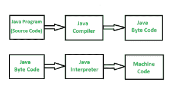

# 字节码和机器码的区别

> 原文:[https://www . geesforgeks . org/字节码和机器码的区别/](https://www.geeksforgeeks.org/difference-between-byte-code-and-machine-code/)

字节码是介于源代码和机器码之间的中间代码。它是低级代码，是用高级语言编写的源代码编译的结果。由 [Java 虚拟机(JVM)](https://www.geeksforgeeks.org/jvm-works-jvm-architecture/) 这样的虚拟机处理。

字节码是一种不可运行的代码，当它被解释器翻译成机器代码后，就可以被机器理解。它被编译成在 JVM 上运行，任何有 JVM 的系统都可以运行它，而不管它们的操作系统是什么。这就是 Java 独立于平台的原因。字节码被称为可移植码。

**机器代码:**

机器代码是一组直接机器可理解的指令，由中央处理器处理。机器代码是二进制(0 和 1)格式，与字节代码和源代码完全不同。它被认为是源代码的最底层表示。机器码是经过编译或解释后得到的。它也被称为机器语言。

下图举例说明了**Java 源代码如何转换为 Byte 代码，再转换为机器码的例子:**

****

****字节码和机器码的区别:****

<figure class="table">

| **序列号** | 字节码 | **机器代码** |
|  01. | 字节码由二进制、十六进制、宏指令(如新指令、添加指令、交换指令等)组成，它不能被中央处理器直接理解。它是为通过软件(如虚拟机)高效执行而设计的 | 由可被中央处理器直接理解的二进制指令组成的机器代码。 |
|  02. | 字节码被认为是中级代码。 | 机器代码被认为是低级代码。 |
|  03. | 字节码是编译源代码后生成的不可运行的代码，它依赖解释器来执行。 | 机器代码是一组机器语言或二进制格式的指令，由中央处理器直接执行。 |
|  04. | 字节码由虚拟机执行，然后由中央处理器执行。 | 机器代码不是由虚拟机执行的，而是由 CPU 直接执行的。 |
|  05.  | 字节码对机器的特异性不如机器码。 | 机器代码比字节代码更具体地面向机器。 |
|  06. | 它是独立于平台的，因为它依赖于虚拟机，并且具有虚拟机的系统可以在不考虑平台的情况下执行。 | 它不是独立于平台的，因为一个平台的目标代码不能在同一个操作系统上运行。对象因系统架构和与机器相关联的本机指令而异。 |
|  07. | 所有的源代码不需要转换成字节码由 CPU 执行。一些由任何特定高级语言编写的源代码被转换成字节码，然后字节码转换成目标码，由中央处理器执行。 | 所有的源代码在被 CPU 执行之前都必须转换成机器码。 |

</figure>