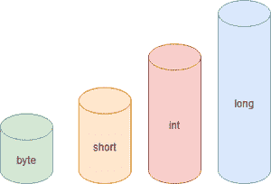

# Java 中字节、短数据类型、整型和长数据类型的区别

> 原文:[https://www . geesforgeks . org/Java 中字节短整型和长整型数据类型的区别/](https://www.geeksforgeeks.org/difference-between-byte-short-int-and-long-datatype-in-java/)

有两种类型的数据类型，即[原始数据类型/基本数据类型](https://www.geeksforgeeks.org/data-types-in-java/)和非原始/派生数据类型。原始数据类型被定义为在派生数据类型或使用它们创建一组数据类型时已经存在的本地数据类型集或默认数据类型集，称为派生数据类型，如数组、堆栈、队列、尝试等。在深入区分原始数据类型之前，让我们先清楚地了解原始数据类型。

<figure class="table">

| 基本数据类型 | 派生数据类型 |
| --- | --- |
| 基本数据类型也称为原始数据类型。这些是基本的数据类型。 | 派生数据类型是基本数据类型的聚合。 |
| 字符、整数、浮点和 void 是基本的数据类型。 | 指针、数组、结构和联合是派生的数据类型。 |
| 字符用于字符。可分为
字符、有符号字符、无符号字符。 | 指针用于存储变量的地址。 |
| 整数用于整数(没有十进制数字)。它可以分为有符号和无符号。进一步，分为 int、short int 和 long int。 | 数组用于包含类似类型的数据。 |
| 浮点数用于十进制数。这些分为浮点型、双精度型和长双精度型。 | 结构用于将可能不同类型的项组合成一个类型。 |
| void 用在不需要返回值的地方。 | 它类似于结构，但联盟中的所有成员共享相同的内存位置 |

</figure>

在 JAVA 中有八种不同的[原语数据类型，即字节、短、int、long、float、double、boolean 和 char。在原语中，数据类型需要不同的内存量，并且有一些特定的操作可以在其上执行。它们包括共八种数据类型，命名如下。其中整数数据类型有字节、短、长、int。整数数据类型用于存储数值。在本文中，我们将讨论这四种整数数据类型之间的区别。JAVA 不支持这些整数数据类型的无符号版本。区别的主要依据是大小和范围。](https://www.geeksforgeeks.org/data-types-in-java/)

*   字节
*   充电
*   布尔
*   （同 Internationalorganizations）国际组织
    *   签名
    *   无符号的
*   短的
*   漂浮物
*   长的
*   两倍

现在，在原始数据类型中，让我们区分字节、短整型、整型和长型，以便更好地理解哪种类型将根据需求使用，因为它们具有不同的特性，这些特性在任何编程语言的实现部分都起着至关重要的作用。



1.  [字节数据类型](https://www.geeksforgeeks.org/data-types-in-java/)的范围从-128 到 127，它需要很少的内存(只有 1 个字节)。它可以用来代替 int，我们确信它的范围会很小。如果在表达式中使用字节变量，并且该值超出其范围，编译器会自动将字节变量提升为 int 类型。
2.  [短数据类型](https://www.geeksforgeeks.org/data-types-in-java/)是变量范围大于字节但小于 int，与 int 相比，它也需要比字节更多的内存但更少的内存。如果短变量在表达式中使用，并且值超出其范围，编译器会自动将短变量提升为 int 类型。
3.  [int 数据类型](https://www.geeksforgeeks.org/data-types-in-java/)是数值最优选的类型。
4.  [长数据类型](https://www.geeksforgeeks.org/data-types-in-java/)使用频率较低。它应该只在数值范围过高时使用。与其他三种数据类型相比，它需要最多的内存(8 字节)。

**结论:**

<figure class="table">

| 标准 | 字节 | 短的 | （同 Internationalorganizations）国际组织 | 长的 |
| --- | --- | --- | --- | --- |
| 尺寸/宽度 | 它是 8 位的 | 它是 16 位的 | 它是 32 位的 | 它是 64 位的 |
| 范围 | -128 到 127 | -32，768 至 32，767 | -2，147，483，648 至 2，147，483，647 | –9，223，372，036，854，775，808 至 9，223，372，036，854，775，807。 |
| 减速/使用的关键字 | 使用的关键字是“byte”。 | 使用的关键字是“short”。 | 使用的关键字是“int”。 | 使用的关键字是“long”。 |
| 声明语法 | 字节 datatype_name; | 短数据类型名称； | int datatype_name; | 长数据类型名称； |
| 需要内存 | 它需要 1 个字节。 | 它需要 2 个字节。 | 它需要 4 个字节。 | 它需要 8 个字节。 |
| 缺省值 | Zero | Zero | Zero | 0L |

</figure>

> 从上表可以明显看出-
> 
> *   如果数值的范围较小，并且我们想节省内存，我们可以根据数值的范围使用 byte 或 short。
> *   如果需要中等范围的值，我们可以使用 int 类型，但是当数值的范围较大时，必须使用 long 类型的变量来保存值。
> *   按范围排序
> 
> ```java
>  long >  int > short > byte
> ```
> 
> *   按大小排序
> 
> ```java
> long> int > short> byte
> ```