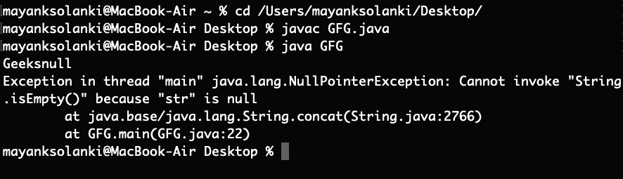

# Java 中 concat()和+运算符的区别

> 原文:[https://www . geesforgeks . org/Java 中 concat 和 operator 的区别/](https://www.geeksforgeeks.org/difference-between-concat-and-operator-in-java/)

**字符串**被定义为字符数组。字符数组和字符串的区别在于字符串以特殊字符“\0”结尾。因为数组是不可变的(不能增长)，所以字符串也是不可变的。每当对字符串进行更改时，就会创建一个全新的字符串。**拼接**是端到端连接的过程。

### [concat()方法](https://www.geeksforgeeks.org/java-string-concat-examples/)

[字符串类](https://www.geeksforgeeks.org/string-class-in-java/)的 [Java 字符串](https://www.geeksforgeeks.org/strings-in-java/) *concat()方法*本身已经存在于 [java.util 包](https://www.geeksforgeeks.org/java-util-package-java/)中将一个字符串连接到另一个字符串的末尾。此方法返回一个字符串，该字符串的值被传递给方法，并附加到字符串的末尾。

插图:

```java
Input:  String 1   : abc
        String 2   : def
        String n-1 : ...
        String n   : xyz
Output: abcdef...xyz  
```

**示例:**

## Java 语言(一种计算机语言，尤用于创建网站)

```java
// Java Program to Demonstrate Working of concat() method

// Main class
class GFG {

    // Main driver method
    public static void main(String args[])
    {
        // Custom input string 1
        String s = "Geeks ";

        // Custom input string 2 is passed as in arguments
        // Here we are adding it to end of same string
        s = s.concat("for Geeks");

        // Printing the concatenated string
        System.out.println(s);
    }
}
```

**Output**

```java
Geeks for Geeks
```

现在让我们详细讨论下一个我们将要讨论的概念

### “+”运算符

+运算符用于连接任意一侧的字符串，并且很可能用于将两个数字相加，从而为我们提供在任意一侧相加的灵活性。

**示例:**

## Java 语言(一种计算机语言，尤用于创建网站)

```java
// Java Program to Demonstrate Working of + Operator
// over Strings

// Main class
class GFG {

    // Main driver method
    public static void main(String args[])
    {
        // Custom input strings
        String s1 = " Geeks ";
        String s2 = " for Geeks ";

        // Now using + operator over string where
        // flexibility is provided to add on either side
        String s3 = s1 + s2;
        String s4 = s2 + s1;

        // Printing strings formed after
        // using + operator
        System.out.println(s3);
        System.out.println(s4);
    }
}
```

**Output**

```java
 Geeks  for Geeks 
 for Geeks  Geeks 
```

虽然 Strings 类的 concat()方法和+运算符都用于字符串的连接，但它们之间存在一些差异，如下表所示:

**因子 1:**concat()方法和+运算符采用的参数数量

*   **concat()** 方法只接受字符串的一个参数，并将其与其他字符串连接起来。
*   **+运算符**接受任意数量的参数并连接所有字符串。

**例**

## Java 语言(一种计算机语言，尤用于创建网站)

```java
// Java Program to Illustrate concat() method
// vs + operator in Strings

// Main class
public class GFG {

    // Main driver method
    public static void main(String[] args)
    {
        // Custom input string
        String s = "Geeks", t = "for", g = "geeks";

        // Printing combined string using + operator
        System.out.println(s + t + g);

        // Printing combined string using concat() method
        System.out.println(s.concat(t));
    }
}
```

**Output**

```java
Geeksforgeeks
Geeksfor
```

**因素 2:** 参数类型

*   strong>concat()方法只接受字符串参数，如果参数中给出了任何其他类型，那么它将引发错误。
*   **+运算符**采用任意类型并转换为字符串类型，然后连接字符串。

**因子 3:** *concat()方法*引发 java.lang.NullPointer 异常

*   **concat()方法**当字符串与 null 连接时抛出 null 指针异常
*   **+运算符**在字符串与 null 连接时没有引发任何异常。

**例**

## Java 语言(一种计算机语言，尤用于创建网站)

```java
// Java Program to Illustrate Raise of NullPointer Exception
// in case of concat() Method

// Main class
public class GFG {

    // Main driver method
    public static void main(String[] args)
    {

        // Input string 1
        String s = "Geeks";
        // Input string 2
        String r = null;

        // Combining above strings using + operator and
        //  printing resultant string
        System.out.println(s + r);

        // Combining above strings using concat() method and
        // printing resultant string
        // It raises an NullPointer Exception
        System.out.println(s.concat(r));
    }
}
```

**输出:**



**因子 4:** 创建新的字符串对象

*   **concat()方法**取两个字符串串联，只有字符串长度大于 0 时才返回一个新的 string 对象，否则返回同一个对象。
*   **+运算符**每次都创建一个新的字符串对象，而不考虑字符串的长度。

**例**

## Java 语言(一种计算机语言，尤用于创建网站)

```java
// Java Program to Illustrate Creation of New String object
// in concat() method and + Operator

// Main class
public class GFG {

    // Main driver method
    public static void main(String[] args)
    {

        // Input strings
        String s = "Geeks", g = "";

        // Using concat() method over strings
        String f = s.concat(g);

        // Checking if both strings are equal

        // Case 1
        if (f == s)

            // Identical strings
            System.out.println("Both are same");

        else

            // Non-identical strings
            System.out.println("not same");

        // Case 2
        String e = s + g;

        // Again checking if both strings are equal
        if (e == s)

            // Identical strings
            System.out.println("Both are same");
        else

            // Non-identical strings
            System.out.println("not same");
    }
}
```

**Output**

```java
Both are same
not same
```

**因子 5:** 性能

**concat()方法**比 **+运算符**更好，因为它只在字符串长度大于零(0)时创建一个新对象，但是+运算符总是创建一个新字符串，而不管字符串的长度如何。

> **结论:**从上面两个程序我们可以看出，两个程序都是以某种方式直接或间接地将两个字符串相加。在 concat 方法中，我们在添加字符串时被绑定，因为我们必须在参数中传递字符串，而在“+”运算符的其他情况下，它只是简单地将字符串加起来，可能是数学，因此没有绑定，我们可以添加任何一方。

<figure class="table">

| 基础 | concat()方法 | +运算符 |
| --- | --- | --- |
| concat()方法和+运算符采用的参数数量 | 只接受字符串的一个参数，并将其与其他字符串连接起来。 | 接受任意数量的参数并连接所有字符串 |
| 参数的类型 | 只接受字符串参数，如果参数中给出了任何其他类型，那么它将引发错误。 | 采用任何类型并转换为字符串类型，然后连接字符串。 |
| zero point 异常 | 当字符串与空值连接时，引发空指针异常 | 当字符串与 null 连接时，它不会引发任何异常 |
| 创建新的字符串对象 | 仅当返回字符串的长度大于其中一个连接字符串的长度时，Takes 才会连接两个字符串并返回一个新的字符串对象，否则，它会返回相同的对象。 | 无论字符串的长度如何，每次都创建一个新的字符串对象。 |
| 表演 | **concat()方法**比“+”运算符更好，因为它只在字符串长度大于零(0)时创建一个新对象，所以它使用的内存更少。 | **+运算符**总是创建一个新字符串，而不考虑字符串的长度，因此会占用更多内存。 |

</figure>