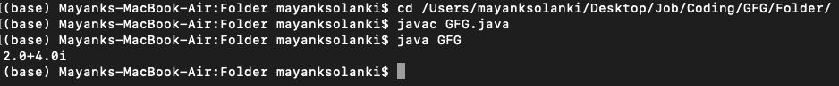

# Java 中构造函数和静态工厂方法的区别

> 原文:[https://www . geesforgeks . org/Java 中构造函数与静态工厂方法的区别/](https://www.geeksforgeeks.org/difference-between-constructor-and-static-factory-method-in-java/)

每当我们创建一个对象时，都会执行一些代码来执行该对象的初始化。这段代码只不过是一个构造函数，因此构造函数的主要目的是执行对象的初始化，而不是创建对象。让我们来看一下编写构造函数的基本规则。它们如下:

1.  类的名称和构造函数的名称必须相同。
2.  返回类型概念不适用于构造函数，甚至无效。错误的是，如果我们试图为构造函数声明返回类型，那么我们不会得到编译时错误，因为编译器把它当作一个方法。
3.  构造函数唯一适用的修饰符是公共、私有、受保护和默认。如果我们试图使用任何其他修饰符，我们会得到一个编译时错误，这里不允许使用修饰符名称。

### 默认构造函数

编译器负责生成默认构造函数，但不负责生成 JVM。如果我们不编写任何构造函数，那么只有编译器会生成默认构造函数，也就是说，如果我们编写至少一个构造函数，那么 java 中的每个类都可以包含一个构造函数，它可以是编译器生成的默认构造函数，也可以是程序员显式提供的自定义构造函数，但不能同时包含两者。

默认构造函数的原型如下:

*   它总是一个无参数的构造函数
*   默认构造函数的访问修饰符与类的访问修饰符完全相同。
*   它只包含一行 super()，是对超类构造函数的无参数调用。

### 静态工厂方法

通过使用类名，如果我们调用一个方法，如果该方法返回相同的类对象，那么这种类型的方法称为静态工厂方法。静态工厂方法是返回本机类实例的方法。与构造函数不同，静态工厂方法有明确代码的名称。在静态工厂方法中，我们不需要在每次调用时创建一个新的对象，也就是说，如果需要，对象可以被缓存和重用。我们也可以返回它们返回类型的子类型。

> 每个构造函数内部的第一行应该是 [super()](https://www.geeksforgeeks.org/super-keyword/) 或者 [this()](https://www.geeksforgeeks.org/difference-super-java/) 如果我们没有写任何东西，那么编译器将总是放置 super()

**示例:**

## Java 语言(一种计算机语言，尤用于创建网站)

```java
// Java Program to showcase Difference Between
// Constructor and Static Factory method

// Importing all utility classes from
// java.util package
// Importing all input output classes
import java.io.*;
import java.util.*;

// Main class
// To find out complex number
public final class GFG {

    // Method 1
    // Static factory method returns an object of this
    // class.
    public static GFG valueOf(float real, float imaginary)
    {
        return new GFG(real, imaginary);
    }

    // Caller cannot see this private constructor.The only
    // way to build a GFG is by calling the static factory
    // method.

    // Constructor
    private GFG(float real, float imaginary)
    {

        // This keyword refers to current object itself
        this.real = real;
        this.imaginary = imaginary;
    }

    private float real;
    private float imaginary;

    // Method 2
    // Main driver method
    public static void main(String[] args)
    {
        // Creating an object of GFG and
        // calling an static factory method valueOf()
        GFG n = GFG.valueOf(2, 4);

        // Print and display the complex number
        System.out.println(n.real + "+" + n.imaginary
                           + "i");
    }
}
```

**输出:**



因此，从上面的文章中，我们可以清楚地得出它们之间的区别如下:

<figure class="table">

| 构造器 | 静态工厂方法 |
| --- | --- |
| 构造函数没有有意义的名称，所以它们总是被限制在标准的命名约定中 | 静态工厂方法可以有一个有意义的名字，因此我们可以明确地表达这个方法的作用。 |
| 构造函数不能有任何返回类型，甚至不能是 void。 | 静态工厂方法可以返回实现方法的相同类型、子类型以及原语。 |
| 在构造函数内部，我们只能执行对象的初始化。 | 除了初始化之外，在静态工厂方法中，如果我们想要为每个对象创建执行任何活动，比如为每个对象创建增加计数值，我们可以在静态工厂方法中这样做。 |
| 构造函数总是在堆中创建一个新对象，因此不可能从构造函数返回类的缓存实例。 | 但是工厂方法可以利用缓存，即我们可以从工厂方法返回不可变类的相同实例，而不是总是创建一个新对象。 |
| 每个构造函数中的第一行应该是 super()或 this() | 但是在工厂方法内部，第一行不一定必须是 super()或 this() |

</figure>