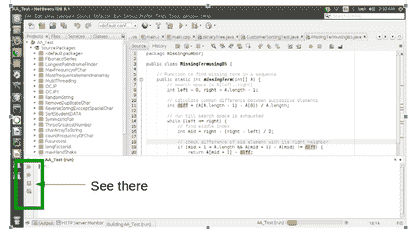

# Java 中守护线程和用户线程的区别

> 原文:[https://www . geesforgeks . org/Java 中守护进程线程和用户线程的区别/](https://www.geeksforgeeks.org/difference-between-daemon-threads-and-user-threads-in-java/)

在 Java 中，有两种类型的线程:

1.  守护线程
2.  用户线程

守护线程是低优先级线程，总是在后台运行，用户线程是高优先级线程，总是在前台运行。用户线程或非守护进程旨在执行特定或复杂的任务，其中守护进程线程用于执行支持任务。

**Java 中守护线程和用户线程的区别**

1.  **JVM 不等待守护线程完成，而是等待用户线程:**守护线程和用户线程最主要的区别是，JVM 不会等待守护线程完成任务，而是等待任何活动的用户线程。
    例如，人们可能在 NetBeans 中运行 Java 程序时注意到了这种行为，即使主线程已经完成，左上角的向下按钮仍然是红色的，表明 Java 程序仍在运行。这是由于主线程产生的任何用户线程，但是主线程在 NetBeans 中看不到红点。



*   **线程优先级:**与守护线程相比，用户线程的优先级较高，这意味着它们不会像用户线程那样容易获得 CPU。*   **线程的创建:**用户线程通常由应用程序创建，用于并发执行某个任务。另一方面，守护线程大部分是由 JVM 创建的，就像一些垃圾收集作业一样。*   **线程终止:**如果所有用户线程都已完成执行，但用户线程被应用程序或其本身关闭，JVM 将强制守护线程终止。用户线程可以通过运行的 JVM 保持运行，但是守护线程不能通过 JVM 保持运行。这就是**用户线程和守护线程最关键的区别**。*   **Usage :** The daemons threads are not used for any critical task. Any important task is done by user thread. A daemon thread is generally used for some background tasks which are not critical task.

    **用户线程和守护线程的主要区别:**

    | 用户线程 | 守护线程 |
    | JVM 一直等到用户线程完成他们的工作。它永远不会退出，直到所有用户线程完成他们的工作。 | JVM 不会等待守护线程完成它们的工作。一旦所有用户线程完成工作，JVM 就会退出。 |
    | JVM 不会强制用户线程终止，所以 JVM 会等待用户线程自行终止。 | 如果所有用户线程都完成了工作，JVM 将强制守护进程线程终止 |
    | 用户线程由应用程序创建。 | 大多是由 JVM 创建的守护线程。 |
    | 主要是用户线程被设计来做一些特定的任务。 | 守护线程被设计为支持用户线程。 |
    | 用户线程是前台线程。 | 守护线程是后台线程。 |
    | 用户线程是高优先级线程。 | 守护线程是低优先级线程。 |
    | 它的生命是独立的。 | 它的寿命取决于用户线程。 |

    **示例:检查线程是否为守护进程**

    可以使用 setDaemon(布尔)方法将用户线程作为守护线程。在本例中，通过使用 isDaemon()方法检查线程类型(用户线程或守护进程线程)。如果它是守护进程，则返回 true，否则返回 false。

    ```java
    // Java program check thread is Daemon or not

    class MyThread extends Thread {

        @Override
        public void run()
        {
            System.out.println("User Thread or Non-Daemon Thread");
        }
    }

    class MainThread {

        public static void main(String[] args)
        {

            MyThread mt = new MyThread();
            mt.start();

            System.out.println("Main Thread");

            System.out.println("Is " + mt.getName()
                               + " a Daemon Thread: "
                               + mt.isDaemon());

            System.out.println("Is " + Thread.currentThread().getName()
                               + " a Daemon Thread: "
                               + Thread.currentThread().isDaemon());
        }
    }
    ```

    **Output:**

    ```java
    Main Thread
    Is Thread-0 a Daemon Thread: false
    Is main a Daemon Thread: false
    User Thread or Non-Daemon Thread

    ```

    **示例:将非守护线程设为守护线程:**
    在本例中，使用 setDeamon(布尔值)将非守护线程设为守护进程。

    ```java
    // Java program make user thread as a daemon thread

    class MyThread extends Thread {

        @Override
        public void run()
        {
            System.out.println("Non-Daemon thread");
        }
    }

    class MainThread {

        public static void main(String[] args)
        {
            MyThread mt = new MyThread();
            System.out.println("Before using setDaemon() method: ");
            System.out.println("Is " + mt.getName()
                               + " a Daemon Thread: "
                               + mt.isDaemon());

            mt.setDaemon(true);

            System.out.println("After using setDaemon() method: ");
            System.out.println("Is " + mt.getName()
                               + " a Daemon Thread: "
                               + mt.isDaemon());
        }
    }
    ```

    **Output:**

    ```java
    Before using setDaemon() method: 
    Is Thread-0 a Daemon Thread: false
    After using setDaemon() method: 
    Is Thread-0 a Daemon Thread: true

    ```