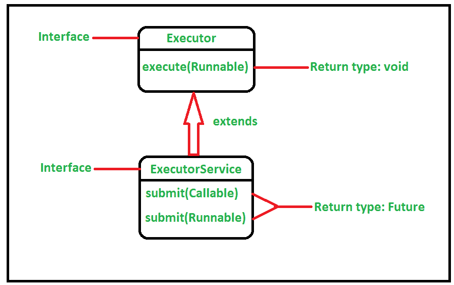
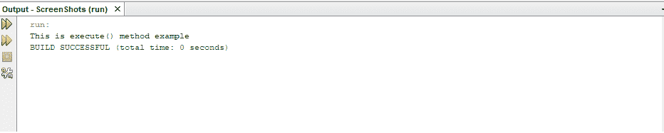
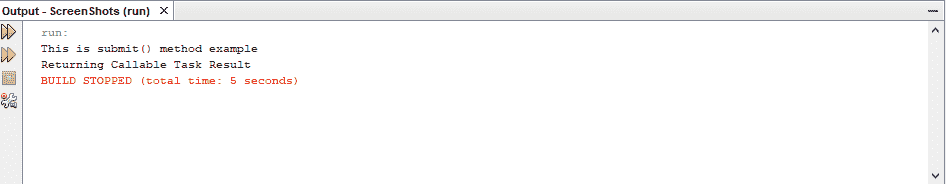

# Java 中 ExecutorService execute()和 submit()方法的区别

> 原文:[https://www . geesforgeks . org/executor service-execute-and-submit-method-in-Java/](https://www.geeksforgeeks.org/difference-between-executorservice-execute-and-submit-method-in-java/)

[执行器服务接口](https://www.geeksforgeeks.org/java-util-concurrent-executorservice-interface-with-examples/)通过添加帮助管理和控制线程执行的方法来扩展[执行器](https://www.geeksforgeeks.org/java-util-concurrent-executor-interface-with-examples/)。在[Java . util . concurrent package](https://www.geeksforgeeks.org/tag/java-concurrent-package/)中定义。它定义了执行返回结果的线程、一组线程和确定关闭状态的方法。在本文中，我们将看到名为 execute()和 submit()的这两种方法之间的区别。

在 Java 中，为了执行异步任务，实现了可运行的[接口](https://www.geeksforgeeks.org/interfaces-in-java/)。为了做到这一点，其中一个可用的接口是[执行器接口](https://www.geeksforgeeks.org/java-util-concurrent-executor-interface-with-examples/)。执行器界面包含 *execute()* 方法。除此之外，还有另一个可用的接口，即扩展执行器接口的执行器服务接口。此方法包含 submit()方法。下图说明了这两个接口之间的关系。

[](https://media.geeksforgeeks.org/wp-content/uploads/20200603173523/execute-2.png)

**执行方法:**该函数在未来某个时间执行给定的命令。根据执行器实现的判断，该命令可以在新线程、池线程或调用线程中执行。这个方法是一个 void 方法，意味着它不返回任何函数。一旦在 execute()方法中分配了任务，我们就不会得到任何响应，并且可以忘记任务。下面是 execute 方法的实现。

## Java 语言(一种计算机语言，尤用于创建网站)

```java
// Java program to demonstrate
// the behavior of the
// execute() method

import java.util.concurrent.*;
public class GFG {

    public static void main(String[] args)
        throws Exception
    {

        // Creating the object of the
        // Executor Service
        ExecutorService executorService
            = Executors.newSingleThreadExecutor();

        // execute() method cannot return
        // anything because it's return type
        // is void.

        // By using execute(), we are accepting
        // a Runnable task
        executorService.execute(new Runnable() {

            // Override the run method
            public void run()
            {
                System.out.println(
                    "This is execute() "
                    + "method example");
            }
        });

        // This method performs all the
        // previouslu submitted tasks
        // before termination
        executorService.shutdown();
    }
}
```

**输出:**

[](https://media.geeksforgeeks.org/wp-content/cdn-uploads/20200622105613/execute.png)

**提交方式:**该功能在未来某个时间执行给定的命令。根据执行器实现的判断，该命令可以在新线程、池线程或调用线程中执行。与 execute 方法不同，此方法返回未来。在 Java 中，[未来](https://www.geeksforgeeks.org/callable-future-java/)代表异步计算的结果。未来对象用于在执行开始后处理任务。因此，当我们需要执行的结果时，那么我们可以使用*提交()未来对象的*方法。为了得到结果，我们可以使用*get()*Future 上的方法。get()方法返回一个[对象](https://www.geeksforgeeks.org/classes-objects-java/)如果我们在任务完成之前调用 get()方法，它将阻塞直到结果准备好，并可能抛出[检查的异常](https://www.geeksforgeeks.org/types-of-exception-in-java-with-examples/)或者如果任务完成，则未来的对象保存一个返回的结果，然后可以在以后使用。以下是提交方法的实现:

## Java 语言(一种计算机语言，尤用于创建网站)

```java
// Java program to demonstrate
// the behavior of the
// submit() method

import java.util.concurrent.*;
public class GFG {
    public static void main(String[] args)
        throws Exception
    {

        // Creating the object of the
        // Executor service interface
        ExecutorService executorService
            = Executors.newFixedThreadPool(1);

        // submit() method can return the
        // result of the computation
        // because it has a return type of Future.

        // By using submit(), we are
        // accepting a Callable task
        Future obj
            = executorService.submit(new Callable() {

                  // Overriding the call method
                  public Object call()
                  {
                      System.out.println(
                          "This is submit() "
                          + "method example");

                      return "Returning Callable "
                          + "Task Result";
                  }
              });

        // This method will return the result
        // if the task has finished perfectly.
        // The submit() method returns a
        // Java Future object which is
        // used to check when the Runnable
        // has completed.
        // As it implements Future,
        // get() method is called
        // to get the result
        System.out.println(obj.get());
         executorService.shutdown();
    }
}
```

**输出:**

[](https://media.geeksforgeeks.org/wp-content/cdn-uploads/20200622105633/submit.png)

下表演示了执行方法和提交方法之间的区别:

<figure class="table">

| 执行方法 | 提交方法 |
| --- | --- |
| 此方法在执行器接口中声明。 | 这个方法是在 ExecutorService 接口中声明的。 |
| 此方法只能接受可运行的任务。 | 这个方法可以接受可运行和可调用的任务。 |
| 此方法的返回类型为 void。 | 此方法的返回类型为“未来”。 |
| 当我们不关心结果，但希望代码由线程池的工作线程并行运行时，就使用这个方法。 | 当我们关心结果并需要从已经执行的任务中得到结果时，就使用这种方法。 |

</figure>