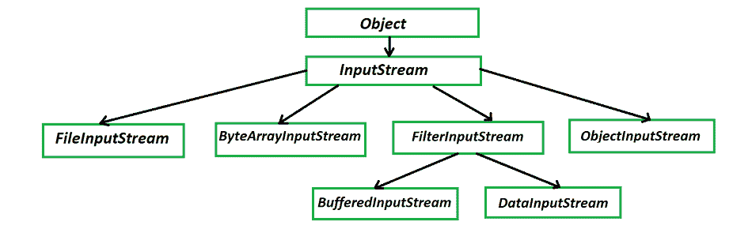

# Java 中 FileInputStream 和 ObjectInputStream 的区别

> 原文:[https://www . geesforgeks . org/file inputstream-和-objectinputstream-in-java/](https://www.geeksforgeeks.org/difference-between-fileinputstream-and-objectinputstream-in-java/) 的区别

**FileInputStream** 类从文件系统中的文件提取输入字节。FileInputStream 用于读取原始字节流，如图像数据。要读取字符流，请考虑使用文件阅读器。它应该用于读取面向字节的数据，例如读取音频、视频、图像等。处理输入流的类的层次结构如下:



处理输入流的类的层次结构

**例 1:**

## Java 语言(一种计算机语言，尤用于创建网站)

```
// Java program to demonstrate Use of FileInputStream class

// Importing the desired class
import java.io.FileInputStream;
// Importing input output class from java.io package
import java.io.IOException;

// Main class
class FileInputStreamGFG {

    // Method 1
    // To read from the file
    private void readFile() throws IOException
    {

        // Creating an object of FileInputStream
        FileInputStream fileInputStream = null;

        // Try block to check for exceptions
        try {

            // Now, creating a FileInputStream by
            //  opening a connection to an actual file
            // The file named by the path name name in the
            // file system

            // Here customly we have taken
            //  gfg.txt contains fileInputStream
            = new FileInputStream("gfg.txt");

            // data - "Java was called
            // Oak at the beginning."
            int i;

            // Reads a byte of data from this input stream
            // using read() method

            // Till condition holds true
            while ((i = fileInputStream.read()) != -1) {

                // Print the stream
                System.out.print((char)i);
            }
        }

        // If there is any exception encountered
        // then execute this block
        finally {

            // Stream is not there in file
            if (fileInputStream != null) {

                // Then close this file input stream and
                // releases any system resources associated
                // with the stream using close() method
                fileInputStream.close();
            }
        }
    }

    // Method 2
    // Main driver method
    public static void main(String[] args)
        throws IOException
    {

        // Constructor of this class
        FileInputStreamGFG fileInputStreamGfg
            = new FileInputStreamGFG();

        // Calling the readFile() method
        // in the main() method
        fileInputStreamGfg.readFile();
    }
}
```

**输出:**

```
Java was called Oak at the beginning.
```

现在停留在输出流上 **ObjectInputStream** 用于反序列化原始数据和以前使用 ObjectOutputStream 编写的对象。只有支持 java.io.Externalizable 接口的对象才能从流中读取。Java ObjectInputStream 类使您能够从输入流中读取 Java 对象，而不仅仅是原始字节。您将输入流包装在对象输出流中，以便可以从中读取对象。当然，读取的字节必须代表一个有效的序列化 Java 对象。否则，读取对象将失败。通常，我们将使用 ObjectInputStream 来读取由 Java ObjectOutputStream 编写(序列化)的数据对象。

**例 2:**

## Java 语言(一种计算机语言，尤用于创建网站)

```
// Java program to demonstrate Use of ObjectInputStream
// class

// Importing required input output classes
import java.io.FileInputStream;
import java.io.FileNotFoundException;
import java.io.IOException;
import java.io.ObjectInputStream;
import java.io.Serializable;

// Before serialization and de-serialization of objects the
// class of the object must implement java.io.Serializable

// Class 1
// Helper clas implementing Serializable interface
class Student implements Serializable {

    // Private class member variables
    private static final long serialVersionUID
        = -1438960132000208485L;
    private String name;
    private int age;

    // Constructor of this class
    public Student(String name, int age)
    {
        // super keyword refers to parent class
        super();

        // this keyword refers to current object instance
        this.name = name;
        this.age = age;
    }

    // Getters and Setter for class
    public String getName() { return name; }

    public void setName(String name) { this.name = name; }

    public int getAge() { return age; }

    public void setAge(int age) { this.age = age; }

    // Override toString method
    @Override public String toString()
    {
        // Simply return the name and age
        return "Student [name=" + name + ", age=" + age
            + "]";
    }
}

// Class 2
// Main class
public class ObjectInputStreamDemo {

    // Main driver method
    public static void main(String[] args)
        throws FileNotFoundException, IOException,
               ClassNotFoundException
    {
        // Creating an object of above class
        // in the main() method
        ObjectInputStreamDemo objectInputStreamDemo
            = new ObjectInputStreamDemo();

        // Readfile function call
        objectInputStreamDemo.readStudentObject();
    }

    // Member method of main class
    private void readStudentObject()
        throws IOException, FileNotFoundException,
               ClassNotFoundException
    {

        // Initially null is set to both streams
        // read and write streams
        FileInputStream fileInputStream = null;
        ObjectInputStream objectInputStream = null;

        // Try block to check for exceptions
        try {

            // Input stream directory
            fileInputStream
                = new FileInputStream("student.txt");

            // Input stream object
            objectInputStream
                = new ObjectInputStream(fileInputStream);

            // Creating an object of above class to
            // read an object from the ObjectInputStream
            Student student
                = (Student)objectInputStream.readObject();

            // Display message when input stream is
            // completely read
            System.out.println(
                "Successfully read student object from the file.");

            // Print an display commands

            System.out.println(student);
            System.out.println("Name = "
                               + student.getName());
            System.out.println("Age  = "
                               + student.getAge());
        }

        // When an exception is encountered execute the
        // block
        finally {

            // If there is nothing to be read
            if (objectInputStream != null) {
                // Then close a ObjectInputStream will will
                //  the InputStream instance from which
                // the ObjectInputStream is reading
                // isong the close() method
                objectInputStream.close();
            }
        }
    }
}
```

**输出:**

```
Successfully read student object from the file.
Student [name=John, age=25]
Name = John
Age  = 25
```

文件输入流和对象输出流之间的唯一区别是:

<figure class="table">

| 文件输入流 | ObjectInputStream |
| --- | --- |
| java.io.FileInputStream 中的 Java FileInputStream 类使得以字节流的形式读取文件的内容成为可能，因此 FileInputStream 可以用于**序列化**。 | Java 中的 ObjectInputStream 可以用来将 InputStream 转换为 object。将输入流转换为对象的过程称为**反序列化**。 |

</figure>