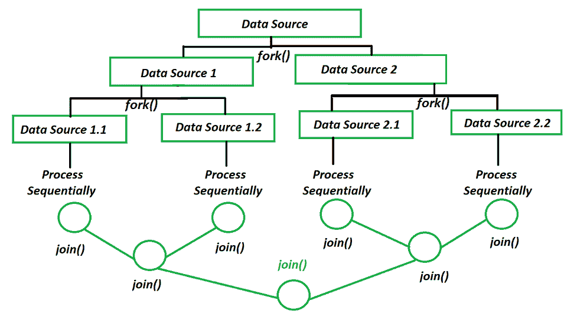

# Java 中 Fork/Join 框架和 ExecutorService 的区别

> 原文:[https://www . geesforgeks . org/fork-join-framework-and-executor service-in-Java/](https://www.geeksforgeeks.org/difference-between-fork-join-framework-and-executorservice-in-java/)之间的区别

[Fork/Join 框架](https://www.geeksforgeeks.org/forkjoinpool-class-in-java-with-examples/)为 Java 数据并行提供了高性能的细粒度任务执行框架。它的并行计算引擎被许多高级框架使用。fork/join 框架支持一种通过“分而治之”来解决问题的并行编程风格，如下所示:

1.  将任务拆分为子任务。
2.  并行解决子任务
    *   子任务可以在不同的内核上并行运行。
    *   子任务也可以在单个内核的不同线程中并发运行。
3.  等待他们完成
    *   join()等待子任务完成
4.  合并结果。
    *   任务使用对 join()的调用将子任务结果合并在一起。



Java 叉连接池计算模型

如果任务没有返回结果，那么它只是等待其子任务完成。

下面是一个演示分叉/连接框架工作原理的 Java 程序:

## Java 语言(一种计算机语言，尤用于创建网站)

```java
// Java program to demonstrate the working of Fork/Join
// Framework

// Importing required libraries
import java.io.*;
import java.util.concurrent.ForkJoinPool;
import java.util.concurrent.RecursiveTask;

// Class 1
// helper class
class SearchTask extends RecursiveTask<Integer> {

    // Global variables
    int array[];
    int start, end;
    int searchElement;

    // Constructor for initialising globals
    public SearchTask(int array[], int start, int end,
                      int searchElement)
    {

        // This keyword regers to current object itself
        this.array = array;
        this.start = start;
        this.end = end;
        this.searchElement = searchElement;
    }

    // Method
    // @Override
    protected Integer compute()
    {

        // Returns the count computed by processSearch
        return processSearch();
    }

    // Method
    // To count the the count of searched element
    private Integer processSearch()
    {

        // Initially count os set to zero
        int count = 0;

        // iterating using for loop
        for (int i = start; i <= end; i++) {

            // if element is present in array
            if (array[i] == searchElement) {

                // Increment the count
                count++;
            }
        }

        // Returning the count of searched element
        return count;
    }
}

// Class 2
//  Main class
public class GFG {

    // main driver method
    public static void main(String args[])
    {

        // Custom input array elements
        int array[] = { 1, 2, 6, 3,  4,  5,  6,
                        7, 8, 9, 10, 11, 12, 6 };

        // Custom element to be searched in array
        int searchElement = 6;

        // initializing starting and ending indices
        int start = 0;
        int end = array.length - 1;

        // Creating object of ForkJoinPool class
        ForkJoinPool pool = ForkJoinPool.commonPool();

        // Now creating object of above class
        SearchTask task = new SearchTask(array, start, end,
                                         searchElement);
        int result = pool.invoke(task);

        // Print and display the searched element
        // If found do display out the number of times it is
        // found
        System.out.println(searchElement + " found "
                           + result + " times ");
    }
}
```

**Output**

```java
6 found 3 times 
```