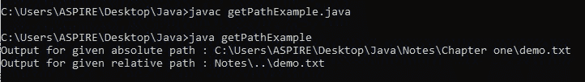
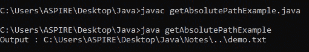
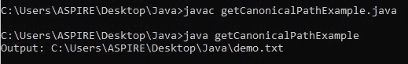

# Java 中 getPath()和 getCononicalPath()的区别

> 原文:[https://www . geesforgeks . org/get path-and-getcononicalpath-in-Java/](https://www.geeksforgeeks.org/difference-between-getpath-and-getcononicalpath-in-java/)之间的差异

在讨论差异之前，让我们快速回顾一下这三种方法

1.  [*getPath()*](https://www.geeksforgeeks.org/file-getpath-method-in-java-with-examples/)**法**
2.  **[*getAbsolutePath()*](https://www.geeksforgeeks.org/file-getabsolutepath-method-in-java-with-examples/)**法****
3.  ****[*getCanonicalPath()*](https://www.geeksforgeeks.org/file-getcanonicalpath-method-in-java-with-examples/)法****

******1。**[*getPath()*](https://www.geeksforgeeks.org/file-getpath-method-in-java-with-examples/)**法******

******[*getPath()*](https://www.geeksforgeeks.org/file-getpath-method-in-java-with-examples/)**是 URL 类的一个方法。它将给定的抽象路径名转换为路径名字符串。生成的字符串使用默认的名称分隔符来分隔名称序列中的名称。********

********返回:**抽象路径名的字符串形式******

******例******

## ****Java 语言(一种计算机语言，尤用于创建网站)****

```java
**// Java Program illustrating the getPath() method

// Importing input output classes
import java.io.*;

// Class for getPath method()
public class GFG {

    // Main driver method
    public static void main(String[] args)
    {
        // Creating a new file object in which input is
        // absolute path as in argument from the user
        File path1 = new File(
            "C:/Users/ASPIRE/Desktop/Java/Notes/Chapter one/demo.txt");

        // Print the display the path string for
        // absolute path using getPath() method
        System.out.println(
            "Output for given absolute path : "
            + path1.getPath());

        // Creating another object of File and this time
        // relative path is provided as an input
        File path2 = new File("Notes/../demo.txt");

        // Print the display the path string for
        // relative path using getPath() method
        System.out.println(
            "Output for given relative path : "
            + path2.getPath());
    }
}**
```

******输出:******

********

******2。**[*getAbsolutePath()*](https://www.geeksforgeeks.org/file-getabsolutepath-method-in-java-with-examples/)**法******

******[*getAbsolutePath()*](https://www.geeksforgeeks.org/file-getabsolutepath-method-in-java-with-examples/)返回一个 Path 对象，表示给定路径的绝对路径。如果给定的路径名已经是绝对的，那么路径名字符串就像通过 [*getPath()*](https://www.geeksforgeeks.org/file-getpath-method-in-java-with-examples/) 方法一样简单地返回。如果该抽象路径名是空的抽象路径名，则是当前用户目录的路径名字符串，由系统属性 user '命名。返回 dir '()。否则**、**该路径名以系统相关的方式解析。******

******返回:**绝对路径名字符串，表示与该抽象路径名相同的文件或目录****

*   ******在 Unix 的系统上:**通过相对于当前用户目录解析相对路径名，使其成为绝对路径名。****
*   ******在微软系统上:**相对路径名是通过相对于路径名命名的驱动器的当前目录(如果有)进行解析而成为绝对路径名的。如果不是，则根据当前用户目录进行解析。****

******示例:******

## ****Java 语言(一种计算机语言，尤用于创建网站)****

```java
**// Java Program illustrating the getAbsolutePath() Method

// Importing all input output classes
import java.io.*;

// Class to get getAbsolutePath
public class GFG {

    // Main driver method
    public static void main(String[] args)
    {

        // Creating a file object where
        // relative path is provided as in parameter
        File path = new File("Notes/../demo.txt");

        // Print and display the string representing
        // absolute path of the file
        System.out.println("Output : "
                           + path.getAbsolutePath());
    }
}**
```

******输出:******

********

*******3** 。*[*getCanonicalPath()*](https://www.geeksforgeeks.org/file-getcanonicalpath-method-in-java-with-examples/)方法****

****此方法返回给定抽象路径名的规范路径名字符串。规范路径名是绝对的和唯一的。此方法首先在必要时将路径名转换为绝对形式，就像通过调用[*getAbsolutePath()*](https://www.geeksforgeeks.org/file-getabsolutepath-method-in-java-with-examples/)方法一样，然后以依赖于系统的方式将其映射到其唯一形式。****

******返回:**规范路径名字符串，表示与抽象路径名相同的文件或目录。****

## ****Java 语言(一种计算机语言，尤用于创建网站)****

```java
**// Java Program illustrating the getCanonicalPath() method

// Importing all input output classes
import java.io.*;

// Class for showcasing getCanonicalPath method
public class GFG {

    // Main driver method
    public static void main(String[] args)
        throws IOException
    {
        // Creating a new File object and
        // providing it relative path as in arguments
        File path = new File("Notes/../demo.txt");

        // Print an display the the canonical path
        // name string
        System.out.println("Output: "
                           + path.getCanonicalPath());
    }
}**
```

******输出:******

********

******输出解释:**为了更好地解释这些 CMD 输出或硬编码输出，使用的 java 文件的指定位置如下****

```java
**:C:\Users\ASPIRE\Desktop\Java\getPathExample or getAbsoltePathExample or getCanonicalPathExample**
```

****demo.txt 文件的位置****

```java
**:C:\Users\ASPIRE\Desktop\Java\Notes\Chapter one\demo.txt**
```

****现在，在讨论了它们之后，让我们来深入探讨一下[](https://www.geeksforgeeks.org/file-getpath-method-in-java-with-examples/)*[*getAbsolutePath()*](https://www.geeksforgeeks.org/file-getabsolutepath-method-in-java-with-examples/)*[*getCanonicalPath()*](https://www.geeksforgeeks.org/file-getcanonicalpath-method-in-java-with-examples/)*之间的差异，具体如下:*******

<figure class="table">

| getPath（） | getAbsolutePath() | getCononicalPath() |
| --- | --- | --- |
| 此方法返回一个字符串，该字符串表示由文件对象表示的文件的(绝对或相对)路径名。 | 此方法返回抽象文件路径名的绝对路径名字符串。 | 此方法返回给定抽象路径名的规范路径名字符串。 |
| 如果文件对象是使用相对路径创建的，那么返回的路径就是相对路径。 | 如果抽象路径名是相对的，那么它是以系统相关的方式解析的。 | 如果文件对象是使用相对路径创建的，则该方法首先将路径名转换为绝对路径名，并将其映射为唯一的形式。 |
| 如果文件对象是使用绝对路径创建的，那么返回的路径就是绝对路径。 | 如果抽象路径名已经是绝对的，则返回相同的路径名字符串。 | 如果文件对象是使用相对路径创建的，那么返回的路径将是唯一的形式。 |
| 此方法不解析路径名。 | 此方法仅解析相对路径的当前目录。速记表示(如“.”和“..”)没有进一步解决。 | 该方法包括删除冗余名称，如“.”和“..”从路径名，解析符号链接(在 Unix 平台上)，并将驱动器号转换为标准大小写(在微软 Windows 平台上)。 |
| **例***在窗口系统上*文件路径=新文件(“注释/../demo . txt ")；**输出:**注释\..\demo.txt*在 Unix 的系统上*文件路径=新文件(“注释/../demo.txt)**输出:**注释/../demo.txt | **例**

*窗口系统*文件路径=新文件(“注释/../demo . txt ")；**输出:**c:\ user \ ASPIRE \ Desktop \ Java \ Notes \..\demo.txt*在 Unix 的系统上*文件路径=新文件(“注释/../demo.txt)**输出:**主页/pooja/桌面/笔记/../demo.txt | **例***在车窗系统上*文件路径=新文件(“注释/../demo . txt ")；**输出:**c:\ Users \ ASPIRE \ Desktop \ Java \ demo . txt*在 Unix 的系统上*文件路径=新文件(“注释/../demo.txt)**输出:**/home/pooja/Desktop/Java/demo . txt |

</figure>