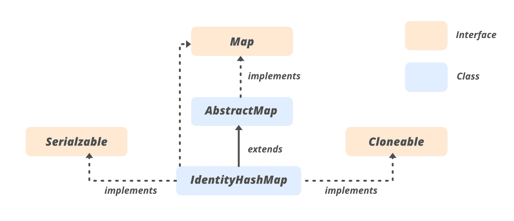

# 【HashMap 和 IdentityHashMap 在 Java 中的区别

> 原文:[https://www . geeksforgeeks . org/区别-hashmap-和-identityhashmap-in-java/](https://www.geeksforgeeks.org/difference-between-hashmap-and-identityhashmap-in-java/)

[java 中的 HashMap](https://www.geeksforgeeks.org/java-util-hashmap-in-java-with-examples/) 是一个类，是 Java 集合的一部分。它实现了 java 的 Map 接口。它以键和值对的形式存储数据。密钥应该是唯一的，但值可能是重复的。如果您尝试插入重复的键，它将替换相应键的元素。HashMap 类似于哈希表，但是不同步。它允许存储空键和空值，但是应该只有一个空键，并且可以有任意数量的空值。

[识别哈希表](https://www.geeksforgeeks.org/identityhashmap-class-java/)实现[映射](https://www.geeksforgeeks.org/map-interface-java-examples/)界面。在比较键(和值)时，它遵循引用相等代替对象相等。当用户需要通过引用比较对象时，使用此类。它不是同步的，必须在外部同步。这个类中的迭代器是快速失败的，抛出[ConcurrentModificationException](https://www.geeksforgeeks.org/concurrentmodificationexception-in-java-with-examples/)**试图在迭代时进行修改。**

**HashMap 和 IdentityHashMap 都是实现[映射](https://www.geeksforgeeks.org/map-interface-java-examples/)接口的类。但是它们之间几乎没有区别。**

****

****示例 1:** HashMap**

## **Java 语言(一种计算机语言，尤用于创建网站)**

```java
// Java program to illustrate
// the working of Java HashMap
// to demonstrate
// internal working difference between them

// Importing HashMap class from
// java.util package
import java.util.HashMap;

// Class
public class GFG {

    // Main driver method
    public static void main(String[] args)
    {
        // Creating an empty HashMap object
        HashMap<Integer, String> map = new HashMap<>();

        // Add elements to the map
        // Custom inputs
        map.put(10, "Geeks");
        map.put(20, "for");
        map.put(30, "geeks");
        map.put(40, "welcome");
        map.put(50, "you");

        // Printing the size of map
        System.out.println("Size of map is:- "
                           + map.size());

        // Printing the HashMap content
        System.out.println("HashMap content: " + map);

        // Removing a key 50
        map.remove(50);

        // Printing the HashMap after the removal
        System.out.println("HashMap after removal : "
                           + map);
    }
}
```

****Output**

```java
Size of map is:- 5
HashMap content: {50=you, 20=for, 40=welcome, 10=Geeks, 30=geeks}
HashMap after removal : {20=for, 40=welcome, 10=Geeks, 30=geeks}
```** 

****示例 2:** 标识哈希表**

## **Java 语言(一种计算机语言，尤用于创建网站)**

```java
// Java program to illustrate
// working of IdentityHashmap
// to demonstrate
// internal working difference between them

// Importing all classes of
// java.util package
import java.util.*;

// Class for iterating IdentityHashMap
public class GFG {

    // Main driver method
    public static void main(String[] args)
    {

        // Creating an empty IdentityHashMap object
        IdentityHashMap<Integer, String> ihmap
            = new IdentityHashMap<Integer, String>();

        // Mapping string values to int keys
        // Custom inputs --> Custom mappings
        ihmap.put(10, "Geeks");
        ihmap.put(20, "for");
        ihmap.put(30, "Geeks");
        ihmap.put(40, "Welcomes");
        ihmap.put(50, "You");

        // Display the size of IdentityHashMap
        System.out.println("IdentityHashMap size : "
                           + ihmap.size());

        // Display the IdentityHashMap
        System.out.println("Initial identity hash map: "
                           + ihmap);

        // Create an Iterator over the IdentityHashMap
        Iterator<IdentityHashMap.Entry<Integer, String> >
            itr = ihmap.entrySet().iterator();

        // Condition check using hasNext() method()

        // Condition check using hasNext() method holding
        // true if there is any next element remaining
        while (itr.hasNext()) {

            // next() method which is used to
            // retrieve the next element
            IdentityHashMap.Entry<Integer, String> entry
                = itr.next();

            // Print and display key and value pairs
            // using getKey() method
            System.out.println("Key = " + entry.getKey()
                               + ", Value = "
                               + entry.getValue());
        }
    }
}
```

****Output**

```java
IdentityHashMap size : 5
Initial identity hash map: {10=Geeks, 40=Welcomes, 50=You, 30=Geeks, 20=for}
Key = 10, Value = Geeks
Key = 40, Value = Welcomes
Key = 50, Value = You
Key = 30, Value = Geeks
Key = 20, Value = for
```** 

**【HashMap 和 IdentityHashMap 在 Java 中的区别**

<figure class="table">

| **无**。 | **哈希映射** | **身份识别哈希图** |
| --- | --- | --- |
| 1. | HashMap 实现了 Map 接口，但并没有违反 Map 的一般约定。 | IdentityHashMap 也实现了 Map 接口，但它故意违反了 Map 一般约定。 |
| 2.  | HashMap 使用对象等式来比较键和值。 | IdentityHashMap 使用引用等式来比较键和值。 |
| 3.  | HashMap 使用 HashMap 类的 [hashCode()](https://www.geeksforgeeks.org/method-class-hashcode-method-in-java/) 方法来查找桶的位置。 | IdentityHashMap 不使用 [hashCode()](https://www.geeksforgeeks.org/method-class-hashcode-method-in-java/) 方法，而是使用 System。IdentityHashCode()方法查找存储桶位置。 |
| 4. | HashMap 使用链接。 | IdentityHashMap 使用[一个](https://www.geeksforgeeks.org/method-class-hashcode-method-in-java/)简单的线性探测哈希表。 |
| 5. | 为了安全地将对象存储在 HashMap 中，键需要是不可变的。 | IdentityHashMap 不要求密钥是不可变的。 |
| 6. | HashMap 的性能略低于 IdentityHashMap。 | IdentityHashMap 的性能优于 HashMap。 |

</figure>