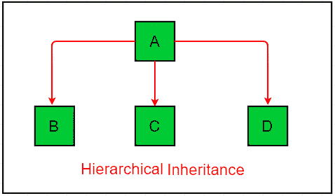

# Java 中继承和接口的区别

> 原文:[https://www . geesforgeks . org/Java 中继承和接口的区别/](https://www.geeksforgeeks.org/difference-between-inheritance-and-interface-in-java/)

[Java](https://www.geeksforgeeks.org/java/) 是目前最流行、应用最广泛的编程语言之一。多年来，Java 一直是最流行的编程语言之一。Java 是[面向对象](https://www.geeksforgeeks.org/object-oriented-programming-oops-concept-in-java/)。但是，它不被认为是纯面向对象的，因为它支持原始数据类型(如 int、char 等)。在本文中，我们将了解 java 中最重要的两个概念继承和接口之间的区别。

[**界面:**](https://www.geeksforgeeks.org/interfaces-in-java/) 界面是类的蓝图。它们指定一个类必须做什么，而不是如何做。像类一样，接口可以有方法和变量，但是在接口中声明的方法默认是抽象的(即它们只包含方法签名，而不包含方法的主体)。接口用于实现完整的[抽象](https://www.geeksforgeeks.org/abstraction-in-java-2/)。

[**继承:**](https://www.geeksforgeeks.org/inheritance-in-java/) 这是 java 中的一种机制，通过这种机制，一个类可以继承另一个类的特性。java 中有多种可能的继承。它们是:

1.  **Single Inheritance:** In single inheritance, subclasses inherit the features of one superclass. In the image below, class A serves as a base class for the derived class B.

    

2.  **Multilevel Inheritance:** In Multilevel Inheritance, a derived class will be inheriting a base class and as well as the derived class also act as the base class to other class. In the below image, class A serves as a base class for the derived class B, which in turn serves as a base class for the derived class C. In Java, a class cannot directly access the grandparent’s members.

    

3.  **Hierarchical Inheritance:** In Hierarchical Inheritance, one class serves as a superclass (base class) for more than one subclass. In the below image, class A serves as a base class for the derived class B, C and D.

    

下表描述了继承和接口之间的区别:

| 种类 | 遗产 | 连接 |
| --- | --- | --- |
| 描述 | 继承是 java 中允许一个类继承另一个类的特性的机制。 | 接口是类的蓝图。它指定一个类必须做什么，而不是如何做。像类一样，接口可以有方法和变量，但是接口中声明的方法默认是抽象的(只有方法签名，没有主体)。 |
| 使用 | 它用于获取另一个类的特征。 | 它用于提供全面的抽象。 |
| 句法 | class subclass_name 扩展了 superclass_name {
} | 界面 <interface_name>{
}</interface_name> |
| 继承数量 | 它用于提供 4 种类型的继承。(多级、简单、混合和分层继承) | 它用于提供 1 种类型的继承(多重)。 |
| 关键词 | 它使用 extends 关键字。 | 它使用 implements 关键字。 |
| 遗产 | 如果我们使用继承，我们可以继承比接口更少的类。 | 如果我们使用接口，我们可以继承比继承多得多的类。 |
| 方法定义 | 在继承的情况下，可以在类中定义方法。 | 在接口的情况下，不能在类中定义方法(除非使用静态和默认关键字)。 |
| 过载 | 如果我们试着扩展很多课程，它会覆盖整个系统。 | 不管我们实现多少类，系统都不会过载。 |
| 提供的功能 | 它不提供松耦合的功能 | 它提供了松耦合的功能。 |
| 多重继承 | 我们不能进行多重继承(导致编译时错误)。 | 我们可以使用接口进行多重继承。 |