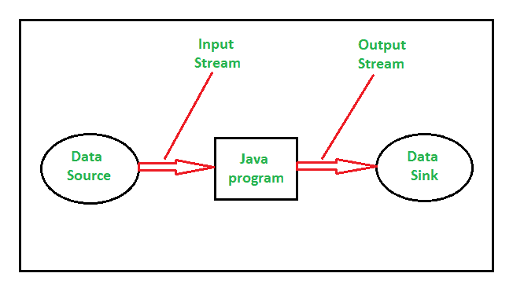
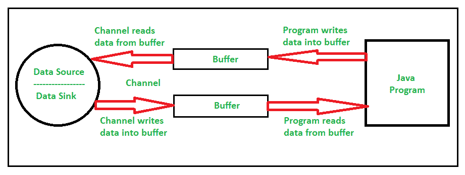

# 【Java IO 和 Java NIO 的区别

> 原文:[https://www . geesforgeks . org/Java-io-和-java-nio 的区别/](https://www.geeksforgeeks.org/difference-between-java-io-and-java-nio/)

**Java IO** (输入/输出)用于执行读写操作。java.io 包包含输入和输出操作所需的所有类。鉴于， **Java NIO** (新 IO)是从 JDK 4 引入的，用于实现高速 IO 操作。它是标准输入输出应用编程接口的替代品。本文将讨论这两个 IO 包之间的区别。

在讨论 java IO 和 Java NIO 之间的区别之前，我们需要了解几个区分两个 I/O 包的关键概念:

1.  <u>**Stream oriented vs Buffer Oriented Packages:**</u>

    Java IO 是一个面向流的包，这意味着它可以一次从流中读取一个或多个字节。它使用一个流在数据源/接收器和 java 程序之间传输数据。这是一种单向数据传输。下图说明了一个面向流的包:

    

    与 Java IO 不同，Java NIO 是一个面向缓冲区的包。这意味着数据被读入一个缓冲区，通过通道对其进行进一步处理。例如，一个线程请求一个通道将数据读入缓冲区，当该通道同时将数据读入缓冲区时，该线程可以进行一些其他工作。一旦数据被读入缓冲区，线程就可以继续处理它在读操作期间留下的工作。因此，NIO 是一种双向数据传输。下图说明了一个面向缓冲区的包:

    

2.  <u>**Blocking IO vs Non Blocking IO Packages:**</u>

    Java IO 是一个阻塞 IO。这意味着，如果一个线程正在调用 read()或 write()操作，该线程将被阻塞，直到有一些数据要读取或数据被完全写入。这就是为什么它是同步 IO 或阻塞 IO。

    与 Java IO 不同，Java NIO 是一种非阻塞 IO。这意味着，如果一个线程正在调用 read()或 write()操作，该线程不会被阻塞，直到有一些数据要读取或者数据被完全写入，而不是线程继续执行其他操作。这就是为什么它是异步 IO 或非阻塞 IO 的原因。

3.  <u>**Channels:**</u>

    通道是实体和缓冲区之间高效数据传输的媒介。它充当与数据源/接收器开放连接的网关。

4.  <u>**Selector:**</u>

    选择器使用单线程在多个输入输出通道中选择通道。

下表说明了 **Java IO** 和 **Java NIO** 的区别:

| Java IO | Java 九 |
| --- | --- |
| Java IO 代表 Java 输入输出 | Java NIO 代表 Java 新输入输出 |
| Java IO 在 java.io 包内部运行 | Java NIO 在 java.nio 包中运行 |
| Java IO 是面向流的 | Java NIO 是面向缓冲区的 |
| 阻塞输入输出操作 | 非阻塞输入输出操作 |
| 频道不可用 | 频道可用 | 它处理数据流 | 它以块的形式处理数据 |
| 不包含选择器的概念 | 包含选择器的概念 |