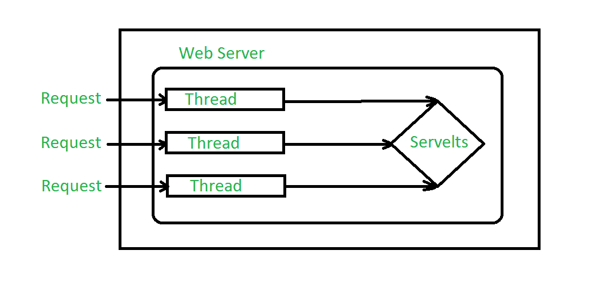
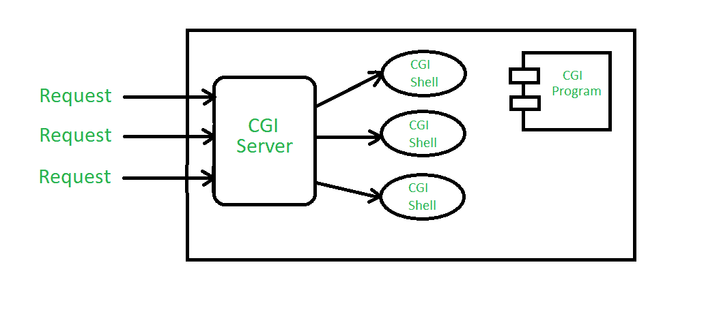

# 【Java Servlet 和 CGI 的区别

> 原文:[https://www . geesforgeks . org/difference-Java-servlet-and-CGI/](https://www.geeksforgeeks.org/difference-between-java-servlet-and-cgi/)

世界已经变成了一个移动优先的时代，但是即使在今天，没有一个应用能像基于网络的应用那样有效。除此之外，执行与移动应用程序相同功能的渐进式网络应用程序也很流行。在本文中，我们将了解基于 web 的应用程序中的两个功能(即 servlets 和 CGI)之间的区别。

**Servlet:** 一个 [servlet](https://www.geeksforgeeks.org/introduction-java-servlets/) 是一个 Java 类，用于扩展托管通过请求-响应模型访问的应用程序的服务器的能力。Servlets 主要用于扩展 web 服务器托管的应用程序，但是，它们也可以响应其他类型的请求。对于这样的应用，特定于 HTTP 的 servlet 类是由 Java Servlet 技术定义的。Servlets 的所有程序都是用 JAVA 编写的，它们可以在 [JAVA 虚拟机](https://www.geeksforgeeks.org/jvm-works-jvm-architecture/)上运行。下图描述了如何借助线程处理来自客户端的请求:

**公共网关接口(CGI):** 公共网关接口(CGI)提供 WWW 服务器与外部数据库和信息源之间的中间件。万维网联盟(W3C)定义了公共网关接口(CGI)，也定义了程序如何与超文本传输协议(HTTP)服务器交互。网络服务器通常将表单信息传递给一个处理数据的小应用程序，并可能发回一条确认消息。这种在服务器和应用程序之间来回传递数据的过程或约定称为公共网关接口(CGI)。下图描述了 web 服务器如何充当 CGI 程序和客户端浏览器之间的中介。

下表解释了 servlet 和 CGI 之间的区别:

<figure class="table">

| 基础 | 小型应用程序 | 公共网关接口 |
| --- | --- | --- |
| 方法 | 它是基于线程的，也就是说，对于每个新的请求，都会创建一个新的线程。 | 它是基于流程的，也就是说，对于每个新的请求，都会创建新的流程。 |
| 使用的语言 | 代码是用 JAVA 编程语言编写的。 | 代码是用任何编程语言编写的。 |
| 面向对象的 | 由于代码是用 Java 编写的，所以它是面向对象的，用户将从 OOPs 中获益 | 因为代码是用任何语言编写的，所以所有的语言都不是面向对象的。因此，用户将无法获得 OOPs 的好处 |
| 轻便 | 它是便携式的。 | 它不是便携式的。 |
| 坚持 | 它会保留在内存中，直到没有被显式销毁。 | 请求完成后，它将从内存中删除。 |
| 服务器独立 | 它可以使用任何网络服务器。 | 它可以使用支持它的网络服务器。 |
| 数据共享 | 数据共享是可能的。 | 数据共享是不可能的。 |
| 环 | 它直接链接到服务器。 | 它不直接链接到服务器。 |
| HTTP 服务器 | 它可以读取和设置 HTTP 服务器。 | 它既不能读取也不能设置 HTTP 服务器。 |
| 费用 | 新线的构建和破坏并不昂贵。 | 建造和破坏新工艺的成本很高。 |

</figure>