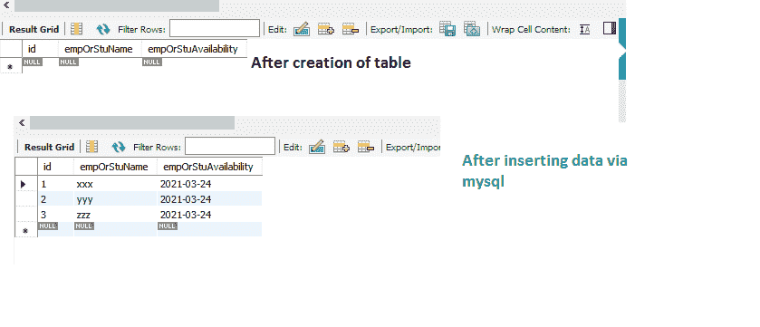
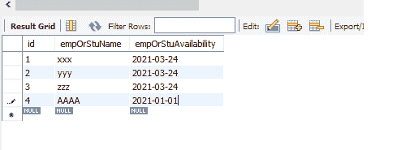
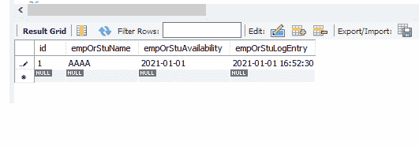
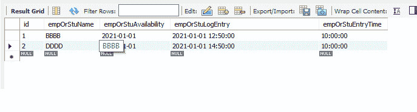
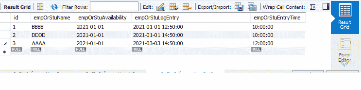

# Java 中 java.sql.Time、java.sql.Timestamp 和 java.sql.Date 的区别

> 原文:[https://www . geesforgeks . org/Java-SQL-time-Java-SQL-timestamp-and-Java-SQL-date-in-Java/](https://www.geeksforgeeks.org/difference-between-java-sql-time-java-sql-timestamp-and-java-sql-date-in-java/)

在软件项目中，我们在许多情况下使用 java.sql.Time、java.sql.Timestamp 和 java.sql.Date。每当 java 应用程序与数据库交互时，我们应该使用这些来代替 java.util.Date。原因是 JDBC，即 java 数据库连接使用这些来标识 SQL Date 和 Timestamp。

这里让我们通过几个例子来看看这三者之间的区别以及它们的用法:

<figure class="table">

| **java.sql.Time** | **java.sql.Timestamp** | Java . SQL . date |
| --- | --- | --- |
| 存储小时、分钟。光是几秒和几毫秒。不存储日期组件，因此不适合表示 SQL 时间

 | 存储日期和时间组件 | 独自储存年、月、日。不存储时间成分，因此不适合表示 SQL 日期 |
| 这是依赖和扩展 java.util.Date 的 | 这是依赖的，并且扩展了 java.util.Date | 这是独立的，不扩展 java.util.Date |
| 由于没有日期信息，日期信息被规范化，可以设置为 0 以确认 ANSI SQL DATE | 因为同时具有日期和时间，所以明确地给出了它们 | 由于没有时间信息，时间信息被规范化，可以设置为 0 来确认 ANSI SQL 时间 |
| 需要有两列，一列用于 java.sql.Date，另一列用于 java.sql.Time。 | 与 java.util.Date 相比，由于它没有通过日期和时间信息存储纳秒级的细节，因此在 java.sql.Timestamp 和 java.util.Date 之间的 equals 方法只返回 false。只有一列足以同时包含日期和时间。纳秒级的差异在很多场景中有很大的帮助来自 Java，setTimestamp()方法用于设置时间戳如果我们使用时间戳作为数据类型，使用 DATE()函数，我们可以单独提取日期，而使用 TIME()函数，我们可以单独提取时间。 | 需要有 2 列一个为 java.sql.Date 和 java.sql.Time 显式来自 java，setDate()方法用于设置日期。 |
| 只是想知道动作发生的时间值。即学生在任何一天的那个时间是否有空等。, | 这是最大的优势。在 Java 中，我们可以编写下面的查询，并分别获得日期和时间部分，如下所示:–约会从<tablename>中选择日期(<columnname>)</columnname></tablename>-为了争取时间从<tablename>中选择时间(<columnname>)</columnname></tablename>对于日志条目，为了了解事务计时的绝对值，我们可以使用时间戳

 | 只是想知道动作发生的日期值。即当天学生是否有空 |

</figure>

人们可以认为，由于 java.sql.Timestamp 可以满足存储日期和时间的要求，那么拥有 java.sql.Date 和 java.sql.Time 的需求是什么呢

**示例 1:** 在学校、学院、工作场所，要想知道学生/员工在某一天是否有空，只保留 java.sql.Date 就足够了

> 例:员工 XX 在特定日期是否有空(或)
> 
> 学生向学校赠送礼物等。,
> 
> 因此，一般来说，我们可能会有一个像(让我们签入 MySQL)这样的表
> 
> //这里的 empOrStuInformation 是表的名称
> 
> 创建表商场信息
> 
> （
> 
> 自动递增主键，
> 
> empOrStuName varchar（20），
> 
> **临时可用性日期**
> 
> );

**插入查询:**

```java
insert into empOrStuInformation(empOrStuName,empOrStuAvailability) values('xxx',now());
insert into empOrStuInformation(empOrStuName,empOrStuAvailability) values('yyy',now()); 
insert into empOrStuInformation(empOrStuName,empOrStuAvailability) values('zzz',now());
```

*now()以字符串形式返回配置时区中的当前日期和时间，但是由于我们使用 date 作为数据类型，所以我们只得到 DATE 作为插入值。*

**输出:**



## Java 语言(一种计算机语言，尤用于创建网站)

```java
import java.sql.Date;
public class GFG {
    public static void main(String[] args)
    {
        String empOrStuAvailableDate = "2021-01-01";
        Date utilAvailabilityDate
            = new SimpleDateFormat("yyyy-MM-dd")
                  .parse(empOrStuAvailableDate);
        // jdbc connectivity expects java.sql.Date
        java.sql.Date sqlAvailabilityDate
            = new java.sql.Date(
                utilAvailabilityDate.getTime());

        try {
            Class.forName("com.mysql.jdbc.Driver");

            // Here test is the databasename
            // username is root and password is root
            Connection con = DriverManager.getConnection(
                "jdbc:mysql://localhost:3306/test", "root",
                "root");

            PreparedStatement pStmt = con.prepareStatement(
                "insert into empOrStuInformation (empOrStuName,empOrStuAvailability) values(?,?)");

            // As we are using Date datatype, we are using
            // setDate only...
            pStmt.setString(1, "AAAA");

            // The setDate() method is used to set date
            // while setTimestamp() is used to set time.
            pStmt.setDate(2, sqlAvailabilityDate);
            pStmt.executeUpdate();
            pStmt.close();
            con.close();
        }
        catch (Exception ex) {
            System.out.println(ex);
        }
    }
}
```

**输出:**



### **java.sql.Timestamp:**

java.sql.Timestamp 列对于记录条目非常有帮助。学生/员工什么时候到达场所并离开场所，什么时候移交记录，什么时候完成工作，等等。,

在 Mysql 中，通过下面的方式，我们可以为包含时间戳的列创建表。

> 创建表商场信息 1
> 
> （
> 
> 自动递增主键，
> 
> empOrStuName varchar（20），
> 
> empOrStuAvailability DATE，
> 
> **暴发户时间戳**
> 
> );

## Java 语言(一种计算机语言，尤用于创建网站)

```java
import java.sql.Date;
import java.sql.Timestamp;
public class GFG {
    public static void main(String[] args)
    {
        String empOrStuAvailableDate = "2021-01-01";
        Date utilAvailabilityDate
            = new SimpleDateFormat("yyyy-MM-dd")
                  .parse(empOrStuAvailableDate);

        // jdbc connectivity expects java.sql.Date
        java.sql.Date sqlAvailabilityDate
            = new java.sql.Date(
                utilAvailabilityDate.getTime());

        // create a java timestamp object that represents
        // the current time (i.e., a "current timestamp")
        Calendar calendarInstance = Calendar.getInstance();

        java.sql.Timestamp sampleJavaTimestampObject
            = new java.sql.Timestamp(
                calendarInstance.getTime().getTime());
        try {
            Class.forName("com.mysql.jdbc.Driver");

            // Here test is the databasename
            // username is root and password is root
            Connection con = DriverManager.getConnection(
                "jdbc:mysql://localhost:3306/test", "root",
                "root");

            PreparedStatement pStmt = con.prepareStatement(
                "insert into empOrStuInformation1 (empOrStuName,empOrStuAvailability,empOrStuLogEntry) values(?,?,?)");

            // As we are using Date datatype, we are using
            // setDate only...
            pStmt.setString(1, "AAAA");

            // The setDate() method is used to set date
            pStmt.setDate(2, sqlAvailabilityDate);

            // setTimestamp() is used to set time.
            pStmt.setTimestamp(3,
                               sampleJavaTimestampObject);
            pStmt.executeUpdate();
            pStmt.close();
            con.close();
        }
        catch (Exception ex) {
            System.out.println(ex);
        }
    }
}
```

**输出:**



拥有**时间戳**的一个**优势是:**

1.  如果我们想得到**日期**，那么我们可以写为**从商场信息 1** 中选择日期(商场日志条目)
2.  如果我们想得到**时间**，那么我们可以写为**从商场信息 1** 中选择时间(商场日志条目)

### **java.sql.TIME**

> 创建表商场信息 2
> 
> （
> 
> 自动递增主键，
> 
> empOrStuName varchar（20），
> 
> empOrStuAvailability DATE，
> 
> backuplogntry timestamp(时间戳)，
> 
> 外卖时间 Time
> 
> );

**通过 mysql 插入语句:**

> INSERT INTO ` test ` . ` emprostuinformation 2 `(` id `、` empOrStuName `、` empOrStuAvailability `、` emprostulogentrytime `)VALUES(' 1 '，' BBBB '，' 2021-01-01 '，' 2021-01-01 12:50:00 '，' 10:00:00 ')；
> 
> INSERT INTO ` test ` . ` emprostuinformation 2 `(` id `、` empOrStuName `、` empOrStuAvailability `、` emprostulogentrytime `)VALUES(' 2 '，' DDDD '，' 2021-01-01 '，' 2021-01-01 14:50:00 '，' 10:00:00 ')；

**输出:**



## Java 语言(一种计算机语言，尤用于创建网站)

```java
import java.sql.Date;
import java.sql.Time;
import java.sql.Timestamp;
public class GFG {
    public static void main(String[] args)
    {
        String empOrStuAvailableDate = "2021-01-01";
        Date utilAvailabilityDate
            = new SimpleDateFormat("yyyy-MM-dd")
                  .parse(empOrStuAvailableDate);
        // jdbc connectivity expects java.sql.Date
        java.sql.Date sqlAvailabilityDate
            = new java.sql.Date(
                utilAvailabilityDate.getTime());

        // create a java timestamp object that represents
        // the current time (i.e., a "current timestamp")
        Calendar calendarInstance = Calendar.getInstance();
        java.sql.Timestamp sampleJavaTimestampObject
            = new java.sql.Timestamp(
                calendarInstance.getTime().getTime());
        try {

            Class.forName("com.mysql.jdbc.Driver");

            // Here test is the databasename
            // username is root and password is root
            Connection con = DriverManager.getConnection(
                "jdbc:mysql://localhost:3306/test", "root",
                "root");

            // Instantiating the Time class
            Time entryTime = new Time(0L);

            // Setting time
            entryTime.setTime(
                new java.util.Date().getTime());
            PreparedStatement pStmt = con.prepareStatement(
                "insert into empOrStuInformation2(empOrStuName,empOrStuAvailability,empOrStuLogEntry,empOrStuEntryTime) values(?,?,?,?)");

            pStmt.setString(1, "AAAA");

            // The setDate() method is used to set date
            pStmt.setDate(2, sqlAvailabilityDate);

            // setTimestamp() is used to set timestamp.
            pStmt.setTimestamp(3, sampleJavaTimestampObject);

            // setTime() is used to set time.
            pStmt.setTime(4, entryTime);

            pStmt.executeUpdate();
            pStmt.close();
            con.close();
        }
        catch (Exception ex) {
            System.out.println(ex);
        }
    }
}
```

**输出:**



**结论:**

根据要求，所有 3 个功能都是有帮助的。日期->用于记录事件的发生、进入、退出等。，没有考虑确切的时间。Java.sql.Time ->为了保持报警类型的功能而不考虑日期，Java.sql.Timestamp->为了完美地记录条目，将非常有助于发现表中出现的每个条目的性质，因此在恢复的情况下非常有帮助。使用日期()和时间()函数，我们可以显式地将日期部分和时间部分分开。