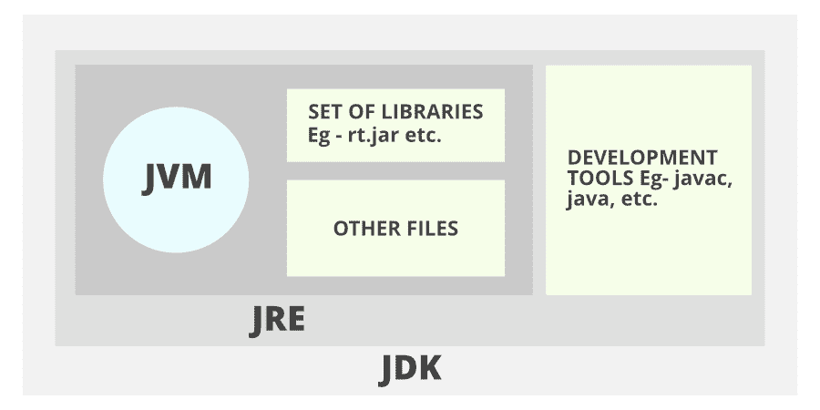
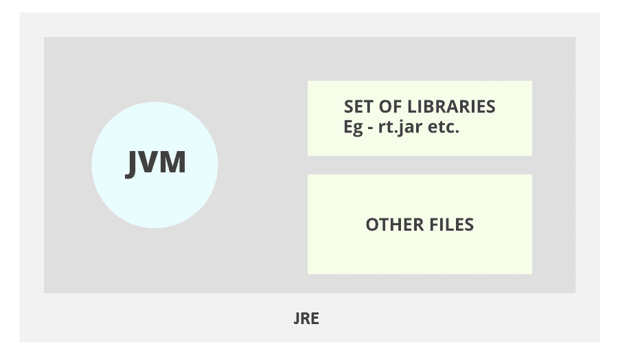
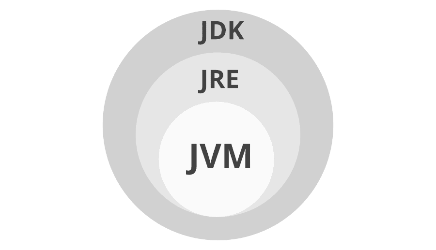

# Java 中 JDK 和 JRE 的区别

> 原文:[https://www . geesforgeks . org/Java 中-JDK-和-JRE-的区别/](https://www.geeksforgeeks.org/difference-between-jdk-and-jre-in-java/)

JDK 和JRE 是 Java 编程中的核心概念，它们的区别是一些最受欢迎的面试问题。我们在编程时不会使用这些概念，但是如果我们想成为一名 Java 开发人员，我们必须了解这些概念。

### **JDK**

JDK 代表 Java 开发工具包。它是一个用于开发 Java 应用程序和小程序的软件开发环境。它是一个特定于平台的软件，也就是说，有单独的安装程序用于 Windows、Mac 和 Unix 系统。Java 开发人员可以在他们的 Windows、macOS、Solaris 和 Linux 上使用它来编码和运行 Java 程序。它包含 Java 运行时环境(JRE) 和其他开发工具，如解释器、编译器、归档器和文档生成器。我们可以在同一台计算机上安装多个 JDK 版本。

### **JRE**

JRE 代表 Java 运行时环境。是 JVM (Java 虚拟机)的实现，是专门为提供执行 Java 程序的环境而设计的。它也像 JDK 一样依赖平台。它由 JVM、Java 二进制文件和其他类组成，用于程序的顺利执行。它不包含任何开发工具，如编译器、调试器等。如果我们只想执行一个程序，我们只需要安装 JRE 而不是 JDK，因为不需要开发或编译所需的代码。

让我们借助下图来看看主要区别:

### JDK 和 JRE 的区别

<figure class="table">

| **键** | **JDK** | **JRE** |
| --- | --- | --- |
| 定义 | JDK(Java 开发工具包)用于开发 Java 应用程序。JDK 还包含许多开发工具，如编译器、调试器等。 | JRE(Java 运行时环境)是 JVM(Java 虚拟机)的实现，它是专门为执行 Java 程序而设计的。 |
| 功能 | 它主要用于代码的执行，主要功能是开发。 | 它主要用于创建代码执行环境。 |
| 平台的依赖性 | 它依赖于平台。 | 它也像 JDK 一样依赖平台。 |
| 工具类型 | 由于 JDK 负责开发目的，因此它包含开发和调试目的所需的工具。 | 另一方面，JRE 不负责开发，所以它不包含编译器、调试器等工具。相反，它包含执行程序所需的类库和支持文件。 |
| JDK 和联合呼吁程序的实施 | JDK = JRE +其他开发工具。 | JRE = JVM +其他类库。 |

</figure>