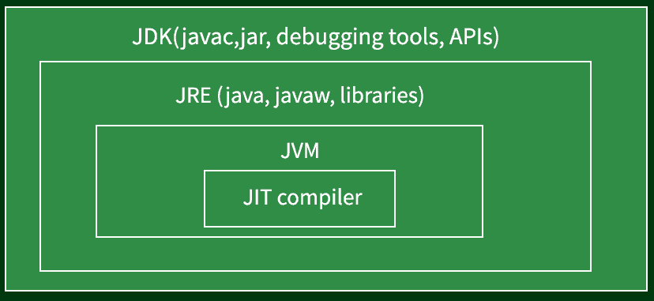

# Java 中 JIT 和 JVM 的区别

> 原文:[https://www . geesforgeks . org/Java 中 jit 和 jvm 的区别/](https://www.geeksforgeeks.org/difference-between-jit-and-jvm-in-java/)

[*Java 虚拟机* (JVM)](https://www.geeksforgeeks.org/jvm-works-jvm-architecture/) 用于 Java 运行时环境(JRE)。最初的 JVM 被认为是一个字节码解释器。由于性能问题，这可能有点出乎意料。许多现代语言都意味着被编译成特定于中央处理器的可执行代码。然而，JVM 执行 Java 程序的事实有助于解决与基于网络的应用程序相关的主要问题。

JVM 执行 Java 程序的事实也有助于使它变得稳定。由于 JVM 是负责的，程序执行由它控制。因此，JVM 可以构建一个有限的执行区域，称为包含软件的沙箱，防止系统获得无限的访问权限。Java 语言中存在的一些限制也改善了保护。Java 的 JVM 架构包括类加载器、执行引擎、内存字段等。

为了理解差异，让我们通过举例说明 JVM 的工作来深入了解组件。

*   [**类加载器**](https://www.geeksforgeeks.org/classloader-in-java/) **:** 类加载器的目的是加载类文件。它有助于完成三个主要功能:加载、初始化和链接。
*   [**JVM 语言栈**](https://www.geeksforgeeks.org/java-virtual-machine-jvm-stack-area/) **:** Java 内存存储局部变量和一次计算的部分结果。每个线程都有自己的 JVM 堆栈，在创建线程时创建。调用方法时，会创建一个新框架，然后将其移除。
*   **方法区:** JVM 方法区专门存储 Java 应用程序的元数据和代码隐藏文件。
*   **PC 寄存器:**当前正在执行的 Java 虚拟机指令地址由 PC 寄存器保存。Java 中的每个线程都有自己独立的 PC 寄存器。
*   **堆:**堆中保存了所有对象、数组和实例变量。该内存由几个线程共享。
*   **执行引擎:**它是一种用于测试软件、硬件或完整系统的软件形式。测试执行引擎从不携带任何关于被测试产品的信息。
*   **原生方法库**是执行引擎需要的原生库(C，C++)，作为编程框架的原生方法接口是原生方法接口。这使得在 JVM 中运行的 Java 代码能够调用库和本机应用程序。此外，根据本机库，本机方法堆栈有一个本机代码命令。它将存储分配给本机堆或使用任何堆栈类型。

[**【准时制】编译器**](https://www.geeksforgeeks.org/just-in-time-compiler/)

虽然 Java 是作为一种解释语言开发的，但为了提高性能，Java 没有任何东西阻止[字节码](https://www.geeksforgeeks.org/generate-byte-code-file-python/)动态编译成本机代码。因此，在 Java 最初发布后不久，HotSpot JVM 就发布了。HotSpot 中包含了一个即时(JIT)字节码编译器。实时编译器是 JVM 的一部分，在逐段需求的基础上，字节码的选定部分被实时编译成可执行代码。也就是说，在执行过程中，JIT 编译器编译代码是必要的。此外，并不是所有的字节码序列都被编译，只有那些将从编译中受益的字节码序列被编译。然而，准时制方法仍然大大提高了效率。即使动态编译应用于字节码，可移植性和安全性功能仍然存在，因为 JVM 仍然控制着执行环境。

为了理解差异，让我们通过举例说明 JIT 的工作来深入了解组件。

解释字节码，JVM 的标准实现减缓了程序的执行。JIT 编译器在运行时与 JVM 交互，以提高性能，并将适当的字节码序列编译成本机机器代码。

硬件正在解释代码，而不是 JVM (Java 虚拟机)。这可以提高执行速度。这可以通过每个文件、每个函数或者任意代码片段来完成；代码通常在接近执行时被编译(因此得名“及时”)，然后缓存并在以后重用，而不必重新编译。它执行许多优化:数据分析、从堆栈操作到注册表操作的转换、通过注册表分配减少内存访问、消除公共子表达式。

因此，根据上述知识，我们得出了它们之间的结论性差异，如下表所示:

<figure class="table">

| 

**JVM**

 | 

**准时制**

 |
| --- | --- |
| JVM 代表 Java 虚拟机。 | JIT 代表及时编译。 |
| 引入 JVM 是为了管理系统内存，并为基于 Java 的应用程序提供可移植的执行环境 | JIT 是为了提高 JVM 的性能而发明的，在最初发布多年后。 |
| JVM 由许多其他组件组成，如堆栈区、堆区等。 | JIT 是 JVM 的组件之一。 |
| JVM 将完整的字节码编译成机器代码。 | JIT 只把可重用的字节码编译成机器代码。 |
| JVM 提供了平台独立性。 | JIT 提高了 JVM 的性能。 |

</figure>