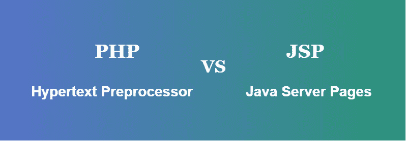

# JSP 和 PHP 的区别

> 原文:[https://www . geesforgeks . org/JSP 和-php 的区别/](https://www.geeksforgeeks.org/difference-between-jsp-and-php/)

JSP 意味着给 PHP 和 ASP 一种类似的编程方式。它基于 Java servlets，需要一个像 Tomcat 这样的 Servlet 持有者服务器来提供将 JSP 转换为可以产生 HTML 的 Servlet 所需的后端准备。在区分 PHP 可以运行在其拥有作为一个 CGI 马达，或作为一个坐标模块在众多的网络服务器。这意味着 PHP 可以更有效地部署在现有的非 Java 框架上，但最终产品是 JSP 最适合 Java 环境。

**[JSP:](https://www.geeksforgeeks.org/introduction-to-jsp/)** JSP 代表 Java Server Pages，JSP 是一种服务器端技术，它在打造一个充满活力的 web 应用程序方面发挥了重要作用。它为构建基于网络的应用程序提供了独立于平台的策略，并用于创建动态网络内容。JSP 采用 Java 编程方言，结合 HTML 句子结构。JSP 是对基于 Java 编程方言的 Servlets 的审议。Java 服务器页面(JSP)可以是一种创新，通过利用 servletss 来控制网页的实质或外观，servlet 是在网页中指示的小程序，并在互联网服务器上运行，以在最近的某个时候调整网页，并将其发送给请求它的客户端。java 的设计者 Sun Microsystems 将 JSP 创新暗指为 Servlet 应用程序接口(API)。JSP 可与微软的动态服务器页面(ASP)创新相媲美。虽然一个 Java 服务器页面调用一个由互联网服务器执行的 Java 程序，但是一个动态服务器页面包含一个脚本，该脚本最近被一个脚本翻译器破译，该页面被发送到客户端。

**JSP 的特点:**

*   它可以标记易于使用和理解的内容。
*   隐式对象减少了代码的长度。
*   它不需要高级的 JAVA 知识。
*   它适用于 JAVA 和非 JAVA 程序员。

**[PHP:](https://www.geeksforgeeks.org/php-introduction/)** PHP 是**超文本预处理器**的缩写，早前被缩写为**个人主页**。它是一种服务器端编程语言。PHP 可能是制作充满活力和直观的网页的有力工具。PHP 是竞争对手(如微软的 ASP)广泛使用、免费且高效的选修课。PHP 可以是一种解释的编程语言，它给出 HTML 代码。PHP 是你看到的邮件或聚会等目的地的幕后工作。PHP 可能是一种广泛使用的通用脚本语言，特别适合网络发展，可以插入到 HTML 中。它还被用作通用编程方言。PHP 代码可以整合到 HTML 代码中，也可以用在网络内容管理框架和一些网络框架中。PHP 在其源代码分散中包含了大量的免费和开源库。它本质上是一个互联网感知框架，内置模块，用于访问 FTP 服务器和大量数据库服务器。

**PHP 的特点:**

*   很容易与数据库连接，从数据库中存储和检索数据。多个数据库也可以与 PHP 集成。
*   与其他编程语言相比，它是最快的编程语言。
*   PHP 框架和工具用于保护 web 应用程序免受外部攻击和安全威胁。
*   PHP 是开源的，所以它的代码对所有程序员都是可见的。

| JSP | 服务器端编程语言（Professional Hypertext Preprocessor 的缩写） |
| --- | --- |
| JSP 需要更多更复杂代码。 | PHP 是基本的，需要更少的代码行。 |
| 服务器端编程技术。 | 拉斯马斯·勒德尔夫制造的服务器端脚本方言。 |
| 具有动态内容的 Web 应用程序。 | 小到中等尺寸的网状物排列。 |
| JSP 促进并不比 PHP 贵多少。 | PHP 便利化非常便宜。 |
| 因为它们被转换成了 Java 类。 | 远不如 JSP 有特色。 |
| 需要像 Tomcat 这样的 Servlet 容器。 | 运行在其拥有作为一个 CGI 电机。 |
| JSP 允许对定制标签进行特征化。 | PHP 不允许自定义标签。 |