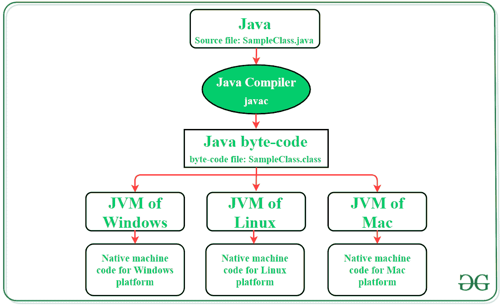

# JVM 和 DVM 的区别

> 原文:[https://www . geesforgeks . org/JVM 和-dvm 之间的差异/](https://www.geeksforgeeks.org/difference-between-jvm-and-dvm/)

[JVM](https://www.geeksforgeeks.org/jvm-works-jvm-architecture/) 是在不同平台上运行 [java](https://www.geeksforgeeks.org/java/) 代码的虚拟机。它充当程序和运行 java 代码的平台之间的抽象层。Java 代码的可移植性仅仅是因为 JVM。 **javac 编译器**转换源代码文件**(。java 文件)**转换成与机器/平台无关的中间 **java 字节码**格式。这个中间文件然后被提供给目标机器/平台，在那里它被翻译成机器代码。JVM 支持多主机架构，这也是 Java 应用被称为 **WORA(写一次运行在任何地方)**的原因。

### 达尔维克虚拟机

[DVM](https://www.geeksforgeeks.org/what-is-dvmdalvik-virtual-machine/) 是执行[安卓](https://www.geeksforgeeks.org/kotlin-android-tutorial/)应用的虚拟机。Java 字节码**(。javac 编译器生成的类文件)**转换为 **Dalvik 字节码**使应用源文件在 DVM 上可执行。由于安卓设备具有确定的处理能力、内存和电池寿命，因此 DVM 设计原则旨在优化自身，以便即使在低内存/低功耗设备上也能快速加载并平稳运行。该虚拟机在同一设备上运行多个实例时非常高效。

## 差异表

<figure class="table">

| 

Java 虚拟机

 | 

达尔维克虚拟机

 |
| --- | --- |
| 基于堆栈的虚拟机，通过推入和弹出操作数执行算术和逻辑运算。操作结果存储在堆栈内存中。 | 基于寄存器的虚拟机，使用位于中央处理器中的寄存器来执行算术和逻辑运算。 |
| Java 源代码被编译成 Java 字节码格式(。类文件)进一步翻译成机器代码。 | 源代码文件首先像 JVM 一样编译成 Java 字节码格式。此外， **DEX 编译器(dx 工具)**将 Java 字节码转换为 Dalvik 字节码(classes.dex)文件，该文件将用于创建**。apk 文件**。 |
| 虚拟机需要更多信息来进行数据加载和操作，以及堆栈数据结构中的方法加载。 | 指令大小更大，因为它需要对虚拟机的源寄存器和目标寄存器进行编码。 |
| 编译后的字节码大小很紧凑，因为操作数的位置隐含在操作数堆栈上。 | 编译后的字节码更大，因为每条指令都需要所有隐式操作数。 |
| 设备的可执行文件是**。jar 文件**。 | 设备的可执行文件是**。apk 文件**。 |
| JVM 的单个实例配置有共享的进程和内存空间，以便运行所有部署的应用程序。 | 该设备运行多个 DVM 实例，在共享内存空间中有一个单独的进程来部署每个应用程序的代码。 |
| 支持多种操作系统，如 Linux、Windows 和 Mac OS。 | 只支持安卓操作系统。 |

</figure>

> **注:**谷歌在 2014 年推出了一款新的安卓应用虚拟机，名为**安卓运行时(ART)** 。它旨在提高应用程序性能并减少设备电池使用。DVM 最后一个支持的版本是安卓 4.4(Kitkat)。