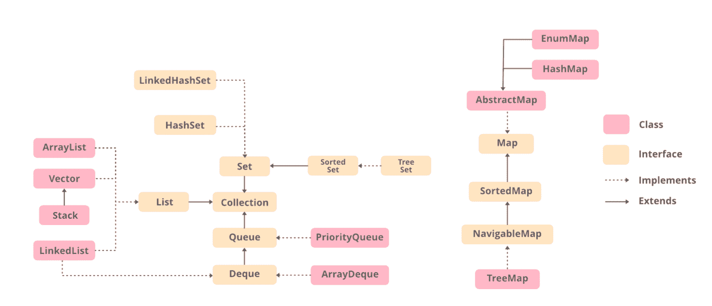

# Java 中列表和数组列表的区别

> 原文:[https://www . geesforgeks . org/Java 中列表和数组列表的区别/](https://www.geeksforgeeks.org/difference-between-list-and-arraylist-in-java/)

集合是表示为单个单元的一组单个对象。Java 提供了[集合框架](https://www.geeksforgeeks.org/collections-in-java-2/)，该框架定义了几个类和接口，将一组对象表示为一个单元。该框架由列表接口和数组列表类组成。本文讨论了列表和数组列表的区别。


[**列表**](https://www.geeksforgeeks.org/list-interface-java-examples/) 是[集合](https://www.geeksforgeeks.org/collections-in-java-2/)的子[界面](https://www.geeksforgeeks.org/interfaces-in-java/)。它是对象的有序集合，其中可以存储重复的值。因为列表保留了插入顺序，所以它允许元素的位置访问和插入。列表接口由[数组列表](https://www.geeksforgeeks.org/arraylist-in-java/)、[链表](https://www.geeksforgeeks.org/linked-list-in-java/)、[向量](https://www.geeksforgeeks.org/java-util-vector-class-java/)、[栈](https://www.geeksforgeeks.org/stack-class-in-java/)的[类实现。List 是一个接口，List 的实例可以通过实现各种类来创建。](https://www.geeksforgeeks.org/classes-objects-java/)

极客如果上面所说的听起来令人困惑，那么请参考下图，在实现列表界面之前，您可以很容易地发现由类组成的层次结构和列表界面。



**例**

## Java 语言(一种计算机语言，尤用于创建网站)

```
// Java program to demonstrate the
// working of a List with ArrayList
// class

// Importing all utility classes
import java.util.*;

// Main class
public class GFG {

    // Main driver method
    public static void main(String[] args)
    {
        // Creating an object of List class
          // Declaring an object of String type with
        // reference to ArrayList class
        // Type safe list
        List<String> al = new ArrayList<String>();

        // Adding elements using add() method
        // Custom input elements
        al.add("Geeks");
        al.add("for");
        al.add("Geeks");

        // Print and display the elements in
        // ArrayList class object
        System.out.println(al);
    }
}
```

**Output**

```
[Geeks, for, Geeks]
```

现在讨论 java 中 ArrayList 的下一个概念。所以 ArrayList 基本上是集合框架的一部分，并且存在于 java.util 包中。它为我们提供了 Java 中的动态数组。这个类实现了列表接口。与列表类似，如果从集合中移除对象，则当集合增大或缩小时，数组列表的大小会自动增大。Java ArrayList 允许我们随机访问列表。ArrayList 不能用于基本类型，如 int、char 等。对于这种情况，我们需要一个[包装类](https://www.geeksforgeeks.org/wrapper-classes-java/)。下面是一个演示数组列表实现的例子。

**语法:**

```
new ArrayList();
```

这只是在堆内存中创建新内存。为了访问对象，我们需要一个引用变量，因为这是面向对象编程中的一个经验法则。

```
ArrayList obj = new ArrayList();
```

到目前为止，我们只创建了一个对象，但是没有定义数组列表对象中会有什么类型的元素。所以像往常一样，我们将使用标识符来传递字符串类型、整数类型、两者或一些其他类型。如下图所示。

```
ArrayList<Integer> obj = new ArrayList<>();
ArrayList<String> obj = new ArrayList<>();
```

> **注意:**在向数组列表添加元素时，如果我们确实在一个索引处添加了元素，比如“I”，那么在我们的数组列表中，所有元素都向右移动，在添加之前位于“I”的前一个元素现在将位于“i+1”索引处。它不会像我们在阵列中看到的那样被取代。

到目前为止，我们已经通过对语法的上述理解，了解了声明以及如何初始化一个列表，现在让我们在程序中实现同样的东西，以获得更好的理解。

**示例:**

## Java 语言(一种计算机语言，尤用于创建网站)

```
// Java Program to Demonstrate
// Working of an ArrayList class

// Importing all classes from java.util package
import java.util.*;

// Main class
class GFG {

    // Main driver method
    public static void main(String[] args)
    {
        // Creating an ArrayList of String type
        // Type safe ArrayList
        ArrayList<String> al = new ArrayList<String>();

        // Adding elements to above object created
        // Custom input elements
        al.add("Geeks");
        al.add("for");
        al.add("Geeks");

        // Print and display the elements of ArrayList
        System.out.println(al);

        // adding element at index where
        // element is already present
        al.add(1, "Hi");

        // Print and display the elements of ArrayList
        System.out.println(al);
    }
}
```

**Output**

```
[Geeks, for, Geeks]
[Geeks, Hi, for, Geeks]
```

现在让我们来讨论一下 java 中两个类之间的区别，如上所述，它们是 List 类和 ArrayList 类，下面以表格形式显示如下，以便于理解。

### Java 中的列表与数组列表

<figure class="table">

| 目录 | 数组列表 |
| --- | --- |
| 列表是一个界面 | 数组列表是一个类 |
| 列表接口扩展了集合框架 | 数组列表扩展了抽象列表类并实现了列表接口 |
| 列表无法实例化。 | 数组列表可以被实例化。 |
| 列表接口用于创建与其索引号相关联的元素(对象)列表。 | ArrayList 类用于创建包含对象的动态数组。 |
| 列表接口创建存储在序列中的元素集合，并使用索引来标识和访问这些元素。 | 数组列表创建一个对象数组，该数组可以动态增长。 |

</figure>