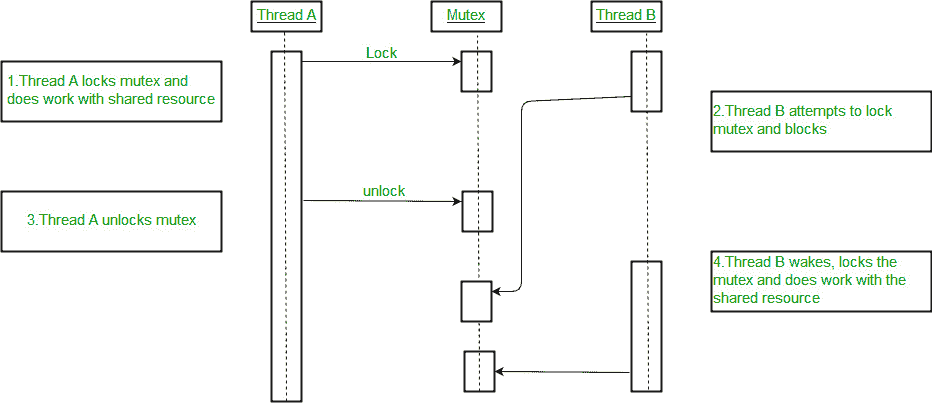
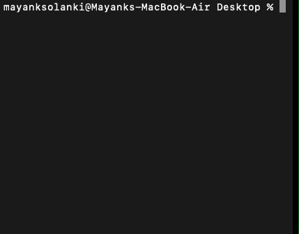

# Java 并发中锁和监控的区别

> 原文:[https://www . geesforgeks . org/Java 中锁和监视器的区别-并发/](https://www.geeksforgeeks.org/difference-between-lock-and-monitor-in-java-concurrency/)

Java Concurrency 主要处理[多线程](https://www.geeksforgeeks.org/multithreading-in-java/)等概念以及其他并发操作。这样做是为了确保最大限度和有效地利用中央处理器的性能，从而减少其空闲时间。在监视器开始使用之前，锁就已经存在来实现多线程。那时，锁(或互斥体)是程序内部线程的一部分，它们使用标志机制与其他线程同步。它们一直作为一种工具来提供对资源和共享对象的同步访问控制。随着进一步的发展，监视器的使用开始作为一种处理访问和协调线程的机制，这在面向对象程序中被证明是更有效、无错误和兼容的。在我们继续寻找两者之间的差异之前，让我们仔细研究一下它们。

**锁定(或互斥)概述**

锁最初用于线程的逻辑部分，用于提供线程之间的同步访问控制。线程通过附加到对象的标志来检查对共享对象的访问控制的可用性，该标志指示共享资源是空闲(未锁定)还是繁忙(锁定)。现在并发应用编程接口支持在 java 中使用锁接口显式使用锁。与使用监视器隐式实现锁相比，显式方法具有更好的控制机制。在我们继续讨论监视器之前，让我们看一个演示基本锁功能的插图。



**监视器–概述**

[Java 中的 Monitor](https://www.geeksforgeeks.org/monitors-in-process-synchronization/)Concurrency 是一种同步机制，它提供了多线程的基本要求，即各种线程之间的互斥和在共同任务中工作的线程之间的协作。监视器基本上“监视”线程间共享资源和对象的访问控制。使用这种结构，一次只有一个线程获得对资源关键部分的访问控制，而其他线程被阻塞并被迫等待，直到某些条件出现。在 Java 中，监视器是使用 [synchronized](https://www.geeksforgeeks.org/synchronized-in-java/) 关键字(同步块、同步方法或类)实现的。例如，让我们看看两个线程 t1 和 t2 是如何同步使用共享数据打印机对象的。

## Java 语言(一种计算机语言，尤用于创建网站)

```java
// Java Program to Illustrate Monitoe in Java Concurrency

// Importing input output classes
import java.io.*;

// Class 1
// Helepr class
class SharedDataPrinter {

    // Monitor implementation is carried on by
    // Using synchronous method

    // Method (synchronised)
    synchronized public void display(String str)
    {

        for (int i = 0; i < str.length(); i++) {
            System.out.print(str.charAt(i));

            // Try-catch bloc kfor exceptions as we are
            // using sleep() method
            try {

                // Making thread to sleep for very
                // nanoseconds as passed in the arguments
                Thread.sleep(100);
            }
            catch (Exception e) {
            }
        }
    }
}

// Class 2
// Helper class extending the Thread class
class Thread1 extends Thread {

    SharedDataPrinter p;

    // Thread
    public Thread1(SharedDataPrinter p)
    {

        // This keyword refers to current instance itself
        this.p = p;
    }

    // run() method for this thread invoked as
    // start() method is called in the main() method
    public void run()
    {

        // Print statement
        p.display("Geeks");
    }
}

// Class 2 (similar to class 1)
// Helper class extending the Thread class
class Thread2 extends Thread {

    SharedDataPrinter p;

    public Thread2(SharedDataPrinter p) { this.p = p; }

    public void run()
    {

        // Print statement
        p.display(" for Geeks");
    }
}

// Class 3
// Main class
class GFG {

    // Main driver method
    public static void main(String[] args)
    {

        // Instance of a shared resource used to print
        // strings (single character at a time)
        SharedDataPrinter printer = new SharedDataPrinter();

        // Thread objects sharing data printer
        Thread1 t1 = new Thread1(printer);
        Thread2 t2 = new Thread2(printer);

        // Calling start methods for both threads
        // using the start() method
        t1.start();
        t2.start();
    }
}
```

**输出:**



最后，在文章的结尾，让我们讨论一下 java 中[并发中的锁和监视器之间的主要区别，如下图所示:](https://www.geeksforgeeks.org/different-approaches-to-concurrent-programming-in-java/)

<figure class="table">

| 

**锁定(互斥)**

 | 

**监控**

 |
| --- | --- |
| 自从多线程概念诞生以来就一直在使用。 | 随着该领域后来的发展而出现。 |
| 通常以有助于实现协调的数据字段或标志的形式。 | 同步性是通过构造机制实现的。类似的 |
| 关键部分(对共享对象的锁定/解锁功能和其他操作)是线程本身的一部分。 | 类似的同步锁定/解锁机制以及操作功能(如读/写)只存在于共享对象中。 |
| 实现互斥(一个线程的执行阻止了其他线程的执行)和协作(执行一个共同任务的线程)是线程的责任。 | 不同线程集之间的互斥和协作(如果需要)都由共享资源本身处理。 |
| 松散链接的机制，因为所有线程都是独立的，并且在访问控制中自己处理它们的同步。 | 该机制非常健壮和可靠，因为一切都只在资源端管理。 |
| 当锁定时间和使用线程同步操作时间片的构造机制具有可比性时，这种方法很容易出错。很有可能一个线程锁定了它的时间片，而另一个线程开始处理资源。 | 监视器被很好地设计成与小线程池一起工作，并且非常有效地执行，除非线程间通信成为必需。 |
| 就绪队列或线程池要么不存在，要么由操作系统处理。 | 线程在队列中等待，队列由它们都试图访问控制的共享对象管理。 |
| 锁独立使用的情况不多，实现的范围也不广。 | 监视器本质上只使用线程间锁，并且使用得更多。 |

</figure>

> **注:**
> 
> 正如我们所看到的，监视器本身是在锁的必要支持下实现的，人们常说它们不是不同的，而是在它们运行的本质上是互补的