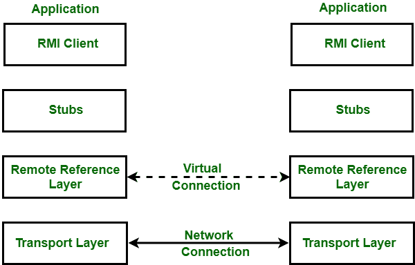
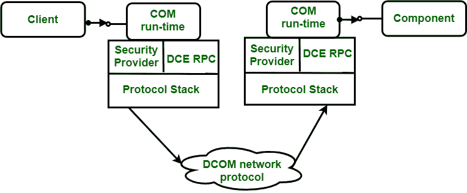

# RMI 和 DCOM 的区别

> 原文:[https://www . geesforgeks . org/difference-RMI-and-DCOM/](https://www.geeksforgeeks.org/difference-between-rmi-and-dcom/)

在本文中，我们将看到[远程方法调用](https://www.geeksforgeeks.org/remote-method-invocation-in-java/) (RMI)和[分布式组件对象模型](https://www.geeksforgeeks.org/distributed-component-object-model-dcom/) (DCOM)之间的区别。在讨论这些差异之前，让我们先了解它们各自的真正含义。

**RMI** 应用程序提供两个独立的程序，一个服务器和一个客户端。服务器程序执行一些任务，即创建一些远程对象，引用对象，以及等待客户端调用这些对象上的方法。客户端获取对服务器上一个或多个远程对象的远程引用，并调用这些对象上的方法。基本上，RMI 提供了一种机制，通过这种机制，服务器和客户端可以相互通信和传递信息。马绍尔群岛由三层组成:

*   存根/骨架层
*   远程参考层
*   传输层

这些层之间的关系如下图所示:

**DCOM** 是微软的分布式计算解决方案。它允许一个客户端应用程序远程启动另一台机器上的 DCOM 服务器对象并调用其方法。它提供了语言独立性、使用 TCP/IP、UDP、IP、IPX/SPX 进行通信的能力，以及对象的 HTTP 和静态/动态调用。它最适合面向微软产品的环境。它包括以下功能:

*   定位和加载远程类。
*   定位远程对象并提供对它们的引用。
*   启用远程方法调用。

下表描述了差异:

<figure class="table">

| 

无线电磁指示器（Radio Magnetic Indicator 的缩写）

 | 

DCOM

 |
| --- | --- |
| 在 RMI 中，每个服务器对象都实现了 java.rmi.Remote 接口。 | 在 DCOM，每个物体都实现了我所知道的。 |
| 它使用 JRMP 作为其底层远程处理协议。 | 它使用对象远程过程调用作为其底层远程处理协议。 |
| 对象名到其实现的映射由 RMIRegistry 处理。 | 对象名到其实现的映射由注册表处理。 |
| 定位对象实现的责任落在了 JVM 身上。 | 定位对象实现的责任落在服务器控制管理上。 |

</figure>