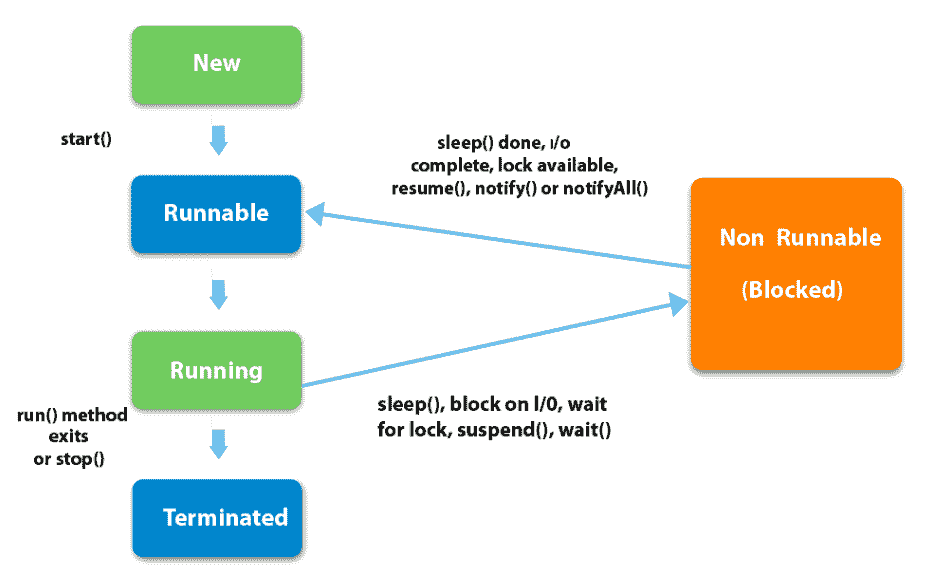

# Java 中线程运行状态和可运行状态的区别

> 原文:[https://www . geeksforgeeks . org/Java 中线程运行状态和可运行状态的区别/](https://www.geeksforgeeks.org/difference-between-running-and-runnable-states-of-a-thread-in-java/)

线程是 java 多线程的支柱。多线程是一种允许程序的两个或多个部分同时执行的功能，以最大限度地利用 CPU。这样一个程序的每个部分都被称为一个线程**。**所以线程是进程内的轻量级进程。

在 Java 中，一个线程可以有多个状态，并且在执行的任何时候都处于下列状态之一

*   新的
*   可追捕的
*   运转
*   等待/阻止
*   终止/死亡



线程的可运行状态是这样一种状态，在这种状态下，线程准备好运行，被称为处于可运行状态，或者换句话说，等待其他线程(当前正在执行)完成其执行并自行执行。线程的运行状态，其中处理器中当前正在执行的线程被称为处于运行状态。线程调度器的责任是给线程运行的时间。

多线程程序为每个单独的线程分配固定的时间。每个线程运行一小段时间，然后暂停，将 CPU 让给另一个线程，这样其他线程就有机会运行。

这里我们将讨论 Runnable 和 Running 状态之间的区别，因为大多数学习程序员在这两种状态下都会感到困惑。以下是为清晰和内部工作起见而提供的程序。

**示例:**

## Java 语言(一种计算机语言，尤用于创建网站)

```java
// java Program to illustrate Difference between
// Running and Runnable states of Thread

// Importing input output classes
import java.io.*;

// Class 1
// Helper Class (extending main Thread class)
// Defining Thread1
class Thread1 extends Thread {

    // run() method for Thread1
    public void run()
    {

        // Display message only when thread1 starts
        System.out.println("Thread 1 started ");

        // Iterations
        for (int i = 101; i < 200; i++)
            System.out.print(i + " ");

        // Display message only when thread1 ended
        System.out.println("\nThread 1 completed");
    }
}

// Class 2
// Helper Class (extending main Thread class)
// Defining Thread2
class Thread2 extends Thread {

    // run() method for Thread 2
    public void run()
    {

        // Display message only when thread 2 starts
        System.out.println("Thread 2 started ");

        // Iterations
        for (int i = 201; i < 300; i++)
            System.out.print(i + " ");

        // Display message only when thread 2 ended
        System.out.println("\nThread 2 completed");
    }
}

// Class 3
// Helper Class (extending main Thread class)
// Defining Thread3
class Thread3 extends Thread {

    // run() method for Thread 3
    public void run()
    {

        // Display message only when thread 3 starts
        System.out.println("Thread 3 started ");

        // Iterations
        for (int i = 301; i < 400; i++)
            System.out.print(i + " ");

        // Display message only when thread 3 starts
        System.out.println("\nThread 3 completed");
    }
}

// Class 4
// Main Class
class GFG {

    // Main driver method
    public static void main(String[] args)
    {

        // Try block to check for exceptions
        try {

            // Creating object of each of the threads
            // defined
            Thread1 thread1 = new Thread1();
            Thread2 thread2 = new Thread2();
            Thread3 thread3 = new Thread3();

            // Instructing thread to start the execution
            // using the start() method
            thread1.start();
            thread2.start();
            thread3.start();
        }

        // Catch block to handle the exceptions
        catch (Exception e) {

            // Print the line number where exception
            // occured
            e.printStackTrace();
        }
    }
}
```

**输出:**

> 螺纹 1 开始
> 螺纹 2 开始
> 螺纹 3 开始
> 301 302 303 304 305 306 307 308 309 310 311 312 313 314 315 316 317 318 319 320 321 322 323 324 325 326 327 328 329 330 331 332 333 334 335 336 370 371 372 373 374 375 376 377 378 379 380 381 382 383 384 385 386 387 388 389 390 391 392 393 394 395 396 397 398 399
> 螺纹 3 完成
> 101 102 103 104 201 105 202 106 107 141 142 143 144 145 146 147 148 149 150 151 152 153 154 155 156 157 158 159 160 161 162 163 164 165 166 167 168 169 170 171 172 173 174 175 207 208 209 210 211 212 213 214 215 216 217 218 219 220 221 222 223 224 225 226 227 228 229 230 231 232 233 234 235 236 237 238 239 240 241 242 243 244 245 246 247 248 249 250 251 252 253 254 255 256 257 258 259 260 261 262 263 264 265 266 267 268 269 270 271 272 273 274 275 276 277 278 279 280 281 282 283 284 285 286 287 288 289 290 291 292 293 294

**注意:**以上代码的输出不一定每次执行都是一样的，因为这取决于 CPU(线程调度器)分配给处理器的线程以及分配的时间。

输出解释:

为了在上述程序的上下文中理解这一点，考虑当 **301** 语句被打印时，它意味着**线程 3** 处于运行状态，但是**线程 1 和线程 2、**的状态是什么？答案是，同时，当线程 3 在处理器中被执行时，线程 2 和线程 1 正在等待轮到它们被处理或执行，即它们当前处于可运行状态(或准备运行)。