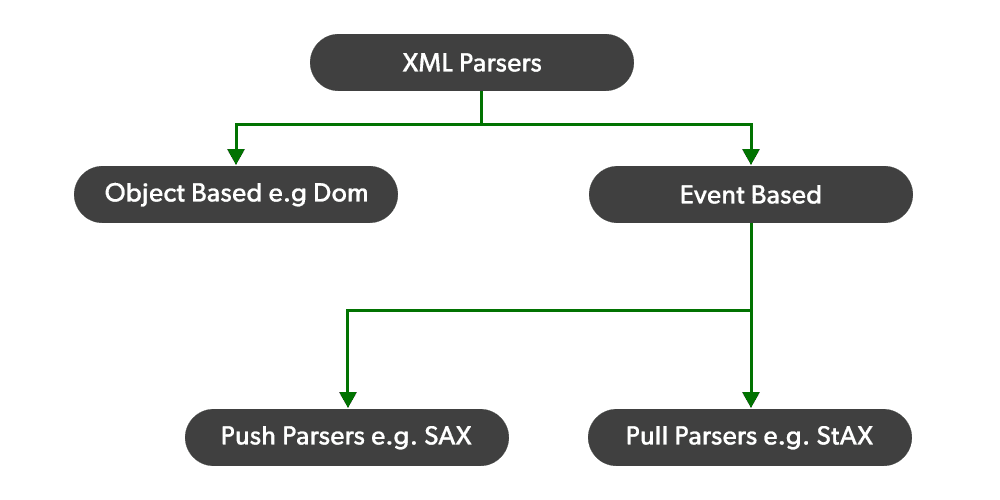

# Java 中 SAX 解析器和 DOM 解析器的区别

> 原文:[https://www . geesforgeks . org/sax-parser-和-dom-parser-in-java/](https://www.geeksforgeeks.org/difference-between-sax-parser-and-dom-parser-in-java/) 的区别

有两种类型的 XML 解析器，即简单应用编程接口和文档对象模型。

*   萨克斯管
*   数字正射影像图

[SAX](https://www.geeksforgeeks.org/java-sax-library/)(XML 的简单 API)，是 Java 中最广泛采用的 XML API，被认为是事实上的标准。虽然它最初是一个专属于 Java 的库，但现在它是一个众所周知的应用编程接口，分布在各种编程语言中。它是一个开源项目，最近已经切换到 SourceForge 项目基础架构，这使得在大容量 XML-dev 列表之外跟踪开放 SAX 问题变得更加容易。截至 2018 年 10 月 1 日的最新版本是 SAX 2.0。它使用事件驱动的串行访问机制来访问 XML 文档，并且经常被需要访问 XML 文档的小程序使用，因为它是可用于解析 XML 文档的最快且最不消耗内存的 API。SAX 使用的机制使它独立于之前的元素，即它是独立于状态的。

[DOM](https://www.geeksforgeeks.org/dom-document-object-model/) 代表文档对象模型。DOM 应用编程接口提供了读取和写入 XML 文件的类。DOM 读取整个文档。它在读取小到中等大小的 XML 文件时非常有用。它是一个基于树的解析器，与 SAX 相比有点慢，并且在加载到内存中时占用更多空间。我们可以使用 DOM API 插入和删除节点。

现在，为使用 [XML 文档](https://www.geeksforgeeks.org/xml-elements/)的客户端提供链接应用程序的包被称为 XML 解析器。计划阅读 XML 文档。创建了一个 XML 解析器，用于执行使用 XML 的程序。

### **SAX 解析器**

SAX 代表一个简单的 XML 应用编程接口，SAX 应用编程接口由 SAX 解析器实现。这个应用编程接口被称为基于事件的应用编程接口，它在处理程序上提供接口。有四个处理程序接口。ContentHandler、DTDHandler、EntityResolver 和 ErrorHandler 接口。它不创建任何内部结构，而是将输入文档组件的出现作为事件，然后告诉客户端它在读取输入文档时读取了什么。它适用于大型的 XML 文件，因为它不需要加载整个 XML 文件。

SAX 解析器的特点

*   SAX Parser 无法创建内部结构。
*   这些基于事件的 SAX 解析器的工作方式与 Java 中的事件处理程序相同。

SAX 解析器的优势

*   非常简单的使用和良好的记忆效率。
*   它的运行时间太快，可以用于更大的文档或文件系统。

SAX 解析器的缺点

*   它理解 API 的能力远不如基于事件的 API。
*   因为有很多数据，我们无法知道全部信息。

### **DOM 解析器**

DOM 代表文档对象模型。当一个对象包含一些关于 XML 文档的信息时，称为 DOM Parser。这看起来像一个树形结构。DOM API 是通过一个 DOM API 来实现的，非常简单易用。它将一个 XML 文档表示为树格式，其中每个元素表示树的分支，并创建一个 XML 文件的内存树表示，然后解析它。这需要更多的内存。

DOM 解析器的特点

*   内部结构可以由 DOM Parser 创建。
*   由于这些内部结构**、**，客户端可以获得关于原始 XML 文档的信息。

DOM 解析器的优势

*   DOM API 很容易使用，因此我们可以同时进行写和读操作。
*   当需要一个文档时，最好是可以随机访问的宽的部分。

DOM 解析器的缺点

*   它的内存效率不是太好，它需要更多的内存，因为 XML 文档需要加载到那里。
*   与 SAX 解析器相比，它太慢了。

因此，在 Java 中 SAX 解析器和 DOM 解析器之间的决定性区别如下

<figure class="table">

| 

SAX 解析器

 | 

DOM 解析器

 |
| --- | --- |
| 它被称为用于 XML 解析的简单应用编程接口。 | 它被称为文档对象模型。 |
| 这是一个基于事件的解析器。 | 它停留在树形结构中。 |
| SAX 解析器比 DOM 解析器慢。 | DOM 解析器比 SAX 解析器更快。 |
| 最适合较大尺寸的文件。 | 最适合较小大小的文件。 |
| 适合用 Java 制作 XML 文件。 | 它不擅长在低内存中制作 XML 文件。 |
| SAX Parser 无法创建内部结构。 | 内部结构可以由 DOM Parser 创建。 |
| 它是只读的。 | 它可以插入或删除节点。 |
| 在 SAX 解析器中，向后导航是不可能的。 | 在 DOM 解析器中，向后和向前搜索是可能的 |
| 适合高效记忆。 | 适合大型的 XML 文档。 |
| XML 文件的一小部分只加载在内存中。 | 它在内存中加载整个 XML 文档。 |

</figure>