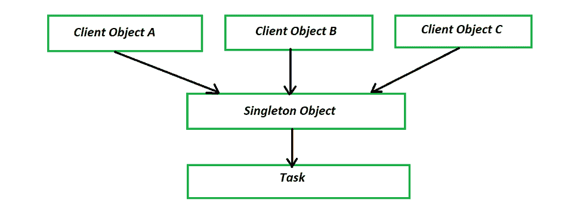

# Java 中单例模式和静态类的区别

> 原文:[https://www . geesforgeks . org/singleton-pattern-和-static-class-in-java 的区别/](https://www.geeksforgeeks.org/difference-between-singleton-pattern-and-static-class-in-java/)

单一模式属于创造型模式。顾名思义，创造性设计类型处理对象创建机制。基本上，为了简化这一点，创造模式向我们解释了以适合特定情况的方式创造物体。当我们需要确保一个特定类中只有一个对象被实例化时，使用单例设计模式。创建的单个实例负责协调整个应用程序的动作。



不同的对象试图调用实例化为单例的对象。

如果您查看上面的图解，您会看到不同的对象试图调用作为单例实例化的对象。该对象的单个实例负责调用下面的方法或事件。

单例模式的指导原则如下:

**优势:**

*   单例控制对资源的并发访问。
*   它确保应用程序中只有一个对象处于受控状态。

#### 实施:

*   请确保该类只存在一个实例。
*   通过将类的所有构造函数声明为私有，提供一个返回实例引用的静态方法，并将实例存储为私有静态变量，从而为该访问提供全局实例。

**例**

## Java 语言(一种计算机语言，尤用于创建网站)

```
// Java Program to illustrate Difference Between
// Singleton Pattern vs Static Class.

// Here illustrating Singleton Pattern

// Importing input output classes
import java.io.*;

// Class 1
// Helper class
class SingletonEagar {

    // Declaration and definition of variable occur
    // simultaneously
    //  Eager initialisation
    private static SingletonEagar instance
        = new SingletonEagar();

    // Private constructor of class 1
    private SingletonEagar() {}

    public static SingletonEagar getInstance()
    {
        return instance;
    }
}

// Class 2
// Helper Class
class Singleton {

    // Lazy  declaration and initialisation
    private static Singleton instance;

    // Private constructor of Class 2
    private Singleton() {}

    public static Singleton getInstance()
    {

        // Condition check
        // When instance is null
        // a new object of Singleton class is created
        if (instance == null) {
            instance = new Singleton();
        }

        return instance;
    }
}

// Class 3
// Helper class
class SingletonSynchronizedMethod {

    private static SingletonSynchronizedMethod instance;

    // Private constructor of Class 3
    private SingletonSynchronizedMethod() {}

    public static synchronized SingletonSynchronizedMethod
    getInstance()
    {

        // Condition check
        // When instance is null
        // a new object of Singleton class is created
        if (instance == null) {
            instance = new SingletonSynchronizedMethod();
        }

        return instance;
    }
}

// Class 4
// Helper class
class SingletonSynchronized {

    private static SingletonSynchronized instance;

    // Private constructor of Class 4
    private SingletonSynchronized() {}

    public static SingletonSynchronized getInstance()
    {

        // Again, condition check
        if (instance == null) {

            // synchronized block
            synchronized (SingletonSynchronized.class)
            {

                if (instance == null) {
                    instance = new SingletonSynchronized();
                }
            }
        }
        return instance;
    }
}

// Class 5
// Main class (SingletonExample)
public class GFG {

    // Main driver method
    public static void main(String[] args)
    {

        // Creating instanc in main() method of class 1
        SingletonEagar instance1
            = SingletonEagar.getInstance();

        // Display message only
        System.out.println(
            instance1
            + " : Singleton Eager initialisation ");

        // Creating instanc in main() method of class 2
        Singleton instance2 = Singleton.getInstance();

        // Display message only
        System.out.println(
            instance2
            + " : Singleton Lazy initialisation ");

        // Creating instanc in main() method of class 4
        SingletonSynchronized instance3
            = SingletonSynchronized.getInstance();

        // Display message only
        System.out.println(instance3
                           + " : Synchronized Singleton");
    }
}
```

**Output**

```
SingletonEagar@2f4d3709 : Singleton Eager initialisation 
Singleton@1d81eb93 : Singleton Lazy initialisation 
SingletonSynchronized@34a245ab : Synchronized Singleton
```

[静态类](https://www.geeksforgeeks.org/static-class-in-java/)

[静态嵌套类](https://www.geeksforgeeks.org/nested-classes-java/)是声明为静态的嵌套类。在 Java 中，静态类是将类分组在一起的一种方便的方式。Java 不允许你创建顶级静态类；仅嵌套(内部)类。这就是为什么静态类也被称为静态内部类或静态嵌套类。

静态类的准则如下:

**优势:**

*   通过使类成为静态的，可以在类内部定义相关类或帮助类。
*   它可以通过对象引用访问封闭类的私有成员。
*   静态类为嵌套类提供了一个很好的命名空间。
*   如果封闭类得到更新，我们也能够在相同的位置更新静态类。
*   在 JVM 中，[类加载器](https://www.geeksforgeeks.org/classloader-in-java/)只在第一次使用时加载静态类，而不是在其封闭类被加载时。

**实施:**

*   静态类只能是内部类或嵌套类。
*   静态类可以像任何其他静态成员一样使用任何类型的访问修饰符(私有、受保护、公共或默认)。
*   静态类只能访问其封闭类的静态成员。
*   静态类只能通过其封闭类的对象与非静态成员交互，因为它不能直接访问其封闭类的非静态成员。

**例**

## Java 语言(一种计算机语言，尤用于创建网站)

```
// Java Program to illustrate Difference Between
// Singleton Pattern vs Static Class.

// Here illustrating Static Class

// Importing input output classes
import java.io.*;

// Class 1
// Helper Class
class GFG_Outer {

    // Custom input integer value
    static int x = 20;

    public static void display() { System.out.println(x); }
    // Class 2
    // Static inner class

    // Can access all static variables of outer class
    // Can't access non-static members
    static class GFG_Inner {

        GFG_Inner()
        {

            // Display message
            System.out.println(
                "This is Inner Class Constructor...");

            // Print the value of x from inside class thrown
            // on console
            System.out.println(
                "Value of \"x\" from inside Inner Class is : "
                + x);
        }
    }

    // Main driver method
    public static void main(String[] args)
    {

        // Printing value of x in the main() method
        System.out.println(GFG_Outer.x);

        // Calling display() method from class 1
        GFG_Outer.display();

        // static inner class object which is as follows:
        // OuterClass.InnerClass variable = new
        // OuterClass.InnerClass();
        GFG_Outer.GFG_Inner object
            = new GFG_Outer.GFG_Inner();
    }
}
```

**Output**

```
20
20
This is Inner Class Constructor...
Value of "x" from inside Inner Class is : 20
```

> 现在我们已经理解了两者的概念和工作原理，并看到了两者的决定性差异。现在，让我们以表格形式说明所有差异，如下所示:

<figure class="table">

| 单一模式 | 静态类 |
| --- | --- |
| Singleton 是一种设计模式。 | 静态类基本上是 Java 中将类分组在一起的一种方式。 |
| 一旦创建了对象，就会分配内存。 | 在访问任何类成员后，都会立即分配内存。 |
| 单例实现既可以有静态成员，也可以有实例成员。 | 静态类只能包含静态成员。 |
| 它可以实现任何其他需要的接口或基类。 | 它不能实现接口或任何其他基类。 |
| 单例类可以用作方法参数。 | 静态类不能用作方法参数。 |
| 单例模式使用堆内存。 | 静态类使用堆栈内存。 |
| 它在垃圾收集器的范围内工作，因为它使用堆内存。 | 超出了垃圾收集器的范围，因为它使用堆栈内存。 |
| 它支持依赖注入(DI)实现，因为 Singleton 遵循 OOPS 概念。 | 它不能实现依赖注入，因为依赖注入是接口驱动的。 |
| Singleton 是一种架构模式，而不是一种语言特性。 | 静态是一种语言特性，而不是一种架构模式。 |
| 物体的处理是可能的。 | 它无法处置静态类，因为没有创建实例。 |

</figure>