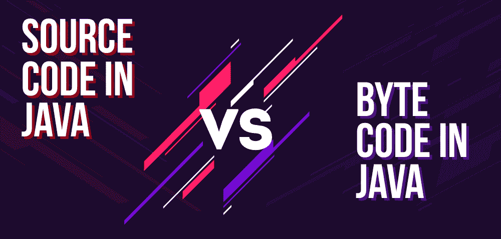
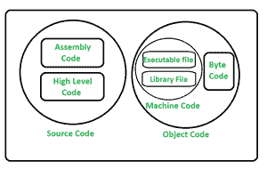

# 源代码和字节码的区别

> 原文:[https://www . geesforgeks . org/源代码和字节码的区别/](https://www.geeksforgeeks.org/difference-between-source-code-and-byte-code/)

**源代码**是指人类/程序员生成的高级代码或汇编代码。源代码易于阅读和修改。它由程序员使用任何人类可读的高级语言或中级语言编写。源代码包含程序员为了更好地理解而放置的注释。

源代码被提供给语言翻译器，语言翻译器将其转换成机器可理解的代码，称为机器代码或目标代码。计算机不能理解直接源代码，计算机理解机器代码并执行它。它被认为是计算机的基本组成部分。简单来说，我们可以说源代码是程序员使用 [C](https://www.geeksforgeeks.org/c-programming-language/) 、 [C++](https://www.geeksforgeeks.org/c-plus-plus/) 、 [Java](https://www.geeksforgeeks.org/java/) 、 [Python](https://www.geeksforgeeks.org/python-programming-language/) 等计算机编程语言编写的一组指令/命令和语句。因此，用任何编程语言编写的语句都被称为源代码。

**字节码**是介于源代码和机器码之间的中间代码。它是低级代码，是用高级语言编写的源代码编译的结果。由 [Java 虚拟机(JVM)](https://www.geeksforgeeks.org/jvm-works-jvm-architecture/) 这样的虚拟机处理。

字节码是一种不可运行的代码，当它被解释器翻译成机器代码后，就可以被机器理解。它被编译成在 JVM 上运行，任何支持 JVM 的系统都可以运行它，而不管它们的操作系统是什么。这就是 Java 独立于平台的原因。字节码被称为可移植码。

下图说明了源代码和字节码的排列–

**源代码和字节码的区别:**

<figure class="table">

| 

**序列号**

 | 

**源代码**

 | 

字节码

 |
| --- | --- | --- |
| 01. | 源代码是由人类或程序员编写的。 | 字节码不是人类或程序员写的。 |
| 02. | 它是用某种高级编程语言编写的。 | 字节码是介于源代码和机器码之间的中间代码。 |
| 03. | 它是编译器的输入，由编译器或其他语言翻译器翻译。 | 它是解释器的输入 |
| 04. | 系统/机器无法直接理解源代码。 | 字节码可由虚拟机执行。 |
| 05. | 源代码可能包含注释。 | 字节代码不包含注释。 |
| 06. | 源代码是类似于英语的纯文本形式。 | 字节码是数字码和常数的形式。 |
| 07. | 源代码更容易被人类理解。 | 字节码不太容易被人类理解。 |
| 08. | 它的速度最低比字节码。 | 它的速度比源代码还要快。 |
| 09. | 源代码的性能低于字节码。 | 字节码的性能超过了源代码。 |
| 10. | 这是一个高级代码。 | 它是一个中级代码。 |

</figure>