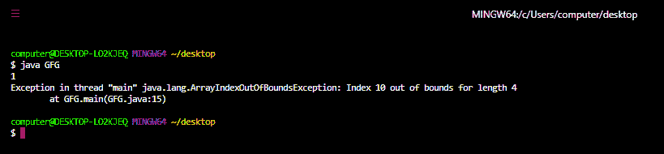
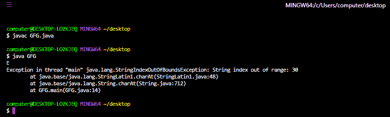

# Java 中 StringIndexOutOfBoundsException 和 ArrayIndexOutOfBoundsException 的区别

> 原文:[https://www . geesforgeks . org/difference-stringindexoutofboundsexception-and-arrayindexoofboundsexception-in-Java/](https://www.geeksforgeeks.org/difference-between-stringindexoutofboundsexception-and-arrayindexoutofboundsexception-in-java/)

扰乱程序正常流程的未被接受的、不想要的事件被称为[异常](https://www.geeksforgeeks.org/exceptions-in-java/) **。**

大多数时候异常是由我们的程序引起的，这些是可以恢复的。例如:如果我们的程序要求从位于美国的远程文件中读取数据。在运行时，如果远程文件不可用，那么我们将得到一个 RuntimeException，表示 fileNotFoundException。如果出现 fileNotFoundException，我们可以向程序提供本地文件，以便正常读取和继续程序的其余部分。

**Java 中的异常主要有** [两种类型](https://www.geeksforgeeks.org/checked-vs-unchecked-exceptions-in-java/) **如下:**

**1。选中异常:**

编译器在运行时为程序的顺利执行而检查的异常称为检查异常。在我们的程序中，如果有机会出现检查异常，那么我们应该强制处理该检查异常(通过 try-catch 或 throws 关键字)，否则我们将得到编译时错误；

选中异常的例子有[class notfoundexception](https://www.geeksforgeeks.org/classnotfoundexception-vs-noclassdeffounderror-java/)**、IOException、SQLException** 、**T5 等。**

**2。未选中异常:**

编译器不检查的异常，无论程序员是否处理这种类型的异常，都被称为未检查的异常。

未检查异常的例子有**算术异常、数组异常**等。

> 无论是否检查异常，只有在编译时不可能出现任何异常时，每个异常才会在**运行时**出现。

[**ArrayIndexOutOfBoundException**](https://www.geeksforgeeks.org/understanding-array-indexoutofbounds-exception-in-java/)**:**ArrayIndexOutOfBoundException 是 RuntimeException 的子类，因此是未检查的异常。每当我们使用一个负值或者一个大于或等于给定数组长度的值作为数组的索引时，JVM 就会自动产生这个异常。

**例**:

## Java 语言(一种计算机语言，尤用于创建网站)

```java
// Java program to demonstrate the
// ArrayIndexOutOfBoundException

// import the required package
import java.io.*;
import java.lang.*;
import java.util.*;

// driver class
class GFG {

    // main method
    public static void main(String[] args)
    {

        // declaring and initializing an array of length 4
        int[] x = { 1, 2, 3, 4 };

        // accessing the element at 0 index
        System.out.println(x[0]);

        // accessing an index which is greater than the
        // length of array
        System.out.println(x[10]);

        // accessing a negative index
        System.out.println(x[-1]);
    }
}
```

**输出:**



**StringIndexOutOfBoundException:**StringIndexOutOfBoundException 是 RuntimeException 的子类，因此是一个未检查的异常。每当在任何字符串类方法中，我们使用的索引值为负或大于或等于给定字符串的长度时，JVM 都会自动引发该异常。

**示例:**

## Java 语言(一种计算机语言，尤用于创建网站)

```java
// Java program to demonstrate
// StringIndexOutOfBoundException

// imort required packages
import java.io.*;
import java.util.*;

// driver class
class GFG {

    // main class
    public static void main(String[] args)
    {

        // declaring a string
        String s = "GEEKSFORGEEKS";

        // accessing the second character of the given
        // string using charAt() method
        System.out.println(s.charAt(1));

        // now using an index greater than the length of the
        // string
        System.out.println(s.charAt(30));
    }
}
```

**输出:**



<figure class="table">

| **数组索引出站异常** | **string index outoffoundation exception** |
| --- | --- |
| 它被抛出以指示数组被非法索引访问(即索引值为负或大于或等于数组的长度)。 | 它由 string 类的方法引发，以指示 string 方法中使用的索引值为负，或者大于或等于给定字符串的长度。 |

</figure>