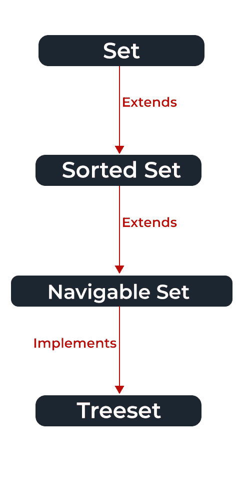

# Java 中 TreeSet 和 SortedSet 的区别

> 原文:[https://www . geesforgeks . org/treeset-and-sorted set-in-Java/](https://www.geeksforgeeks.org/difference-between-treeset-and-sortedset-in-java/)的区别

[树集](https://www.geeksforgeeks.org/treeset-in-java-with-examples/)是可导航子界面的实现之一。它的底层数据结构是一棵[红黑树](https://www.geeksforgeeks.org/red-black-tree-set-1-introduction-2/)。元素以升序存储，与排序集相比，树集中有更多的方法可用。我们也可以使用[比较器](https://www.geeksforgeeks.org/comparator-interface-java/)来更改排序参数。例如，根据使用的构造函数，在设置创建时提供比较器。

*   它还实现了 NavigableSet 接口。
*   [导航设置](https://www.geeksforgeeks.org/navigableset-java-examples/)扩展排序设置和[设置](https://www.geeksforgeeks.org/set-in-java/)界面。



**例**

## Java 语言(一种计算机语言，尤用于创建网站)

```
// Java Program to Illustrate TreeSet

// Importing required classes
import java.util.*;

// Main class
class GFG {

    // Main driver method
    public static void main(String args[]) {

        // Creating an empty TreeSet of string type elements
        TreeSet<String> al = new TreeSet<String>();

        // Adding elements
        // using add() method
        al.add("Welcome");
        al.add("to");
        al.add("Geeks for Geeks");

        // Traversing elements via help of iterators
        Iterator<String> itr = al.iterator();

        // Holds true until there is element remaining in object
        while (itr.hasNext()) {

            // Moving onto next element with help of next() method
            System.out.println(itr.next());
        }
    }
}
```

**Output**

```
Geeks for Geeks
Welcome
to
```