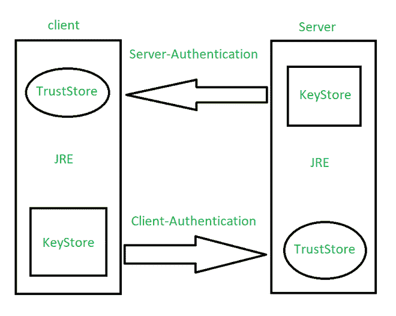

# Java 中信任库和密钥库的区别

> 原文:[https://www . geesforgeks . org/trust store 和 keystore-in-java 的区别/](https://www.geeksforgeeks.org/difference-between-truststore-and-keystore-in-java/)

**信任库**用于存储来自认证机构(CA)的证书，认证机构通过SSL 连接验证服务器提供的证书。而**密钥库**用于存储私钥和身份证书，特定程序应将其提交给双方(服务器或客户端)进行验证。这说明他们是对立的。用外行人的话来说，我们可以直接得出结论，在认证中，trustStore 持有标识其他人的标识证书，而 keyStore 持有持有我们的标识证书。

在 java 中，就像在编程语言中一样，每当我们试图与第三方应用程序通信时，都会用到这个概念。客户端和服务器之间的连接示意性地表示为密钥库和信任库，如下所示:

信任库和密钥库之间的区别如下表所示:

<figure class="table">

| 

信任库

 | 

密钥库

 |
| --- | --- |
| 信任库不包含私人和敏感信息。 | 密钥库包含私有和敏感信息。 |
| javax.net.ssl.trustStore 用于指定 trustStore。 | javax.net.ssl.keyStore 用于指定 keyStore。 |
| 客户端的成功连接需要信任库设置。 | 在 SSL 上设置服务器端时，需要密钥库。

 |
| TrustStore 存储其他人的凭据。 | 密钥库存储您的凭据。 |
| 信任库保存您信任的外部系统的证书。 | 密钥库保存应用程序的证书。 |
| TrustStore 密码由以下扩展名 Djavax . net . SSL . trust store password 提供。 | 密钥库密码由以下扩展名给出:Djavax . net . SSL . KeyStorePassword |
| 信任库和信任库密码存储在明文文件中，对所有人都可见。 | 密钥库和密钥密码以纯文本形式存储在一个文件中，该文件只能由相应组的成员读取。 |

</figure>