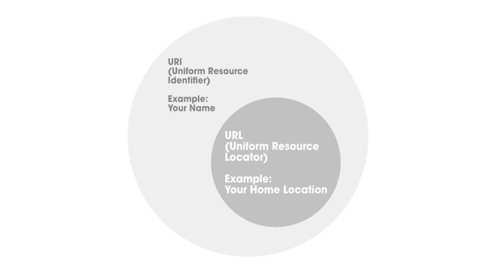
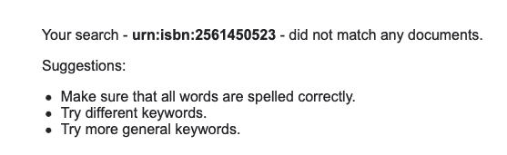

# Java 中 URL 和 URN 的区别

> 原文:[https://www . geesforgeks . org/URL 和 urn-in-java 的区别/](https://www.geeksforgeeks.org/difference-between-url-and-urn-in-java/)

**网址** 代表统一资源定位。网址包含协议、服务器名称或 IP 地址、端口号、文件名或目录名。 URL 是 URI 的一个子集，如下图所示，描述了网络地址或来源可用的位置。URL 以用于访问资源的协议名称开始，然后是特定的资源位置。网址建立在域名服务(DNS)的基础上，象征性地寻址主机，并使用类似文件路径的语法来识别给定主机上的特定资源。由于这个原因，将 URL 映射到物理资源很简单，并且可以通过各种网络浏览器来实现。

这里，统一涉及网络资源/网络资源的统一标识，即特定网络上托管的任何静态或动态文件。我们需要一种标准的方法来通过文件或资源的位置来识别它们，这意味着它基本上包含了关于我们如何使用位置来获取资源的信息。通常，我们将网址命名为网址。



插图:

XML 文件似乎没有任何与 ii 相关联的样式信息，其文档树如下所示:

```
This 
<Error>
<Code>NoSuchKey</Code>
<Message>The specified key does not exist.</Message>
<Key>wp-content/uploads/2021030515058/g.png</Key>
<RequestId>976QM4R3JWBBPE4Z</RequestId>
<HostId>
yQ/SHq/9wwvXszbY4pAQrZOk+3q6IexIpESeQelGcgX09MVMV6woZFMpaKbXXTrezQqb6HQ7h+4=
</HostId>
</Error>
```

从上面的 XML 文件中，我们可以得到如下公平的理解:

1.  HTTPS 是我们正在使用的*协议*。
2.  **'*****【media.geeksforgeeks.org】*****'**是*服务器*名称，因安全和维护组织隐私而被拒绝访问。
3.  **'***/WP-content/uploads/2021030515058/***'**是*目录名*，**g.png**是*文件名*。

现在细想一下这个密切相关的第二个概念。

**URN** 代表统一资源名称。这是一个使用 URN 方案的 URI。 URL 通过给定命名空间中的名称，后跟冒号，再后跟命名空间特定的字符串来标识 web 资源/网络资源。 URN 并不意味着已识别资源的可用性。URN 是与位置无关的资源标识符，旨在使其他名称空间轻松映射到 URN 空间。

**语法:**

```
<URN> ::= "urn:" [NID] ":" [NSS]
```

> **注意:** NID 是命名空间标识符，NSS 是命名空间特定的字符串。

插图:



如果习惯于在谷歌上搜索，图片描述如下

1.  **骨灰盒**是**T3**的一个**统一资源名称。**
2.  **isbn** 是一个命名空间标识符。国际标准书号用于通过书号识别图书，它是国际标准书号。
3.  **0451450523** 是命名空间特定的字符串，是书号。

现在，在充分了解了网址和 URN 之后，让我们总结一下它们之间的主要区别，这些区别以表格形式列出如下:

<figure class="table">

| 统一资源定位器 | 缸 |
| --- | --- |
| 网址也被称为统一资源定位符 | URN 也称为统一资源名 |
| 它使用位置从网络获取资源。 | 它用于按名称获取资源。 |
| 网址包含协议、IP 地址、端口号、目录名、主机等。 | 它以前缀 urn 开始，后跟一个名称空间标识符，然后是一个名称空间特定的字符串。 |

</figure>