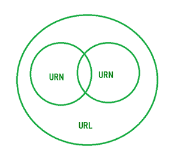

# Java 中 URL、URI 和 URN 的区别

> 原文:[https://www . geesforgeks . org/URL-uri-和-urn-in-java 的区别/](https://www.geeksforgeeks.org/difference-between-url-uri-and-urn-in-java/)

**URI** 代表统一资源标识符。URI 是一系列字符，用于在万维网上识别资源位置或名称或两者。URI 可以进一步分为定位器、名称或两者。

**URI 语法:**以一个方案开始，后跟一个冒号字符，然后是方案特定的部分。

最流行的 URI 方案是 HTTP、HTTPS 和 FTP。

**网址**代表统一资源定位。URL 是 URI 的一个子集，它描述了网络地址或来源可用的位置。URL 以用于访问资源的协议名称开始，然后是特定的资源位置。网址建立在域名服务的基础上，象征性地寻址主机，并使用类似文件路径的语法来识别给定主机上的特定资源。由于这个原因，将 URL 映射到物理资源很简单，并且可以通过各种网络浏览器来实现。

**URN** 代表统一资源名称。这是一个使用 URN 方案的 URI。

**“urn”方案:**后面是名称空间标识符，后面是冒号，后面是名称空间特定的字符串

URN 并不意味着已识别资源的可用性。URN 是与位置无关的资源标识符，旨在使其他名称空间轻松映射到 URN 空间。

<figure class="table">

| 不 | 上呼吸道感染 | 统一资源定位器 | 缸 |
| --- | --- | --- | --- |
| one | URI 代表统一资源标识符 | 代表统一资源位置 | URN 代表统一资源名 |
| Two | URI 是 URL & URN 的超集 | 网址是统一资源的一个子集 | URN 是统一资源的一个子集。 |
| three | 它用于通过位置或名称或两者来识别互联网上的资源 | 它用于通过位置来识别互联网上的资源 | 它通过名称唯一地标识资源 |
| four | URI 并不总是一个网址 | 所有的网址都是 URIs | 所有骨灰盒都是 URIs 的 |
| five | URI 包括方案、权限、路径、查询等组件。 | 网址包括协议、域、路径、散列、查询、字符串等 | URN 不包括任何组件 |
| six | 示例:https://www.geeksforgeeks.org/setting-environment-java/?ref=lbp | 示例:https % 3A % 2F % 2 Fww . geeksforgeks . org % 2 Fsetting-environment-Java % 2F % 3 Fref % 3 Dlbp | 示例:在 java 中设置环境 |

</figure>

下面是一个图表，显示了 URL、URI、URN 之间的关系:

