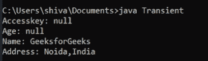

# Java 中易失性关键字和瞬态关键字的区别

> 原文:[https://www . geesforgeks . org/volatile-and-transient-keywords-in-Java/](https://www.geeksforgeeks.org/difference-between-volatile-and-transient-keywords-in-java/)之间的区别

就像任何其他编程语言一样， [Java 有一组关键字](https://www.geeksforgeeks.org/list-of-all-java-keywords/)，它们是保留的，有特殊的含义。在本文中，我们将看到关键词 volatile 和 transient 之间的区别。

在讨论这些差异之前，让我们先了解它们各自的真正含义。

**[波动](https://www.geeksforgeeks.org/volatile-keyword-in-java/) :**

[Volatile 关键字](https://www.geeksforgeeks.org/volatile-keyword-in-java/)用于标记 JVM 和线程从主内存中读取其值，而不使用线程堆栈中存在的缓存值。它在 java 并发编程中使用。

## Java 语言(一种计算机语言，尤用于创建网站)

```
class GFG extends Thread {

    // using volatile
    volatile boolean working = true;

    // if non-volatile it will
    // sleep in main and
    // runtime error will coocur
    public void run()
    {
        long count = 0;
        while (working) {
            count++;
        }

        System.out.println("Thread terminated."
                           + count);
    }

    // Driver code
    public static void main(String[] args)
        throws InterruptedException
    {
        GFG test = new GFG();
        test.start();
        Thread.sleep(100);
        System.out.println("After Sleeping in Main");
        test.working = false;
        test.join();
        System.out.println("Working set to "
                           + test.working);
    }
}
```

**输出:**


易失性代码输出

**[瞬变](https://www.geeksforgeeks.org/transient-keyword-java/) :**

[瞬态关键字](https://www.geeksforgeeks.org/transient-keyword-java/)与实例变量一起使用，以将其从序列化过程中消除。在序列化过程中，不保存瞬态字段或变量的值。

## Java 语言(一种计算机语言，尤用于创建网站)

```
import java.io.*;

class Test implements Serializable {

    // Making Accesskey transient for security
    transient String accessKey;

    // Making age transient as age can be
    // calculated from Date of Birth
    // and current date.
    transient int age;

    // serialize other fields
    String name, address;
    public Test(String accessKey, int age,
                String name, String address)
    {
        this.accessKey = accessKey;
        this.age = age;
        this.name = name;
        this.address = address;
    }
}

public class GFG {
    public static void main(String[] args)
        throws Exception
    {
        ObjectInputStream in
            = new ObjectInputStream(
                (new FileInputStream(
                    "login_details.txt")));
        Test obj = (Test)in.readObject();

        /* Transient variable will be shown 
        null due to security reasons.*/
        System.out.println("Accesskey: "
                           + obj.accessKey);
        System.out.println("Age: "
                           + obj.age);
        System.out.println("Name: "
                           + obj.name);
        System.out.println("Address: "
                           + obj.address);
    }
}
```

**输出:**



瞬态代码输出

下表描述了差异:

<figure class="table">

| 短暂的 | 不稳定的 |
| --- | --- |
| 瞬态标记变量阻止它被序列化。 | 在多线程 java 程序中，Volatile 标记的变量在可见性上遵循先发生后发生的关系，这降低了内存一致性错误的风险。 |
| 它为从序列化过程中排除一些对象方法提供了控制和灵活性。 | 它防止 JVM 进行可能危及同步的重新排序。 |
| 在反序列化过程中，它们用默认值初始化。 | 它们没有用默认值初始化。 |
| 它不能与 static 关键字一起使用，因为静态变量不属于单个实例。在序列化期间，只关心对象的当前状态。 | 它可以与 static 关键字一起使用。 |
| 它不能与 final 关键字一起使用。虽然 JVM 没有抱怨，但是在反序列化期间，人们将面临重新初始化变量的问题。 | 它可以和 final 关键字一起使用。 |

</figure>