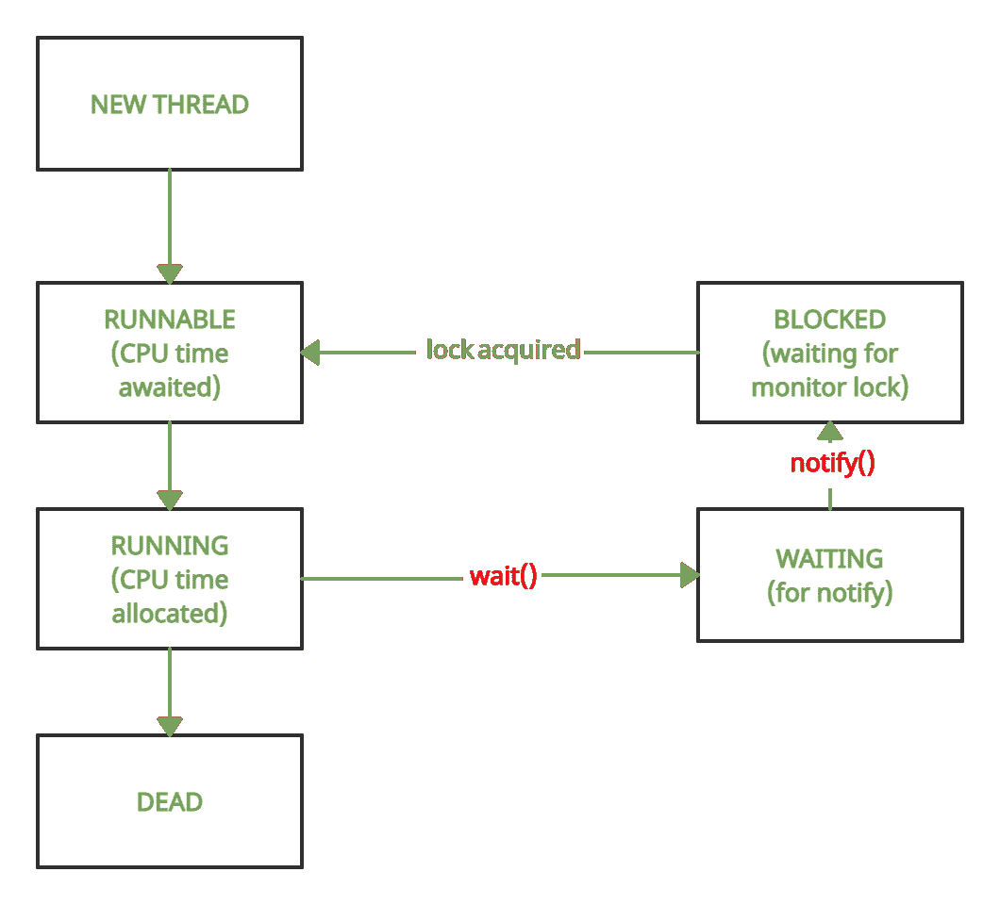

# Java 中 wait()和 notify()的区别

> 原文:[https://www . geesforgeks . org/Java 中等待和通知的区别/](https://www.geeksforgeeks.org/difference-between-wait-and-notify-in-java/)

**等待()**和**通知()**是[对象类](https://www.geeksforgeeks.org/object-class-in-java/)的方法。他们被介绍与轮询分道扬镳，轮询是反复检查要满足的条件的过程。轮询会相当浪费 CPU 资源，因此不是首选。

**wait()有 3 个变体:**

**1。**不接受任何参数的基本版本

```
public final void wait()
// will cause thread to wait till notify is called
```

**2。**采用单个超时参数的版本

```
public final void wait(long timeout)
// will cause thread to wait either till notify is called or 
// till timeout (One which occurs earlier)
```

**3。**版本采用超时参数和纳秒参数以获得额外的精度

```
public final void wait(long timeout,
int nanoseconds)
```

**notify()有 1 个签名**

```
public final void notify()
// Function does not take any argument
```



<figure class="table">

| 等待() | 通知() |
| --- | --- |
| 当在持有监视器锁的线程上调用 wait()时，它会放弃监视器锁并进入等待状态。 | 当在持有监视器锁的线程上调用 notify()时，它象征着该线程即将放弃锁。 |
| 一次可以有多个线程处于等待状态。 | 随机选择一个等待线程并通知相同的情况。然后，被通知的线程退出等待状态，并进入阻塞状态，在阻塞状态下，它一直等待，直到前一个线程放弃了锁，并且这个线程获得了锁。一旦获得锁，它就进入可运行状态，等待 CPU 时间，然后开始运行。 |

</figure>

下面是 wait()和 notify()方法的演示:

## Java 语言(一种计算机语言，尤用于创建网站)

```
// Java Program to demonstrate usage of wait() and notify()

class demo {
    // variable to check if part1 has returned
    // volatile used to prevent threads from
    // storing local copies of variable
    volatile boolean part1done = false;

    // method synchronized on this
    // i.e. current object of demo
    synchronized void part1()
    {
        System.out.println("Welcome to India");
        part1done = true;
        System.out.println(
            "Thread t1 about to surrender lock");
        // notify the waiting thread, if any
        notify();
    }

    // method synchronized on this
    // i.e. current object of demo
    synchronized void part2()
    {
        // loop to prevent spurious wake-up
        while (!part1done) {
            try {
                System.out.println("Thread t2 waiting");
                // wait till notify is called
                wait();
                System.out.println(
                    "Thread t2 running again");
            }
            catch (Exception e) {
                System.out.println(e.getClass());
            }
        }
        System.out.println("Do visit Taj Mahal");
    }
}

public class Main {

    public static void main(String[] args)
    {

        // Make an instance of demo class
        demo obj = new demo();

        // Thread t1 will call part1()
        Thread t1 = new Thread(new Runnable() {
            public void run() { obj.part1(); }
        });

        // Thread t2 will call part2()
        Thread t2 = new Thread(new Runnable() {
            public void run() { obj.part2(); }
        });

        // Start t2 and then t1
        t2.start();
        t1.start();
    }
}
```

**Output**

```
Thread t2 waiting
Welcome to India
Thread t1 about to surrender lock
Thread t2 running again
Do visit Taj Mahal
```

**各种异常**

**A .等待()**

*   必须在 try-catch 块中包含 wait()，因为如果处于等待状态的线程被中断，它将引发中断异常。
*   如果超时值为负或者纳秒值不在 0 到 9，99，999 的范围内，等待外壳参数的另外两个变体将引发 IllegalArgumentException。

下面是异常处理的实现。

## Java 语言(一种计算机语言，尤用于创建网站)

```
// Program demonstrating occurrence of InterruptedException

class demo {
    volatile boolean part1done = false;

    synchronized void part1()
    {
        System.out.println("Welcome to India");
        part1done = true;
        // notify() has been commented, waiting
        // thread remains waiting forever notify();
    }

    synchronized void part2()
    {
        while (!part1done) {
            try {
                wait();
            }
            catch (Exception e) {
                System.out.println("Exception : "
                                   + e.getClass());
                // quit program after exception is thrown
                System.exit(-1);
            }
        }
        System.out.println("Do visit Taj Mahal");
    }
}

public class Main {

    public static void main(String[] args)
    {
        // Make an instance of demo class
        demo obj = new demo();

        // Thread t1 will call part1()
        Thread t1 = new Thread(new Runnable() {
            public void run() { obj.part1(); }
        });

        // Thread t2 will call part2()
        Thread t2 = new Thread(new Runnable() {
            public void run() { obj.part2(); }
        });

        // Start t2 and then t1
        t2.start();
        t1.start();

        // This is a counter which will
        // interrupt Thread t2 after 3 seconds
        long startTime = System.currentTimeMillis();
        while (true) {
            if (System.currentTimeMillis() - startTime
                > 3000)
                t2.interrupt();
        }
    }
}
```

**Output**

```
Welcome to India
Exception : class java.lang.InterruptedException
```

**B. notify()**

与 wait()不同，notify 方法不会引发中断异常，因此不强制将其包含在 try-catch 块中

**注:**

*   wait()和 notify()都有抛出 IllegalMonitorStateException 的倾向
*   当线程持有对象 A 的监视器锁并试图调用对象 b 上的等待或通知时，就会发生这种情况。
*   在前面的所有例子中，方法都是在“this”上同步的，即用于调用这些方法的对象(obj)。此外，wait() & notify()被调用为 this.wait()和 this.notify()(这种用法是多余的)。因此，不存在任何问题。
*   在下面的例子中，方法 part1 和 part2 现在在一个整数对象上同步，但是 wait() & notify()仍然在调用这些方法(obj)的对象上被调用。
*   这将导致非法监控状态异常

下面是异常处理的实现。

## Java 语言(一种计算机语言，尤用于创建网站)

```
// Program to demonstrate IllegalMonitorStateException

class demo {
    volatile boolean part1done = false;
    // Made an Integer object a
    // and set it randomly to 5
    Integer a = 5;

    void part1()
    {
        // Synchronized code on a
        synchronized (a)
        {
            System.out.println("Welcome to India");
            part1done = true;
            // calling this.notify()
            notify();
        }
    }

    void part2()
    {
        // Synchronized code on a
        synchronized (a)
        {
            while (!part1done) {
                try {
                    // calling this.wait()
                    wait();
                }
                catch (Exception e) {
                    System.out.println("Exception: "+e.getClass());
                    System.exit(-1);
                }
            }
            System.out.println("Do visit Taj Mahal");
        }
    }
}

public class Main {

    public static void main(String[] args)
    {

        // Make an instance of demo class
        demo obj = new demo();

        // Thread t1 will call part1()
        Thread t1 = new Thread(new Runnable() {
            public void run() { obj.part1(); }
        });

        // Thread t2 will call part2()
        Thread t2 = new Thread(new Runnable() {
            public void run() { obj.part2(); }
        });

        // Start t2 and then t1
        t2.start();
        t1.start();
    }
}
```

**Output**

```
Exception: class java.lang.IllegalMonitorStateException
```

要修复上述代码，只需在第 19 行用 a.notify()替换 notify()，在第 31 行用 a.wait()替换 wait()。