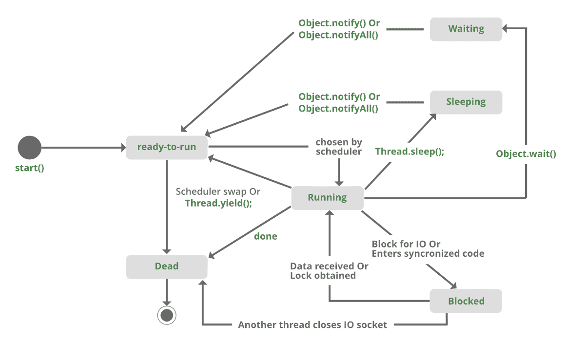

# Java 中等待和睡眠的区别

> 原文:[https://www . geesforgeks . org/Java 中等待和睡眠的区别/](https://www.geeksforgeeks.org/difference-between-wait-and-sleep-in-java/)

**Sleep():** 此方法用于以毫秒为单位暂停当前线程执行指定时间。在这里，线程不会失去它对监视器的所有权，并继续它的执行

**Wait():** 此方法在对象类中定义。它告诉调用线程(也称为当前线程)等待，直到另一个线程为此对象调用 notify()或 notifyAll()方法，线程等待，直到它重新获得监视器的所有权并继续执行。

<figure class="table">

| 等待() | 睡眠() |
| --- | --- |
| Wait()方法属于对象类。 | Sleep()方法属于 Thread 类。 |
| Wait()方法在同步期间释放锁定。 | Sleep()方法不会在同步过程中释放对象上的锁。 |
| 只能从同步上下文中调用 Wait()。 | 不需要从同步上下文中调用 sleep()。 |
| Wait()不是静态方法。 | Sleep()是一个静态方法。 |
| Wait()有三种重载方法:

*   等待()
*   等待(长时间超时)
*   等待(长超时，int nanos)

 | Sleep()有两种重载方法:

*   睡眠(长毫秒)毫秒:毫秒
*   睡眠(长毫秒，整数纳米)纳米:纳秒

 |
| 公共最终无效等待(长时间超时) | 公共静态无效睡眠(长毫秒)引发中断执行选项 |

</figure>

**睡眠方法示例:**

```
synchronized(monitor)
{
Thread.sleep(1000);  Here Lock Is Held By The Current Thread
//after 1000 milliseconds, current thread will wake up, or after we call that is interrupt() method
}
```

**等待方法示例:**

```
synchronized(monitor)
{
monitor.wait()  Here Lock Is Released By Current Thread 
}
```

**等待()和睡眠()的相似性方法:**

1.  两者都使当前线程进入不可运行状态。
2.  两者都是原生方法。

调用**等待()**和**睡眠()**方法的以下代码片段:

## Java 语言(一种计算机语言，尤用于创建网站)

```
synchronized(monitor){
    while(condition == true)
    {
        monitor.wait()  //releases monitor lock
    }

    Thread.sleep(100); //puts current thread on Sleep   
}
```



**程序:**

## Java 语言(一种计算机语言，尤用于创建网站)

```
// Java program to demonstrate the difference
// between wait and sleep

class GfG{

private static Object LOCK = new Object();

public static void main(String[] args)
  throws InterruptedException {

    Thread.sleep(1000);

    System.out.println("Thread '" + Thread.currentThread().getName() +
      "' is woken after sleeping for 1 second");

    synchronized (LOCK)
    {
        LOCK.wait(1000);

        System.out.println("Object '" + LOCK + "' is woken after" +
          " waiting for 1 second");
    }
}
}
```

**Output**

```
Thread 'main' is woken after sleeping for 1 second
Object 'java.lang.Object@1d81eb93' is woken after waiting for 1 second
```