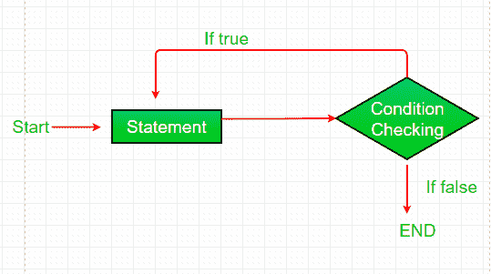

# C、C++、Java 中 while 和 do-while 循环的区别

> 原文:[https://www . geeksforgeeks . org/c-c-Java 中边循环边做的区别/](https://www.geeksforgeeks.org/difference-between-while-and-do-while-loop-in-c-c-java/)

<u>**而环:**</u>

while 循环是一种控制流语句，它允许基于给定的布尔条件重复执行代码。while 循环可以看作是一个重复的 if 语句。
**语法:**

```java
while (boolean condition)
{
   loop statements...
}

```

**流程图:**
[](https://media.geeksforgeeks.org/wp-content/uploads/Loop1.png)

**示例:**

## C

```java
#include <stdio.h>

int main()
{

    int i = 5;

    while (i < 10) {
        printf("GFG\n");
        i++;
    }

    return 0;
}
```

## C++

```java
#include <iostream>
using namespace std;

int main()
{

    int i = 5;

    while (i < 10) {
        i++;
        cout << "GFG\n";
    }

    return 0;
}
```

## Java 语言(一种计算机语言，尤用于创建网站)

```java
import java.io.*;

class GFG {
    public static void main(String[] args)
    {

        int i = 5;

        while (i < 10) {
            i++;
            System.out.println("GfG");
        }
    }
}
```

**Output:**

```java
GFG
GFG
GFG
GFG
GFG

```

<u>**边干边循环:**</u>

do while 循环类似于 while 循环，唯一的区别是它在执行语句后检查条件，因此是**退出控制循环的一个例子。**

**语法:**

```java
do
{
    statements..
}
while (condition);

```

**流程图:**
[](https://media.geeksforgeeks.org/wp-content/uploads/loop3.png)

**示例:**

## C

```java
#include <stdio.h>

int main()
{

    int i = 5;

    do {
        printf("GFG\n");
        i++;
    } while (i < 10);

    return 0;
}
```

## C++

```java
#include <iostream>
using namespace std;

int main()
{

    int i = 5;

    do {
        i++;
        cout << "GFG\n";
    } while (i < 10);

    return 0;
}
```

## Java 语言(一种计算机语言，尤用于创建网站)

```java
import java.io.*;

class GFG {
    public static void main(String[] args)
    {

        int i = 5;

        do {
            i++;
            System.out.println("GfG");
        } while (i < 10);
    }
}
```

**Output:**

```java
GFG
GFG
GFG
GFG
GFG

```

**以下是差异表:**

| 在…期间 | 边做边看 |
| --- | --- |
| 首先检查条件，然后执行语句。 | 语句至少执行一次，然后检查条件。 |
| 如果条件为假，语句可能执行零次。 | 至少执行一次语句。 |
| while 结尾没有分号。
while(条件) | while 结尾的分号。
while(条件)； |
| 如果只有一条语句，则不需要括号。 | 括号总是必需的。 |
| 条件中的变量在循环执行前初始化。 | 变量可以在循环之前或循环中初始化。 |
| 而循环是入口控制循环。 | do-while 循环是出口控制循环。 |
| while(条件)
{语句；} | do {语句)；}
while(条件)； |