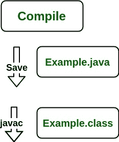

# JDK、JRE 和 JVM 的区别

> 原文:[https://www.geeksforgeeks.org/differences-jdk-jre-jvm/](https://www.geeksforgeeks.org/differences-jdk-jre-jvm/)

**Java 开发工具包(JDK** )是一个用于开发 Java 应用程序和小程序的软件开发环境。它包括 Java 运行时环境(JRE)、解释器/加载器(Java)、编译器(javac)、归档器(jar)、文档生成器(Javadoc)以及 Java 开发中需要的其他工具。

现在我们需要一个环境来运行我们的程序。从今往后， **JRE** 代表**“Java 运行时环境”**，也可以写成**“Java RTE。”**Java 运行时环境提供了执行 Java 应用程序的最低要求；它由 *Java 虚拟机(JVM)、核心类*和*支持文件*组成。

现在我们来讨论一下 **JVM** ，它代表了 java 虚拟机。具体如下:

*   一种**规范**，规定了 Java 虚拟机的工作方式。但是实现提供者是独立选择算法的。它的实现由孙和其他公司提供。
*   一个**实现**是一个满足 JVM 规范要求的计算机程序。
*   **运行时实例**每当您在命令提示符下编写一个 java 命令来运行 java 类时，就会创建一个 JVM 实例。

在继续讨论 JDK、JRE 和 JVM 之间的差异之前，让我们先简单讨论一下它们，并与下面提出的图像相关联。

不要混淆，因为我们将逐一讨论所有这些问题。

**1。JDK** (Java 开发工具包)是一个为**开发和执行(运行)**Java 程序提供环境的工具包。JDK 是一个套件(或包装)，包括两件事

*   开发工具(提供开发 java 程序的环境)
*   JRE(执行你的 java 程序)。

**2。JRE** (Java 运行时环境)是一个安装包，它提供了一个环境让**只在你的机器上运行(而不是开发)**Java 程序(或应用程序)。JRE 只供那些只想运行 Java 程序的人使用，这些程序是您系统的最终用户。

**3。**[**【JVM】**(**Java 虚拟机)**](https://www.geeksforgeeks.org/jvm-works-jvm-architecture/) 是 JDK 和 JRE 都非常重要的一部分，因为两者都包含或内置了它。无论您使用 JRE 或 JDK 运行什么样的 java 程序，都会进入 JVM，JVM 负责逐行执行 Java 程序，因此它也被称为[**I*****interpreter***](https://www.geeksforgeeks.org/compiler-vs-interpreter-2/)**。**

现在让我们讨论 JRE 的组件，以便理解它的重要性，并了解它实际上是如何工作的。为此，让我们讨论组件。

**JRE 的成分如下:**

1.  **部署技术**，包括部署、Java Web Start、Java 插件。
2.  **用户界面工具包**，包括*抽象窗口工具包(AWT)、Swing、Java 2D、可访问性、图像 I/O、打印服务、声音、拖拽*、*和拖拽(DnD)* 、*输入法*。
3.  **集成库**，包括*接口定义语言(IDL)、Java 数据库连接(JDBC)、Java 命名和目录接口(JNDI)、远程方法调用(RMI)、基于互联网 Orb 间协议的远程方法调用(RMI-IIOP)* 和*脚本*。
4.  **其他基础库**，包括*国际支持、输入/输出(I/O)、扩展机制、Beans、Java 管理扩展(JMX)、Java 原生接口(JNI)、数学、网络、覆盖机制、安全性、序列化*，以及*用于 XML 处理的 Java(XML JAXP)*。
5.  **Lang 和 util 基础库**，包括 *lang 和 util、管理、版本控制、zip、工具、反射、集合、并发实用程序、Java Archive (JAR)、日志、首选项 API、Ref Objects* 和*正则表达式*。
6.  **Java 虚拟机(JVM)** ，包括 *Java 热点客户端*和*服务器虚拟机*。

在充分了解组件之后，现在让我们讨论一下 JRE 的工作方式。为了理解 JRE 是如何工作的，让我们考虑下面的示例:

插图:

> 考虑一个保存为“*的 java 源文件。该文件被编译成一组存储在“*”中的字节码。类*”文件。这里是“*榜样班*”。*

> **注**:由上可知，可以解释编译时的媒体操作计算。
> 
> 以下操作在运行时发生，如下所示:
> 
> *   类加载器
> *   字节代码验证器
> *   解释者
>     *   执行字节码
>     *   对底层硬件进行适当的调用

**现在让我们简单讨论一下 JVM 是如何工作的。具体如下:**

JVM 在 Java 程序运行时变成了一个 JRE 的实例。它被广泛称为运行时解释器。JVM 在很大程度上有助于从程序员那里抽象出内部实现，这些程序员在 JDK 为他们的程序使用库。

***主要负责三项活动。**T3】*

*   装货
*   连接
*   初始化

**同样，现在我们来讨论一下 JRE 的工作情况，如下:**

*   JVM(Java 虚拟机)充当运行 Java 应用程序的运行时引擎。JVM 实际上是调用 java 代码中存在的 **main** 方法。JVM 是 Java 运行时环境的一部分。
*   Java 应用程序被称为 WORA(写一次运行在任何地方)。这意味着程序员可以在一个系统上开发 Java 代码，并可以期望它在任何其他支持 Java 的系统上运行，而无需任何调整。这都是可能的，因为有了 JVM。
*   当我们编译一个*的时候。java* 文件，*。类*文件(包含字节码)与*中的类名相同。java* 文件均由 java 编译器生成。这个*。类*文件在运行时会进入不同的步骤。这些步骤一起描述了整个 JVM。

本文由**克里希纳·巴蒂亚**供稿。如果你喜欢 GeeksforGeeks 并想投稿，你也可以使用[write.geeksforgeeks.org](https://write.geeksforgeeks.org)写一篇文章或者把你的文章邮寄到 review-team@geeksforgeeks.org。看到你的文章出现在极客博客主页上，帮助其他极客。

如果你发现任何不正确的地方，或者你想分享更多关于上面讨论的话题的信息，请写评论。