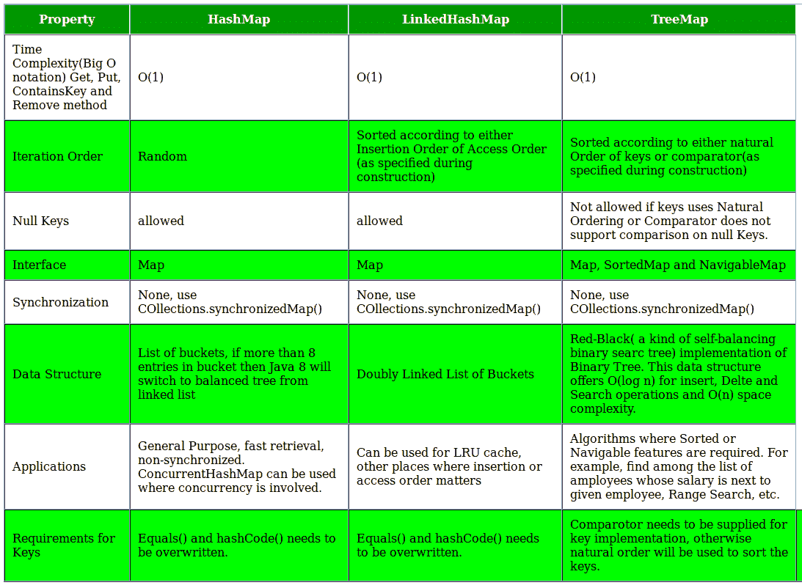

# Java 中 TreeMap、HashMap 和 LinkedHashMap 的区别

> 原文:[https://www . geesforgeks . org/differences-tree map-hashmap-linked hashmap-Java/](https://www.geeksforgeeks.org/differences-treemap-hashmap-linkedhashmap-java/)

先决条件:[Java 中的 HashMap 和 tree map](https://www.geeksforgeeks.org/hashmap-treemap-java/)

**树形图、HashMap 和 LinkedHashMap:有什么相似之处？**

*   都提供了**一个键- >值**映射和一个遍历键的方法。这些类之间最重要的区别是时间保证和键的顺序。
*   三个类 HashMap、TreeMap 和 LinkedHashMap 都实现了 [**java.util.Map**](https://www.geeksforgeeks.org/map-interface-java-examples/) 接口，表示从唯一键到值的映射。

**要点**

1.  **HashMap:** HashMap 提供 **0(1)** 查找和插入。但是，如果您遍历键，键的顺序基本上是任意的。它是由一组链表实现的。
    **语法:**

```
public class HashMap extends AbstractMap 
implements Map,Cloneable, Serializable
```

*   哈希表包含基于键的值。
*   它只包含独特的元素。
*   它可能有一个空键和多个空值。
*   它维持**无秩序**。

**2。linked hashmap:**linked hashmap 提供 **0(1)** 查找和插入。键按插入顺序排序。它由双链接桶实现。
**语法:**

```
public class LinkedHashMap extends HashMap 
implements Map
```

*   LinkedHashMap 包含基于键的值。
*   它只包含独特的元素。
*   它可能有一个空键和多个空值。
*   与 HashMap 相同，只是**保持插入顺序**。

**3。树形图:**树形图提供**0(对数 N)** 查找和插入。键是有序的，所以如果需要按排序顺序遍历键，可以这样做。这意味着键必须实现可比接口。树形图由红黑树实现。
**语法:**

```
public class TreeMap extends AbstractMap implements
NavigableMap, Cloneable, Serializable
```

*   树形图包含基于关键字的值。它实现了导航映射接口并扩展了抽象映射类。
*   它只包含独特的元素。
*   它不能有空键，但可以有多个空值。
*   它与 HashMap 相同，而是**保持升序(使用其键**的自然顺序排序)。

**4。哈希表:**“哈希表”是基于哈希的映射的通称。
**语法:**

```
public class Hashtable extends Dictionary implements
Map, Cloneable, Serializable
```

*   哈希表是列表数组。每个列表被称为一个桶。桶的位置通过调用 hashcode()方法来标识。哈希表包含基于键的值。
*   它只包含独特的元素。
*   它可能没有任何空键或空值。
*   它是同步的。
*   这是一个遗留类。

## HashMap

```
// Java program to print ordering
// of all elements using HashMap
import java.util.*;
import java.lang.*;
import java.io.*;
class Main
{
    // This function prints ordering of all elements
    static void insertAndPrint(AbstractMap<Integer, String> map)
    {
        int[] array= {1, -1, 0, 2,-2};
        for (int x: array)
        {
            map.put(x, Integer.toString(x));
        }
        for (int k: map.keySet())
        {
            System.out.print(k + ", ");
        }
    }

    // Driver method to test above method
    public static void main (String[] args)
    {
        HashMap<Integer, String> map = new HashMap<Integer, String>();
        insertAndPrint(map);
    }
}
```

## LinkedHashMap

```
// Java program to print ordering
// of all elements using LinkedHashMap
import java.util.*;
import java.lang.*;
import java.io.*;

class Main
{
    // This function prints ordering of all elements
    static void insertAndPrint(AbstractMap<Integer, String> map)
    {
        int[] array= {1, -1, 0, 2,-2};
        for (int x: array)
        {
            map.put(x, Integer.toString(x));
        }
        for (int k: map.keySet())
        {
            System.out.print(k + ", ");
        }
    }

    // Driver method to test above method
    public static void main (String[] args)
    {
        LinkedHashMap<Integer, String> map = new LinkedHashMap<Integer, String>();
        insertAndPrint(map);
    }
}
```

## 树图

```
// Java program to print ordering of
// all elements using TreeMap

import java.util.*;
import java.lang.*;
import java.io.*;

class Main
{
    // This function prints ordering of all elements
    static void insertAndPrint(AbstractMap<Integer, String> map)
    {
        int[] array= {1, -1, 0, 2,-2};
        for (int x: array)
        {
            map.put(x, Integer.toString(x));
        }
        for (int k: map.keySet())
        {
            System.out.print(k + ", ");
        }
    }

    // Driver method to test above method
    public static void main (String[] args)
    {
        TreeMap<Integer, String> map = new TreeMap<Integer, String>();
        insertAndPrint(map);
    }
}
```

哈希表输出:

```
-1, 0, 1, -2, 2,     
// ordering of the keys is essentially arbitrary (any ordering)
```

LinkedHashMap 的输出:

```
 1, -1, 0, 2, -2,     
// Keys are ordered by their insertion order
```

树形图输出:

```
 -2, -1, 0, 1, 2,   
// Keys are in sorted order
```

**对照表**



**现实生活应用**

1.  假设您正在创建一个名称到 Person 对象的映射。您可能希望定期按姓名的字母顺序输出人员。树形图可以让你做到这一点。
2.  树形图还提供了一种方法，给定一个名字，输出下 10 个人。这对于许多应用中的“更多”功能可能是有用的。
3.  每当您需要键的顺序来匹配插入的顺序时，LinkedHashMap 就很有用。当您想要删除最旧的项目时，这在缓存情况下可能很有用。
4.  通常，除非有不这样做的理由，否则您会使用 HashMap。也就是说，如果您需要将键恢复到插入顺序，那么使用 LinkedHashMap。如果你需要让钥匙回到它们真正的/自然的顺序，那么使用 TreeMap。否则，HashMap 可能是最好的。它通常更快，并且需要更少的开销。

本文由 Somesh Awasthi 先生供稿。如果你喜欢 GeeksforGeeks 并想投稿，你也可以使用[write.geeksforgeeks.org](https://write.geeksforgeeks.org)写一篇文章或者把你的文章邮寄到 review-team@geeksforgeeks.org。看到你的文章出现在极客博客主页上，帮助其他极客。
如果你发现任何不正确的地方，或者你想分享更多关于上面讨论的话题的信息，请写评论。