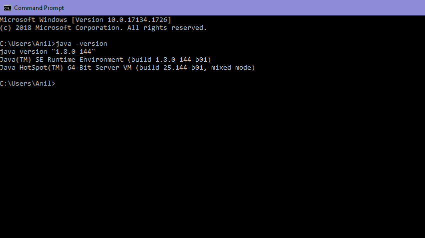
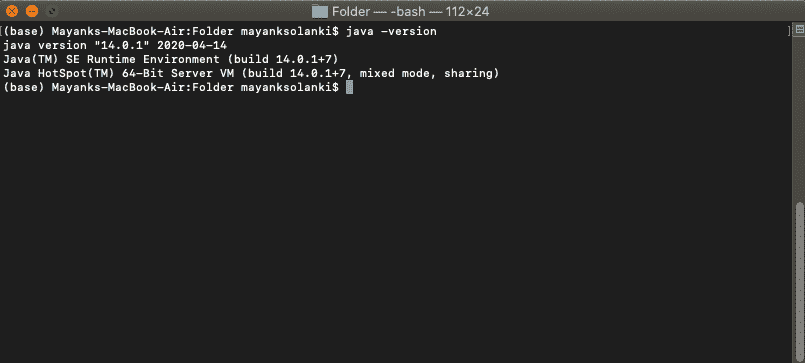
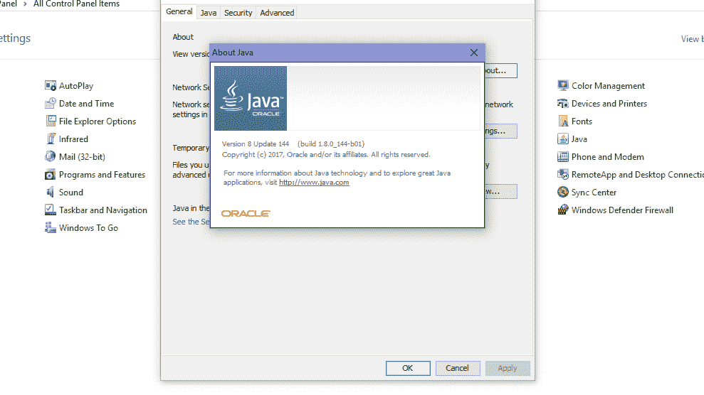
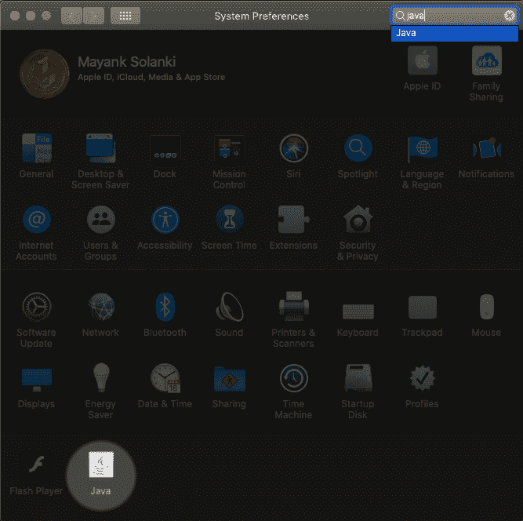
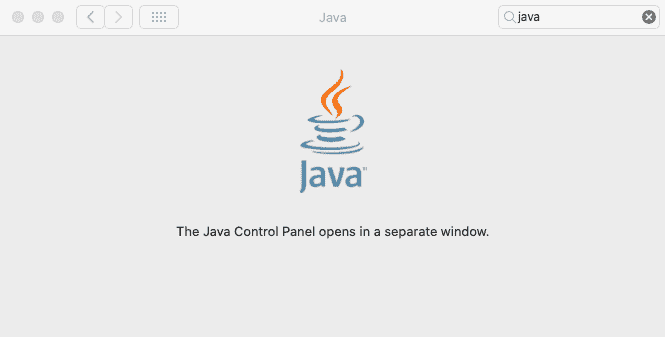
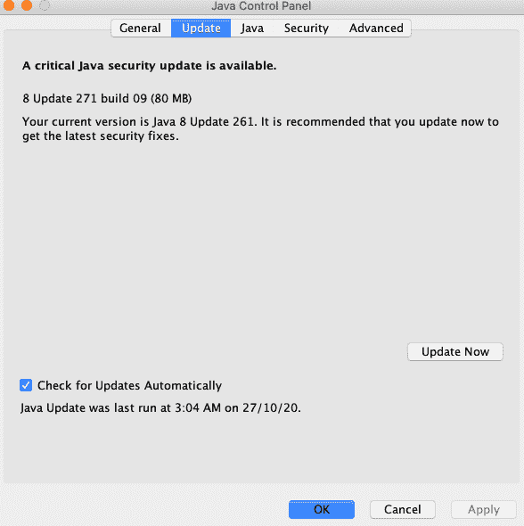
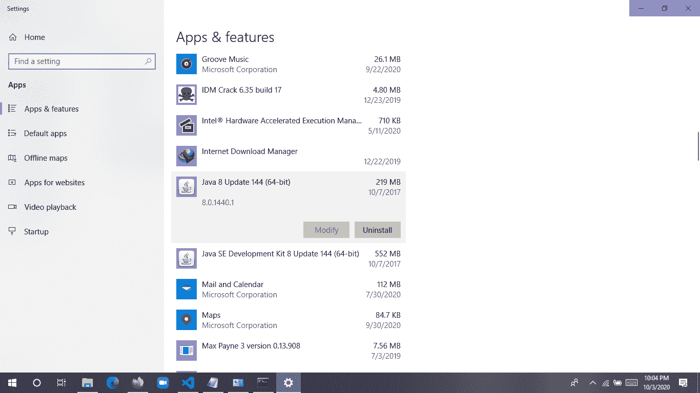
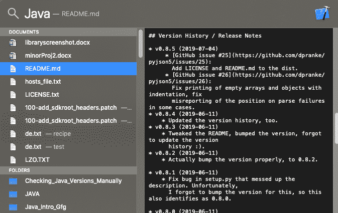

# 在 Windows 中检查 Java 版本的不同方法

> 原文:[https://www . geesforgeks . org/不同的检查方式-Java-in-window 版本/](https://www.geeksforgeeks.org/different-ways-to-check-java-version-in-windows/)

Java 是一种独立于平台、流行、简单、安全和静态类型的编程语言。在讨论之前，让我们弄清楚 java 语言需要一个运行时平台，所以在继续之前，让我们弄清楚 Java 是如何出现在机器上的。

**Java 语言主要由三部分组成:**

*   [Java 开发工具包](https://www.geeksforgeeks.org/differences-jdk-jre-jvm/)
*   [Java 运行时环境](https://www.geeksforgeeks.org/differences-jdk-jre-jvm/)
*   [Java 虚拟机](https://www.geeksforgeeks.org/differences-jdk-jre-jvm/)

运行时概念我们将检查平台(操作系统+架构)上是否有 Java

**1。Java 虚拟机**

这是一个机器**–**专用软件，负责该机器上的[字节码](https://www.geeksforgeeks.org/difference-between-byte-code-and-machine-code/)，并将其转换为机器专用指令。

```java
JVM is different for Windows 
JVM is different for Linux
JVM is different for Different Platforms

```

因此，作为程序员，我们不需要检查机器上的存在，因为它是预先安装在机器上的。它负责逐行运行 Java 代码。

**2。Java 运行时环境**

它只是一个包 **t** ，提供了一个只在机器上运行我们的 java 代码的环境。由于缺乏发展工具，这里没有发展。

**3。Java 开发工具包**

它也是一个包，提供了一个开发和执行的环境，其中 JRE 和开发工具是它的一部分。

*   **JDK = JRE +开发工具**
*   **JRE = JVM +库类**

现在，第一步也是最重要的一步是检查 Windows 中的 Java 开发工具包，它也被称为 JDK。Java 有很多版本。根据操作系统方法，有几种方法可以在您的机器上找到已安装的 JAVA 版本:

让我们在 Windows 中讨论 **3 个标准方法**

1.  用户需要打开命令提示符并输入- 'java -version '
2.  打开控制面板并查找 Java
3.  目录方法-单击菜单“开始”并键入 About.java 或自述文件

一个接一个，单独深入展示

### 1.命令提示符 **t**

T2 CMDT4(命令解释器是一个 **命令行** 界面。它支持一组命令和实用程序；并且有自己的编程语言来编写批处理文件。打开 CMD，搜索**Java-版本。**首先，我们要一个环境变量到 java 文件夹的安装路径位置。否则会显示无效命令。在 mac 操作系统的情况下，它被称为“终端”。

```java
java -version  // CMD/Terminal command to check java version on the machine

```

**在 Windows 操作系统的情况下:**显示 java 安装在版本为 1.8.0 的机器上(请仔细查看第 5 行)



**“1 . 8 . 0 _ 144”**是 java 的版本

**对于 macOS:** 显示 java 安装在版本为 14.0.1 的机器上(请仔细查看第 2 行)



### 第二种方法:

*   打开控制面板，在控制面板的界面上有一个 java 选项
*   点击 java 选项，点击一下，会出现一个小的弹出窗口

**在窗户的情况下:**



**在 Mac 的情况下:**点击 Java 图标下行。mac 中的系统偏好设置与 Windows 中的控制面板相同。

  

### 第三种方法:

在控制面板中搜索程序和功能，并搜索 JAVA 命名选项

**在 Windows 的情况下:**简单自定义搜索-关于 Java



**在 Mac 的情况下:**

按下命令按钮，然后按空格键，不要从命令按钮上抬起手指。

一个弹出框将出现不到一秒钟，然后是另一个弹出框，如下所示:

