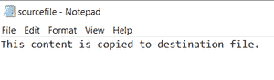
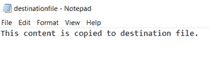

# 在 Java 中将内容从一个文件复制到另一个文件的不同方式

> 原文:[https://www . geeksforgeeks . org/不同的方式将内容从一个文件复制到另一个 java 文件/](https://www.geeksforgeeks.org/different-ways-to-copy-content-from-one-file-to-another-file-in-java/)

在 Java 中，我们可以将一个文件的内容复制到另一个文件中。这可以通过[文件输入流](https://www.geeksforgeeks.org/java-io-fileinputstream-class-java/#:~:text=FileInputStream%20is%20useful%20to%20read,bytes%20such%20as%20image%20data.&text=FileInputStream(File%20file)%20%3ACreates,from%20the%20specified%20File%20object.) 和**文件输出流**类来完成。

fileinputstream 类

它是一个字节输入流类，有助于从文件中读取字节。它提供了从文件中读取数据的不同方法。

> FileInputStream fin =新建 FileInputStream(filename)：

这将创建一个文件输入流对象 **fin** 给它一个文件名，从那里它将复制内容或进行读取操作。

### 使用的方法:

**1。read():** 此方法用于读取一个字节的数据。它将该字节作为整数值返回，如果到达文件末尾，则返回 **-1** 。

**2。close():** 此方法用于关闭 FileInputStream。

文件输出流类

它是一个字节输出流类，有助于将字节写入文件。它提供了将数据写入文件的不同功能。

> FileOutputStream 错误 = 新的 FileOutputStream（文件名）;

这将为给定的文件名创建一个文件输出流对象**，并将读取的内容写入该文件名。**

### **使用的方法:**

****1。write():** 此方法用于将一个字节的数据写入 FileOutputStream。**

****2。close():** 此方法用于关闭 FileInputStream。**

****文件类****

> **文件 f =新文件(文件名)；**

**这将创建一个名为 **f、**的[文件](https://www.geeksforgeeks.org/file-class-in-java/)对象，该对象是要访问的文件的文件名或位置路径。**

****注意:**如果这里给定的文件名不存在，那么**文件**类将创建一个同名的新文件。**

****示例:****

## **Java 语言(一种计算机语言，尤用于创建网站)**

```
// Java program to copy content from
// one file to another

import java.io.*;
import java.util.*;

public class CopyFromFileaToFileb {

    public static void copyContent(File a, File b)
        throws Exception
    {
        FileInputStream in = new FileInputStream(a);
        FileOutputStream out = new FileOutputStream(b);

        try {

            int n;

            // read() function to read the
            // byte of data
            while ((n = in.read()) != -1) {
                // write() function to write
                // the byte of data
                out.write(n);
            }
        }
        finally {
            if (in != null) {

                // close() function to close the
                // stream
                in.close();
            }
            // close() function to close
            // the stream
            if (out != null) {
                out.close();
            }
        }
        System.out.println("File Copied");
    }

    public static void main(String[] args) throws Exception
    {
        Scanner sc = new Scanner(System.in);

        // get the source file name
        System.out.println(
            "Enter the source filename from where you have to read/copy :");
        String a = sc.nextLine();

        // source file
        File x = new File(a);

        // get the destination file name
        System.out.println(
            "Enter the destination filename where you have to write/paste :");
        String b = sc.nextLine();

        // destination file
        File y = new File(b);

        // method called to copy the
        // contents from x to y
        copyContent(x, y);
    }
}
```

****输出****

```
**Enter the source filename from where you have to read/copy :**
sourcefile.txt
**Enter the destination filename where you have to write/paste :**
destinationfile.txt
**File Copied** 
```

****源文件****

**

源文件** 

****目标文件****

**

结果文件**