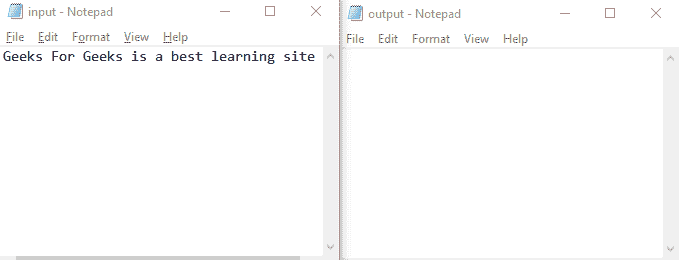
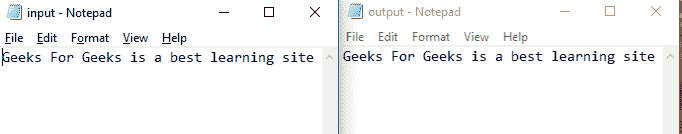

# 用 Java 复制文件的不同方式

> 原文:[https://www . geeksforgeeks . org/不同方式复制 java 文件/](https://www.geeksforgeeks.org/different-ways-to-copy-files-in-java/)

使用 java 语言复制文件主要有三种方法。它们如下所示:

1.  使用文件流(简单方法)
2.  使用文件通道类
3.  使用文件类。

**注意:**像 Apache Commons IO FileUtils 这样的方法还有很多，但我们只是讨论使用 java 类复制文件。

**方法 1:** 使用文件流(朴素方法)

这是一个简单的方法，我们使用文件输入流从第一个文件获取输入字符，使用文件输出流将输出字符写入另一个文件。这就像看到一个文件并写入另一个文件。

**示例:**

## Java 语言(一种计算机语言，尤用于创建网站)

```java
// Java Program to Copy file using File Stream

// Importing input output classes
import java.io.*;

// Main Class
public class GFG {

    // Main driver method
    public static void main(String[] args)
        throws IOException
    {

        // Creating two stream
        // one input and other output
        FileInputStream fis = null;
        FileOutputStream fos = null;

        // Try block to check for exceptions
        try {

            // Initializing both the streams with
            // respective file directory on local machine

            // Custom directory path on local machine
            fis = new FileInputStream(
                "C:\\Users\\Dipak\\Desktop\\input.txt");

            // Custom directory path on local machine
            fos = new FileOutputStream(
                "C:\\Users\\Dipak\\Desktop\\output.txt");

            int c;

            // Condition check
            // Reading the input file till there is input
            // present
            while ((c = fis.read()) != -1) {

                // Writing to output file of the specified
                // directory
                fos.write(c);
            }

            // By now writing to the file has ended, so

            // Display message on the console
            System.out.println(
                "copied the file successfully");
        }

        // Optional finally keyword but is good practice to
        // empty the occupied space is recommended whenever
        // closing files,connections,streams
        finally {

            // Closing the streams

            if (fis != null) {

                // Closing the fileInputStream
                fis.close();
            }
            if (fos != null) {

                // Closing the fileOutputStream
                fos.close();
            }
        }
    }
}
```

**输出:**

```java
copied the file successfully 
```

对于上面的程序，我们需要一个 input.txt 和一个 output.txt 文件。最初，两个文本文件看起来都是这样的



程序成功执行后，



**方法 2:** 使用文件通道类

这是一个存在于 ***java.nio*** 中的类，通道包，用于写、修改、读文件。这个类的对象创建了一个可查找的文件通道，通过它执行所有这些活动。这个类主要提供两种方法，命名如下:

*   ***transfer from(ReadableByteChannel src，长位置，长计数):*** 将字节传输到从 src 通道调用此方法的通道。这是由目标通道调用的。位置是指针开始复制操作的位置。Count 指定文件的大小，该大小几乎等于它包含的内容量。
*   ***transferTo(长位置、长计数、可写字节通道目标)*** :将字节从文件的源通道或方法调用通道传输到目标通道。这个方法主要是使用源通道调用的，Count 提到源文件的大小和拷贝的位置

因此，我们可以使用这两种方法中的任何一种来传输文件数据并复制它们。

**示例:**

## Java 语言(一种计算机语言，尤用于创建网站)

```java
// Java Program to Copy Files Using FileChannel Class

// Importing java.nio package for network linking
// Importing input output classes
import java.io.*;
import java.nio.channels.FileChannel;

// Main Class
public class GFG {

    // Main driver method
    public static void main(String[] args)
        throws IOException
    {

        // Creating two channels one input and other output
        // by creating two objects of FileChannel Class
        FileChannel src
            = new FileInputStream(
                  "C:\\Users\\Dipak\\Desktop\\input.txt")
                  .getChannel();
        FileChannel dest
            = new FileOutputStream(
                  "C:\\Users\\Dipak\\Desktop\\output.txt")
                  .getChannel();

        // Try block to check for exceptions
        try {

            // Transfering files in one go from source to
            // destination using transferFrom() method
            dest.transferFrom(src, 0, src.size());
            // we can also use transferTo
            // src.transferTo(0,src.size(),dest);
        }

        // finally keyword is good practice to save space in
        // memory by closing files, connections, streams
        finally {

            // Closing the channels this makes the space
            // free

            // Closing the source channel
            src.close();

            // Closing the destination channel
            dest.close();
        }
    }
}
```

**输出:**

对于上面的程序，我们需要一个 input.txt 和一个 output.txt 文件。最初，这两个文本文件如下所示


程序成功执行后，


**方法 3:** 使用文件类

这是 ***java.nio.File*** 包中存在的一个类。这个类提供了 3 种复制文件的方法，如下所示:

*   ***复制(InputStream in，Path target):*** 将所有字节的数据从输入文件流复制到输出文件的输出路径。它不能用于制作源文件中指定部分的副本。这里我们不需要创建输出文件。它是在代码执行期间自动创建的。
*   ***复制(路径源，OutputStream out):*** 将路径源中指定文件的所有字节复制到输出文件的输出流中。
*   ***复制(路径源，路径目标):*** 使用源文件和目标文件的路径复制文件。这里也不需要创建输出文件。

**示例:**

## Java 语言(一种计算机语言，尤用于创建网站)

```java
import java.nio.file.Files;
import java.io.*;
// save the file named as GFG.java
public class GFG{

    // main method
    public static void main(String[] args) throws IOException{

        // creating two channels
        // one input and other output   
        File src = new File("C:\\Users\\Dipak\\Desktop\\input.txt");
        File dest = new File("C:\\Users\\Dipak\\Desktop\\output.txt");

        // using copy(InputStream,Path Target); method
        Files.copy(src.toPath(), dest.toPath());

        // here we are not required to have an
        // output file at the specified target.
        // same way we can use other method also.

    }
}
```

**输出:**

对于上面的程序，我们需要一个 input.txt 和一个 output.txt 文件。最初，这两个文本文件如下所示


程序成功执行后，


> **注意:**在所有这些方法中，stream 一的处理速度很快，但是如果有人想要技术上比他们更先进，可以选择其他两种方法。另外，文件通道方法为我们提供了许多选项来控制要复制的文件部分并指定其大小。