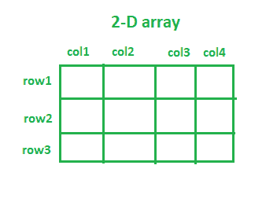
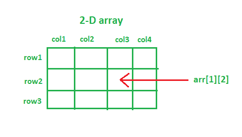

# Java 中声明和初始化二维数组的不同方式

> 原文:[https://www . geesforgeks . org/不同的方法来声明和初始化 java 中的二维数组/](https://www.geeksforgeeks.org/different-ways-to-declare-and-initialize-2-d-array-in-java/)

一个具有多个维度的[数组](https://www.geeksforgeeks.org/array-data-structure/)被称为一个[多维数组](https://www.geeksforgeeks.org/multidimensional-arrays-in-java/)。最常用的多维阵列是二维和三维阵列。我们可以说，任何高维数组基本上都是数组的数组。2D 阵列的一个非常常见的例子是棋盘。棋盘是一个包含 64 个 1×1 方块的格子。同样，您可以想象一个 2D 阵列。在 2D 数组中，每个元素都与行号和列号相关联。访问 2D 数组的任何元素类似于使用行号和列号访问 Excel 文件的记录。2D 阵列在实现井字游戏、象棋甚至存储图像像素时非常有用。



### 用 Java 声明二维数组:

任何二维数组都可以声明如下:

**语法:**

```java
data_type array_name[][];   (OR)     data_type[][] array_name;
```

*   **data_type:** 因为 Java 是一种静态类型的语言(即它希望在变量被赋值之前声明它的变量)。因此，指定数据类型决定了它将接受的元素类型。例如，为了仅存储整数值，数据类型将被声明为 int。
*   **array_name:** 是赋予二维数组的名称。例如科目、学生、水果、系等。

**注意:**我们可以在 data_type 后写[ ][ ]，也可以在声明 2D 数组时在 array_name 后写[ ][ ]。

## Java 语言(一种计算机语言，尤用于创建网站)

```java
// java program showing declaration of arrays
import java.io.*;

class GFG {
    public static void main(String[] args)
    {

        int[][] integer2DArray; // 2D integer array
        String[][] string2DArray; // 2D String array
        double[][] double2DArray; // 2D double array
        boolean[][] boolean2DArray; // 2D boolean array
        float[][] float2DArray; // 2D float array
        double[][] double2DArray; // 2D double array
    }
}
```

### **Java 中二维数组的初始化:**

```java
data_type[][] array_Name = new data_type[no_of_rows][no_of_columns];
```

任何 2D 数组中的元素总数将等于(行数)*(列数)。

*   **行数:**一个数组可以存储的行数。例如 no_of_rows = 3，那么该阵列将有三行。
*   **列数:**一个数组可以存储的行数。例如，列数= 4，那么该阵列将有四列。

上面的数组初始化语法将根据指定的数据类型为所有数组元素分配默认值。

让我们看看初始化 2D 阵列的各种方法:

### **接近 1**

## Java 语言(一种计算机语言，尤用于创建网站)

```java
// java program to initialize a 2D array
import java.io.*;

class GFG {
    public static void main(String[] args)
    {
        // Declaration along with initialization
        // 2D integer array with 5 rows and 3 columns
        // integer array elements are initialized with 0
        int[][] integer2DArray = new int[5][3];
        System.out.println(
            "Default value of int array element: "
            + integer2DArray[0][0]);

        // 2D String array with 4 rows and 4 columns
        // String array elements are initialized with null
        String[][] string2DArray = new String[4][4];
        System.out.println(
            "Default value of String array element: "
            + string2DArray[0][0]);

        // 2D boolean array with 3 rows and 5 columns
        // boolean array elements are initialized with false
        boolean[][] boolean2DArray = new boolean[4][4];
        System.out.println(
            "Default value of boolean array element: "
            + boolean2DArray[0][0]);

        // 2D char array with 10 rows and 10 columns
        // char array elements are initialized with
        // '\u0000'(null character)
        char[][] char2DArray = new char[10][10];
        System.out.println(
            "Default value of char array element: "
            + char2DArray[0][0]);

        // First declaration and then initialization
        int[][] arr; // declaration

        // System.out.println("arr[0][0]: "+ arr[0][0]);
        // The above line will throw an error, as we have
        // only declared the 2D array, but not initialized
        // it.
        arr = new int[5][3]; // initialization
        System.out.println("arr[0][0]: " + arr[0][0]);
    }
}
```

**注意:**初始化 2D 数组时，必须始终指定第一维(行数)，但可以省略提供第二维(列数)。

在下面的代码片段中，我们没有指定列的数量。然而，Java 编译器足够聪明，可以通过检查列内的元素数量来操纵大小。

## Java 语言(一种计算机语言，尤用于创建网站)

```java
import java.io.*;

class GFG {
    public static void main(String[] args)
    {
        // The line below will throw an error, as the first
        // dimension(no. of rows) is not specified
        int[][] arr = new int[][3];

        // The line below will execute without any error, as
        // the first dimension(no. of rows) is specified
        int[][] arr = new int[2][];
    }
}
```

您可以使用行号和列号来访问 2D 数组的任何元素。



### **接近 2**

在下面的代码片段中，我们没有指定行数和列数。然而，Java 编译器足够聪明，可以通过检查行和列内的元素数量来操作大小。

## Java 语言(一种计算机语言，尤用于创建网站)

```java
import java.io.*;

class GFG {
    public static void main(String[] args)
    {
        String[][] subjects = {
            { "Data Structures & Algorithms",
              "Programming & Logic", "Software Engineering",
              "Theory of Computation" },                       // row 1

            { "Thermodynamics", "Metallurgy",
              "Machine Drawing",
              "Fluid Mechanics" },                             // row2

            { "Signals and Systems", "Digital Electronics",
              "Power Electronics" }                            // row3
        };

        System.out.println(
            "Fundamental Subject in Computer Engineering: "
            + subjects[0][0]);
        System.out.println(
            "Fundamental Subject in Mechanical Engineering: "
            + subjects[1][3]);
        System.out.println(
            "Fundamental Subject in Electronics Engineering: "
            + subjects[2][1]);
    }
}
```

### **接近 3**

此外，我们可以分别初始化数组的每个元素。请看下面的代码片段:

## Java 语言(一种计算机语言，尤用于创建网站)

```java
import java.io.*;
import java.util.*;

class GFG {
    public static void main(String[] args)
    {
        int[][] scores = new int[2][2];
        // Initializing array element at position[0][0],
        // i.e. 0th row and 0th column
        scores[0][0] = 15;
        // Initializing array element at position[0][1],
        // i.e. 0th row and 1st column
        scores[0][1] = 23;
        // Initializing array element at position[1][0],
        // i.e. 1st row and 0th column
        scores[1][0] = 30;
        // Initializing array element at position[1][1],
        // i.e. 1st row and 1st column
        scores[1][1] = 21;

        // printing the array elements individually
        System.out.println("scores[0][0] = "
                           + scores[0][0]);
        System.out.println("scores[0][1] = "
                           + scores[0][1]);
        System.out.println("scores[1][0] = "
                           + scores[1][0]);
        System.out.println("scores[1][1] = "
                           + scores[1][1]);
        // printing 2D array using Arrays.deepToString() method
        System.out.println(
            "Printing 2D array using Arrays.deepToString() method: ");
        System.out.println(Arrays.deepToString(scores));
    }
}
```

### **接近 4**

如果 2D 阵列的大小太大，使用上述方法进行阵列初始化将是一项乏味的任务。有效的方法是在大型 2D 阵列的情况下使用 for 循环来初始化阵列元素。

## Java 语言(一种计算机语言，尤用于创建网站)

```java
import java.io.*;

class GFG {
    public static void main(String[] args)
    {
        int rows = 80, columns = 5;
        int[][] marks = new int[rows][columns];

        // initializing the array elements using for loop
        for (int i = 0; i < rows; i++) {
            for (int j = 0; j < columns; j++) {
                marks[i][j] = i + j;
            }
        }

        // printing the first three rows of marks array
        System.out.println("First three rows are: ");
        for (int i = 0; i < 3; i++) {
            for (int j = 0; j < columns; j++) {
                System.out.printf(marks[i][j] + " ");
            }
            System.out.println();
        }        
    }
}
```

我们可以用 arr。长度可用于查找行的大小(第一维)和 arr[0]。长度可以用来计算列的大小(第二维)。

### **方法 5:(交错阵列)**

可能有一种情况，您希望每行都有不同数量的列。这种类型的数组称为[交错数组](https://www.geeksforgeeks.org/jagged-array-in-java/)。

## Java 语言(一种计算机语言，尤用于创建网站)

```java
import java.io.*;

class GFG {
    public static void main(String[] args)
    {
        // declaring a 2D array with 2 rows
        int jagged[][] = new int[2][];

        // not specifying the 2nd dimension,
        // and making it as jagged array
        // first row has 2 columns
        jagged[0] = new int[2];
        // second row has 2 columns
        jagged[1] = new int[4];
        // Initializing the array
        int count = 0;
        for (int i = 0; i < jagged.length; i++) {
            // remember to use jagged[i].length instead of
            // jagged[0].length, since every row has
            // different number of columns
            for (int j = 0; j < jagged[i].length; j++) {
                jagged[i][j] = count++;
            }
        }

        // printing the values of 2D Jagged array
        System.out.println("The values of 2D jagged array");
        for (int i = 0; i < jagged.length; i++) {
            for (int j = 0; j < jagged[i].length; j++)
                System.out.printf(jagged[i][j] + " ");
            System.out.println();
        }
    }
}
```

**实施:**

让我们看一个简单的程序来添加两个 2D 阵列:

## Java 语言(一种计算机语言，尤用于创建网站)

```java
import java.io.*;
import java.util.*;

class GFG {
    public static void main(String[] args)
    {
        int[][] arr1 = { { 1, 2, 3 }, { 4, 5, 6 } };
        int[][] arr2 = { { 4, 5, 6 }, { 1, 3, 2 } };
        int[][] sum = new int[2][3];

        // adding two 2D arrays element-wise
        for (int i = 0; i < arr1.length; i++) {
            for (int j = 0; j < arr1[0].length; j++) {
                sum[i][j] = arr1[i][j] + arr2[i][j];
            }
        }

        System.out.println("Resultant 2D array: ");
        for (int i = 0; i < sum.length; i++) {
            System.out.println(Arrays.toString(sum[i]));
        }
    }
}
```