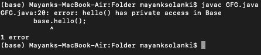
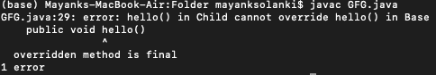

# Java 中防止方法重写的不同方法

> 原文:[https://www . geesforgeks . org/differential-way-to-prevention-method-override-in-Java/](https://www.geeksforgeeks.org/different-ways-to-prevent-method-overriding-in-java/)

继承是任何面向对象编程(OOP)语言的基本规则，但是仍然有一些方法可以防止子类中的方法重写，如下所示:

**方法:**

1.  使用[静态](https://www.geeksforgeeks.org/static-methods-vs-instance-methods-java/)方法
2.  使用[私有](https://www.geeksforgeeks.org/access-modifiers-java/)访问修饰符
3.  使用[默认](https://www.geeksforgeeks.org/access-modifiers-java/)访问修改器
4.  使用[最终](https://www.geeksforgeeks.org/final-keyword-java/)关键词方法

**方法 1:** 使用[静态](https://www.geeksforgeeks.org/static-methods-vs-instance-methods-java/)方法

这是防止子类中方法重写的第一种方法。如果您使任何方法成为静态的，那么它将成为类方法而不是对象方法，因此不允许被重写，因为它们是在编译时解析的，而被重写的方法是在运行时解析的。

## Java 语言(一种计算机语言，尤用于创建网站)

```java
// Java Program to Prevent Method Overriding
// using a static method

// Importing java input output classes
import java.io.*;

// Class 1
// Main class
class GFG {

    // Main driver method
    public static void main(String[] args)
    {
        // Creating an object og Base class
        Base base = new Child();

        // Printing message from base class as
        // its static methods have static binding

        // Hence even if the object is of Child class
        //  message printed is from base class
        base.hello();
    }
}

// Class 2
// Parent class
class Base {

    // hello() method of parent class
    public static void hello()
    {

        // Print and display the message if
        // hello() method of parent class is called
        System.out.println("Hello from base class");
    }
}

// Class 3
// Child class
class Child extends Base {

    // Overriding the existing method - hello()
    // @Override
    // hello() method of child class
    public static void hello()
    {
        // Print and display the message if
        // hello() method of child class is called
        System.out.println("Hello from child class");
    }
}
```

**Output**

```java
Hello from base class
```

**方法 2** 使用 [private](https://www.geeksforgeeks.org/access-modifiers-java/) 访问修饰符

使任何方法成为 private 将该方法的范围缩小到类，这意味着类外绝对没有人可以引用该方法。

**例**

## Java 语言(一种计算机语言，尤用于创建网站)

```java
// Java Program to Prevent Method Overriding
// using a private method specifier

// Importing input output classes
import java.io.*;

// Class 1
// Main class
public class GFG {

    // Main driver method
    public static void main(String[] args)
    {
        // Creating an object of Child class
        Child child = new Child();

        // Calling hello() method in main()
        child.hello();
    }
}

// Class 2
// Helper class 1
// Child Class
class Child extends Base {

    //@Override
    // hello() method of child class
    public void hello()
    {

        // Print statement when hello() method of
        // child class is called
        System.out.println("Hello from child class");
    }
}

// Class 3
// Helper class 2
// Parent Class
class Base {

    // hello() method of parent class
    private void hello()
    {

        // Print statement when hello() method of
        // child class is called
        System.out.println("Hello from base class");
    }
}
```

**Output**

```java
Hello from child class
```

**方法 3** 使用[默认](https://www.geeksforgeeks.org/access-modifiers-java/)访问修改器

只有在同一包内允许方法重写，但在包外不允许时，才能使用这种方法。Default 修饰符允许该方法仅在包中可见，因此同一包之外的任何子类都不能重写它。

**例**

## Java 语言(一种计算机语言，尤用于创建网站)

```java
// Java Program to Prevent Method Overriding
// using a private method specifier

// Importing input output classes
import java.io.*;

// Class 1
// Main class
class GFG {

    // Main driver method
    public static void main(String[] args)
    {

        // Creating an object of base class
        Base base = new Child();

        // Calling hello() method using Base class object
        base.hello();
    }
}

// Class 2
// Parent class
class Base {

    // hello() method of parent class
    private void hello()
    {

        // Print statement when hello() method of
        // child class is called
        System.out.println("Hello from base class");
    }
}

// Class 3
// Child class
class Child extends Base {

    // Overriding existing method
    // @Override

    // Hello method of child class
    void hello()
    {

        // Print statement when hello() method
        // of child class is called
        System.out.println("Hello from child class");
    }
}
```

**输出:**



**方法 4:** 使用[最终](https://www.geeksforgeeks.org/final-keyword-java/)关键字方法

防止覆盖的最后一种方法是通过在你的方法中使用[【最终】](https://www.geeksforgeeks.org/final-keyword-java/) 关键字。最后一个关键字终止了继承。因此，如果一个方法成为最终的，它将被认为是最终的实现，没有其他类可以覆盖这个行为。

## Java 语言(一种计算机语言，尤用于创建网站)

```java
// Java Program to Prevent Method Overriding
// using a final keyword method

// Importing input output classes
import java.io.*;

// Class
class GFG {

    // Main driver method
    public static void main(String[] args)
    {
        // Creating object of Child class
        Child child = new Child();

        // Calling hello() method using Child class object
        child.hello();
    }
}

// Class 2
// Child class
class Child extends Base {

    // Overriding
    // @Override

    // Method of child class
    public void hello()
    {
        // Print statement for Child class
        System.out.println("Hello from child class");
    }
}

// Class 3
// Base class
class Base {

    // Method of parent class
    public final void hello()
    {
        // Print statement for Base(parent) class
        System.out.println("Hello from base class");
    }
}
```

输出:

