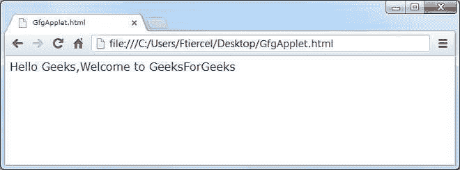

# Java 运行小程序的不同方式

> 原文:[https://www . geesforgeks . org/不同的运行方式-java 小程序/](https://www.geeksforgeeks.org/different-ways-to-run-applet-in-java/)

[**小程序**](https://www.geeksforgeeks.org/java-applet-basics/) 是微小的 Java 程序，可以作为网页的一部分自动安装和运行。它们可以在互联网服务器上查看，通过互联网传输，并作为网络文档或桌面应用程序的一部分自动安装和运行。

运行小程序有两种标准方法:

1.  **使用网络浏览器**
2.  **使用小程序查看器**

让我们逐一了解每种技术

### **1。在兼容 Java 的网络浏览器中执行小程序**:

假设我们有一个 GfgApplet.java 文件，其中有我们的 java 代码。

## Java 语言(一种计算机语言，尤用于创建网站)

```
// Java program to run the applet 
// using the web browser

import java.awt.*;
import java.applet.*;
public class GfgApplet extends Applet
{
     String msg="";
     public void init()
    {
         msg="Hello Geeks";
     }

     public void start()
     {
         msg=msg+",Welcome to GeeksForGeeks";
     }

     public void paint(Graphics g)
     {
         g.drawString(msg,20,20);
     }
}
```

*   编译:javac GfgApplet.java
*   创建一个 HTML 文件，并将 Applet 标签嵌入到 Html 文件中。

要在网络浏览器中运行小程序，我们必须创建一个带有加载小程序的标签的 HTML 文本文件。为此，我们可以使用 APPLET 或 OBJECT 标签。下面是用 APPLET 运行 HelloWorld 的 HTML 文件:

**小程序标签中的属性:**

*   **代码:**指定要加载到浏览器中的小程序类的名称。
*   **宽度:**指定小程序的宽度。
*   **高度:**设置小程序的高度。

**GfgApplet.html**

```
<html>
<body>
<applet code="GfgApplet.class" width=300 height=100></applet>
</body>
</html> 
```

**浏览器输出:**



当您访问 GfgApplet.class 时，小程序 GfgApplet.class 被加载到浏览器中。

要加载 applet 程序，浏览器必须启用 java。

### **2。** **使用小程序查看器运行小程序:**

这是一个 java 应用程序，允许您查看小程序。它类似于一个迷你浏览器，可以让你看到一个小程序在浏览器中的表现。它识别 APPLET 标签并在创建过程中使用它。APPLET 标签应该写在源代码文件中，并带有注释。

*   在源文件的注释中写入 HTML APPLET 标记。
*   使用 javac 编译小程序源代码。
*   使用小程序查看器 ClassName.class 查看小程序。

## Java 语言(一种计算机语言，尤用于创建网站)

```
// Java program to run the applet 
// using the applet viewer 

import java.awt.*;
import java.applet.*;
public class GfgApplet extends Applet
{
     String msg="";
     public void init()
    {
         msg="Hello Geeks";
     }

     public void start()
     {
         msg=msg+",Welcome to GeeksForGeeks";
     }

     public void paint(Graphics g)
     {
         g.drawString(msg,20,20);
     }

}
/*
<applet code="GfgApplet" width=300 height=100>
</applet>
*/
```

要使用 applet viewer 实用程序运行 applet，请在命令提示符下键入以下内容:

```
c:\>javac GfgApplet.java
c:\>appletviewer GfgApplet.java
```

**输出:**

