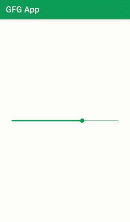

# 使用库

在安卓中离散 SeekBar

> 原文:[https://www . geesforgeks . org/discrete-seek bar-in-Android-use-library/](https://www.geeksforgeeks.org/discrete-seekbar-in-android-using-library/)

**离散 SeekBar** 是我们在大多数应用程序中可以看到的另一个最常见的功能。我们可以在大多数音乐播放器应用程序、分级应用程序或给定点数的应用程序中看到这个离散 SeekBar。离散 SeekBar 是一种先进的评级而不是写作系统。在前一篇文章中，我们已经在安卓系统中实现了[离散 SeekBar，而没有使用任何第三方库](https://www.geeksforgeeks.org/discrete-seekbar-in-kotlin/)。但是，在本文中，我们将看到如何在安卓应用程序中实现离散 SeekBar。下面给出了一个示例 GIF，以了解我们将在本文中做什么。请注意，我们将使用 **Java** 语言来实现这个项目。



### 离散 SeekBar 的应用

*   离散 SeekBar 用于大多数音乐播放器应用程序。
*   在大多数电子商务应用程序中，它主要用于给出评级。
*   在应用程序中使用离散 SeekBar 可以改善用户体验。

### 离散 SeekBar 的属性

<figure class="table">

| 属性 | 描述 |
| --- | --- |
| **dsb_max** | 用于给出最大值。 |
| **dsb_min** | 用于给出最小值。 |
| **dsb_indicatorFormatter** | 应用于气泡指示器内部值的字符串格式。 |
| **DSB _ indicator popup enabled** | 用于显示气泡指示器。 |
| **dsb_value** | 当前值。 |
| **DSB _ track 颜色** | 可绘制轨道的颜色。 |
| **dsb_progressColor** | 进度条和缩略图的颜色。 |
| **dsb_rippleColor** | 波纹抽屉的颜色。 |

</figure>

### **分步实施**

**第一步:创建新项目**

要在安卓工作室创建新项目，请参考[如何在安卓工作室创建/启动新项目](https://www.geeksforgeeks.org/android-how-to-create-start-a-new-project-in-android-studio/)。注意选择 **Java** 作为编程语言。

**第二步:在 build.gradle 文件**中添加离散 SeekBar 库的依赖关系

然后导航到渐变脚本，然后导航到**构建.渐变(模块)**级别。在依赖项部分的 [build.gradle](https://www.geeksforgeeks.org/android-build-gradle/) 文件中添加以下行。

> 实现' org . adw . library:discrete-seek bar:1 . 0 . 1 '

现在点击**立即同步**它将同步你在 **build.gradle()** 中的所有文件。

**第三步:在你的 activity_main.xml 文件中创建一个新的离散 SeekBar**

导航到**应用程序> res >布局**打开 **activity_main.xml** 文件。下面是 **activity_main.xml** 文件的代码。

## 可扩展标记语言

```java
<?xml version="1.0" encoding="utf-8"?>
<RelativeLayout 
    xmlns:android="http://schemas.android.com/apk/res/android"
    xmlns:app="http://schemas.android.com/apk/res-auto"
    xmlns:tools="http://schemas.android.com/tools"
    android:layout_width="match_parent"
    android:layout_height="match_parent"
    android:paddingLeft="16dp"
    android:paddingTop="16dp"
    android:paddingRight="16dp"
    android:paddingBottom="16dp"
    tools:context=".MainActivity">

    <!--Discrete SeekBAr-->
    <org.adw.library.widgets.discreteseekbar.DiscreteSeekBar
        android:id="@+id/seekBar"
        android:layout_width="match_parent"
        android:layout_height="wrap_content"
        android:layout_centerInParent="true"
        app:dsb_indicatorColor="@color/purple_200"
        app:dsb_max="100"
        app:dsb_min="0"
        app:dsb_progressColor="@color/purple_200"
        app:dsb_rippleColor="@color/purple_200"
        app:dsb_trackColor="@color/purple_200" />

</RelativeLayout>
```

**步骤 4:使用 MainActivity.java 文件**

转到**MainActivity.java**文件，参考以下代码。以下是**MainActivity.java**文件的代码。代码中添加了注释，以更详细地理解代码。

## Java 语言(一种计算机语言，尤用于创建网站)

```java
import android.os.Bundle;
import androidx.appcompat.app.AppCompatActivity;
import org.adw.library.widgets.discreteseekbar.DiscreteSeekBar;

public class MainActivity extends AppCompatActivity {

    @Override
    protected void onCreate(Bundle savedInstanceState) {
        super.onCreate(savedInstanceState);
        setContentView(R.layout.activity_main);

        // Discrete SeekBar
        DiscreteSeekBar discreteSeekBar = (DiscreteSeekBar) findViewById(R.id.seekBar);
        discreteSeekBar.setProgress(80);
    }
}
```

现在点击**运行**选项**构建梯度**需要一些时间。之后，您将获得如下所示的设备输出。

### **输出:**

<video class="wp-video-shortcode" id="video-554741-1" width="640" height="360" preload="metadata" controls=""><source type="video/mp4" src="https://media.geeksforgeeks.org/wp-content/uploads/20210130135925/Screenrecorder-2021-01-30-13-56-20-229.mp4?_=1">[https://media.geeksforgeeks.org/wp-content/uploads/20210130135925/Screenrecorder-2021-01-30-13-56-20-229.mp4](https://media.geeksforgeeks.org/wp-content/uploads/20210130135925/Screenrecorder-2021-01-30-13-56-20-229.mp4)</video>