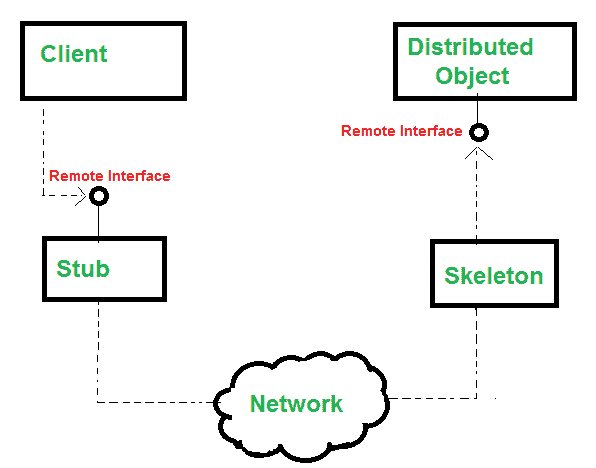
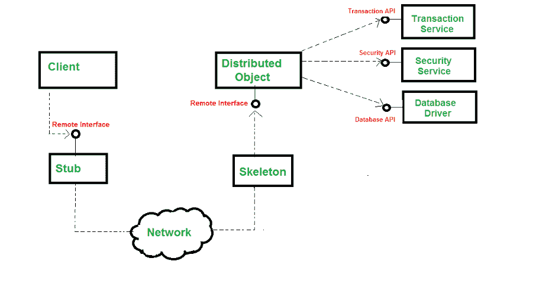
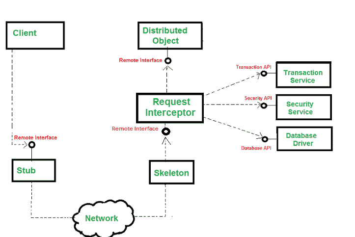

# EJB 的分布式对象(企业 Java bean)–显式与隐式中间件

> 原文:[https://www . geesforgeks . org/distributed-objects-in-ejbenterprise-Java-beans-explicit-vs-implicit-中间件/](https://www.geeksforgeeks.org/distributed-objects-in-ejbenterprise-java-beans-explicit-vs-implicit-middleware/)

分布式对象是可从远程系统调用的对象。进程内客户端、进程外客户端或位于其他位置的客户端(在网络上)都可以调用它。下图显示了客户端如何调用分布式对象。



**Stub** 是客户端代理对象。它屏蔽了客户端的网络通信。使用套接字、消息参数，存根可以通过网络调用**。**

**Skeleton** 是服务器端代理。它屏蔽了分布式对象的网络通信。骷髅负责在插座上接电话&它知道怎么做。它知道如何将参数从它们的网络表示形式传递到它们的 Java 表示形式。

从客户端调用分布式对象的步骤如下:

*   客户端调用存根。
*   存根通过网络调用骨架。
*   然后，骨架将调用委托给适当的实现对象。完成工作后，这个对象将控制返回给框架，框架返回给存根&然后存根将控制返回给客户端。

> **注意:**两个存根&服务器端实现对象必须实现**同一个**接口，称为*远程接口。*

这意味着分布式对象签名的克隆是由存根完成的。这里的客户端认为他是直接调用分布式对象，但实际上，他在存根上调用了一个方法。因此，我们可以得出结论，分发对象是由存根、框架和实现对象之间的协作创建的抽象。这里没有一个单独的实体是分布式对象。

**中间件服务:**随着分布式对象的应用变得越来越大，需要事务&安全等中间件服务。有两种方法可以得到它:

*   显式中间件，我们在这里显式地获得中间件
*   隐式中间件，我们隐式地获得中间件

**显式中间件:**可以购买中间件&编写调用中间件 API 的代码。传统的分布式对象编程(如 CORBA)使用了这样一个过程。

**示例:**您可以通过写入事务 API 来获得事务，如图所示:

```java
transferAmount(Account acc1, Account acc2, long amount)
{
    // 1\. Call middleware API to perform a security check
    // 2\. Call middleware API to start a transaction
    // 3\. Call middleware API to load rows from the database.
    // 4\. Subtract the balance from one account(acc1), add to the other(acc2)
    // 5\. Call middleware API to store updated rows in the database
    // 6\. // 1\. Call middleware API to end the transaction
}
```

**输出解释:**

这里 *transferAmount()* 是取账户类型 acc1、账户类型 acc2&长型金额 3 个输入参数的方法。调用此方法将金额从 acc1 转移到 acc2。

**例:**这里可以把 Account 想象成一个类，它的每个对象都指向不同的账号。



这里，业务逻辑与调用中间件 API 的逻辑交织在一起。

**隐式中间件**是无需编写中间件 API，就可以在企业应用中驾驭复杂中间件的地方。人们需要遵循这些步骤来利用中间件的力量，如下图所示



**程序:**步骤如下:

1.  不要编写复杂的中间件 API，编写只包含业务逻辑的分布式对象。
2.  在单独的描述符文件(如纯文本文件)中，声明您的对象需要的中间件服务。示例:您可以声明需要事务、安全性和持久性检查。
3.  中间件供应商为您提供命令行工具，运行它。该工具将描述符文件作为输入，并生成一个对象。我们称该对象为请求拦截器。
4.  客户端的请求由请求拦截器接收。然后，它执行您的分布式对象需要的中间件&将调用委托给分布式对象

**示例:**在分布式对象内部运行的代码是:

```java
transferAmount(Account acc1, Account acc2, long amount){
// 1\. subtract the amount from the balance of acc1 & add amount to balance of acc2
}
```

显式和隐式中间件之间的差异以表格形式显示如下

<figure class="table">

| 

**显式中间件**

 | 

**隐式中间件**

 |
| --- | --- |
| 这里，业务逻辑与调用中间件 API 的逻辑交织在一起。 | 不要编写复杂的中间件 API，编写只包含业务逻辑的分布式对象。 |
| 难以维护:如果你想改变你做中间件的方式，需要重写你的代码。 | 易于维护:如果你想改变你做中间件的方式，不需要重写你的代码。 |
| 难写:要执行简单的操作，需要大量的代码。 | 易于编写:无需向中间件 API 编写任何代码，只需在描述符文件中声明您需要的内容 |
| 难以支持:客户不能改变他们的中间件(比如改变安全性的工作方式) | 难以支持:客户可以通过调整描述符文件来改变他们需要的中间件。 |
| 这里不需要描述符文件。 | 我们需要写一个单独的描述符文件。 |
| 请求拦截器不是必需的。 | 请求拦截器是必需的。 |

</figure>