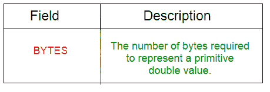
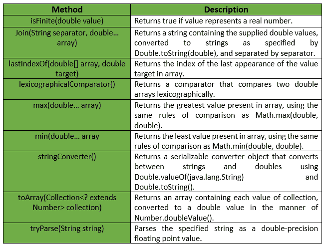

# 双打班|番石榴|爪哇

> 原文:[https://www.geeksforgeeks.org/doubles-class-guava-java/](https://www.geeksforgeeks.org/doubles-class-guava-java/)

**替身**是一个用于原始人类型 ***替身*** 的效用类。它提供了属于双原语的 ***静态实用方法*** ，这些方法在双原语或数组中都找不到。

**申报:**

```
@GwtCompatible(emulated=true)
public final class Doubles
extends Object

```

下表显示了番石榴双打比赛的场地总结:


番石榴双打班提供的方法有:

**例外:**

*   **min:***IllegalArgumentException*若阵为空。
*   **max:***IllegalArgumentException*如果数组为空。
*   **确保容量:** *如果最小长度或填充值为负，则显示“异常”。*
*   **to array:***NullPointerException*如果集合或其任何元素为空。

下表显示了番石榴双打类提供的一些其他方法:

下面给出了一些示例，显示了番石榴双打类方法的实现:
**示例 1 :**

```
// Java code to show implementation
// of Guava Doubles.asList() method

import com.google.common.primitives.Doubles;
import java.util.*;

class GFG {
    // Driver method
    public static void main(String[] args)
    {
        double arr[] = { 2.6, 4.6, 1.2, 2.4, 1.5 };

        // Using Doubles.asList() method which
        // converts array of primitives to array of objects
        List<Double> myList = Doubles.asList(arr);

        // Displaying the elements
        System.out.println(myList);
    }
}
```

输出:

```
[2.6, 4.6, 1.2, 2.4, 1.5]

```

**例 2 :**

```
// Java code to show implementation
// of Guava Doubles.toArray() method

import com.google.common.primitives.Doubles;
import java.util.*;

class GFG {
    // Driver method
    public static void main(String[] args)
    {
        List<Double> myList = Arrays.asList(2.6, 4.6, 1.2, 2.4, 1.5);

        // Using Doubles.toArray() method which
        // converts a List of Doubles to an
        // array of double
        double[] arr = Doubles.toArray(myList);

        // Displaying the elements
        System.out.println(Arrays.toString(arr));
    }
}
```

输出:

```
[2.6, 4.6, 1.2, 2.4, 1.5]

```

**例 3 :**

```
// Java code to show implementation
// of Guava Doubles.concat() method

import com.google.common.primitives.Doubles;
import java.util.*;

class GFG {
    // Driver method
    public static void main(String[] args)
    {
        double[] arr1 = { 2.6, 4.6, 1.2 };
        double[] arr2 = { 2.4, 1.5 };

        // Using Doubles.concat() method which
        // combines arrays from specified
        // arrays into a single array
        double[] arr = Doubles.concat(arr1, arr2);

        // Displaying the elements
        System.out.println(Arrays.toString(arr));
    }
}
```

输出:

```
[2.6, 4.6, 1.2, 2.4, 1.5]

```

**例 4 :**

```
// Java code to show implementation
// of Guava Doubles.contains() method

import com.google.common.primitives.Doubles;

class GFG {
    // Driver method
    public static void main(String[] args)
    {
        double[] arr = { 2.6, 4.6, 1.2, 2.4, 1.5 };

        // Using Doubles.contains() method which
        // checks if element is present in array
        // or not
        System.out.println(Doubles.contains(arr, 2.5));
        System.out.println(Doubles.contains(arr, 1.5));
    }
}
```

输出:

```
false
true

```

**例 5 :**

```
// Java code to show implementation
// of Guava Doubles.min() method

import com.google.common.primitives.Doubles;

class GFG {
    // Driver method
    public static void main(String[] args)
    {
        double[] arr = { 2.6, 4.6, 1.2, 2.4, 1.5 };

        // Using Doubles.min() method
        System.out.println(Doubles.min(arr));
    }
}
```

输出:

```
1.2

```

**例 6 :**

```
// Java code to show implementation
// of Guava Doubles.max() method

import com.google.common.primitives.Doubles;

class GFG {
    // Driver method
    public static void main(String[] args)
    {
        double[] arr = { 2.6, 4.6, 1.2, 2.4, 1.5 };

        // Using Doubles.max() method
        System.out.println(Doubles.max(arr));
    }
}
```

输出:

```
4.6

```