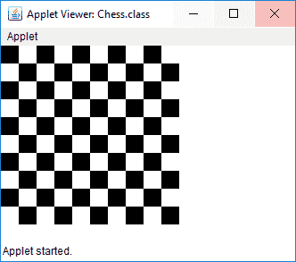

# 在 Java 小程序中绘制棋盘

> 原文:[https://www . geesforgeks . org/draw-a-棋盘-in-java-applet/](https://www.geeksforgeeks.org/draw-a-chessboard-in-java-applet/)

给定的任务是在 [Java 小程序](https://www.geeksforgeeks.org/java-applet-basics/)中画一个棋盘

**进场:**

1.  创建一个长宽各为 20 个单位的矩形，包含 10 行和 10 列象棋。
2.  一旦行和列中出现偶数位置，就用黑色改变矩形的颜色，否则它将是白色

下面是上述方法的实现:

**小程序程序:**

```java
import java.awt.*;
import java.applet.*;

// Extends Applet Class
public class Chess extends Applet {

    static int N = 10;

    // Use paint() method
    public void paint(Graphics g)
    {
        int x, y;
        for (int row = 0; row < N; row++) {

            for (int col = 0; col < N; col++) {

                // Set x coordinates of rectangle
                // by 20 times
                x = row * 20;

                // Set y coordinates of rectangle
                // by 20 times
                y = col * 20;

                // Check whether row and column
                // are in even position
                // If it is true set Black color
                if ((row % 2 == 0) == (col % 2 == 0))
                    g.setColor(Color.BLACK);
                else
                    g.setColor(Color.WHITE);

                // Create a rectangle with
                // length and breadth of 20
                g.fillRect(x, y, 20, 20);
            }
        }
    }
}
```

**Output:**

**注意:**要在命令行中运行小程序，请使用以下命令

```java
> javac Chess.java
> appletviewer Chess.html
```