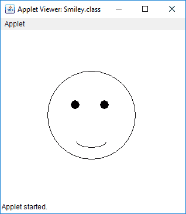

# 在 Java 小程序中画一个笑脸

> 原文:[https://www.geeksforgeeks.org/draw-a-smiley-in-java-applet/](https://www.geeksforgeeks.org/draw-a-smiley-in-java-applet/)

给定的任务是在 Java Applet 中画一个笑脸。

**进场:**

1.  创建三个椭圆，一个用于面部，两个用于眼睛。
2.  用黑色填充椭圆形的眼睛。
3.  为脸上的微笑画一个弧线。

下面是上述方法的实现:

**小程序程序:**

```java
// Java program to Draw a 
// Smiley using Java Applet
import java.applet.*;
import java.awt.*;

public class Smiley extends Applet {
    public void paint(Graphics g)
    {

        // Oval for face outline
        g.drawOval(80, 70, 150, 150);

        // Ovals for eyes
        // with black color filled
        g.setColor(Color.BLACK);
        g.fillOval(120, 120, 15, 15);
        g.fillOval(170, 120, 15, 15);

        // Arc for the smile
        g.drawArc(130, 180, 50, 20, 180, 180);
    }
}
```

**Output:**

**注意:**要在命令行中运行小程序，请使用以下命令

```java
> javac Smiley.java
> appletviewer Smiley.html
```