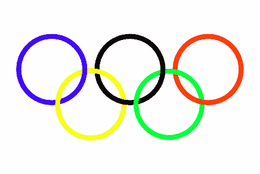
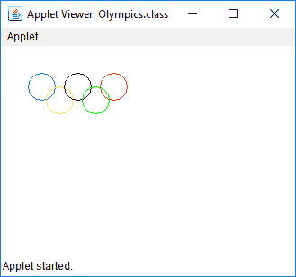

# 在 Java 小程序中绘制奥林匹克标志

> 原文:[https://www . geesforgeks . org/draw-an-a-Olympic-symbol-in-Java-applet/](https://www.geeksforgeeks.org/draw-an-olympic-symbol-in-java-applet/)

给定的任务是在 Java 小程序中绘制一个奥林匹克标志。

**预期产量:**


**逼近:**
用 drawOval()方法画一个有 x、y 坐标和长宽的圆。

下面是上述方法的实现:
**小程序程序:**

```java
// Java program to Draw an Olympic 
// Symbol using Java Applet
import java.awt.*;
import java.applet.*;

public class Olympics extends Applet {
    public void paint(Graphics g)
    {
        g.setColor(Color.BLUE);
        g.drawOval(30, 30, 30, 30);
        g.setColor(Color.YELLOW);
        g.drawOval(50, 45, 30, 30);
        g.setColor(Color.BLACK);
        g.drawOval(70, 30, 30, 30);
        g.setColor(Color.GREEN);
        g.drawOval(90, 45, 30, 30);
        g.setColor(Color.RED);
        g.drawOval(110, 30, 30, 30);
    }
}
```

**Output:**

**注意:**要在命令行中运行小程序，请使用以下命令

```java
> javac Olympics.java
> appletviewer Olympics.html
```