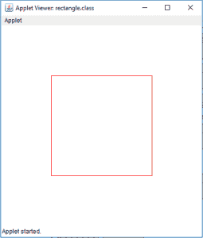

# 在 Java 小程序中画一个椭圆和一个矩形

> 原文:[https://www . geesforgeks . org/draw-ellips-rectangle-Java-applet/](https://www.geeksforgeeks.org/draw-ellipse-rectangle-java-applet/)

Java 小程序是可以在网络浏览器或小程序查看器中执行的应用程序。我们可以在 Java 小程序上绘制形状。
在本文中我们将通过两种方式在 Java 小程序上绘制一个椭圆。通过使用 drawOval(int x，int y，int width，int height)或通过使用数学公式(X= A * sin a，Y= B *cos a，其中 A 和 B 是长轴和短轴，A 是角度)。
同样，我们将通过两种方式在 Java 小程序上绘制一个矩形。通过使用 drawRect(int x，int y，int width，int height)或通过绘制四条连接边的线。

**在 Java 小程序中绘制椭圆**
示例:
**让我们绘制一个宽 150、高 100 的椭圆**

```java
Input : x and y coordinates 100, 100 respectively
Width and height 150 and 100 respectively 

```

输出:


**在 Java Applet 中绘制矩形**
示例:
**我们将在 Applet 上的位置 100，100 处绘制一个高 200、宽 200 的矩形和
。**

```java
Input : x and y coordinates 100, 100 respectively
Width and height 200 and 200 respectively.

```

输出:


**1。使用 drawOval(int x，int y，int width，int height)** 绘制椭圆的 Java 程序

```java
// java program to draw a ellipse
// using drawOval function.
import java.awt.*;
import javax.swing.*;

public class ellipse extends JApplet {

    public void init()
    {
        // set size
        setSize(400, 400);

        repaint();
    }

    // paint the applet
    public void paint(Graphics g)
    {
        // set Color for rectangle
        g.setColor(Color.red);

        // draw a ellipse
        g.drawOval(100, 100, 150, 100);
    }
}
```

**输出:**

**2。使用画线功能**绘制椭圆的程序

```java
// java program to draw a ellipse
// using drawLine function
import java.awt.*;
import javax.swing.*;

public class ellipse extends JApplet {

    public void init()
    {
        setSize(300, 300);
    }

    public void paint(Graphics g)
    {
        // center of the
        int cx, cy;

        // center of th ellipse
        cx = 150;
        cy = 175;

        // major and minor axis
        double A = 75, B = 50, px = 0, py = 0;

        // set color
        g.setColor(Color.red);

        // draw the ellipse
        for (int i = 0; i <= 360; i++) {
            double x, y;
            x = A * Math.sin(Math.toRadians(i));
            y = B * Math.cos(Math.toRadians(i));

            if (i != 0) {
                // draw a line joining previous and new point .
                g.drawLine((int)px + cx, (int)py + cy,
                                (int)x + cx, (int)y + cy);
            }

            // store the previous points
            px = x;
            py = y;
        }
    }
}
```

**输出:**


**现在我们来看看如何在 Java 小程序**中绘制一个矩形

**我们可以通过两种方式在 java 小程序中绘制矩形。**
**1。使用 drawRect(int x，int y，int 宽度，int 高度)绘制一个矩形**

```java
// Java Program to  Draw a rectangle
// using drawRect(int x, int y, int width, int height)
import java.awt.*;
import javax.swing.*;

public class rectangle extends JApplet {

    public void init()
    {
        // set size
        setSize(400, 400);

        repaint();
    }

    // paint the applet
    public void paint(Graphics g)
    {
        // set Color for rectangle
        g.setColor(Color.red);

        // draw a rectangle
        g.drawRect(100, 100, 200, 200);
    }
}
```

**输出:**


**2。使用画线(int x，int y，int x1，int y1)绘制一个矩形**

```java
// Java Program  Draw a rectangle
// using drawLine(int x, int y, int x1, int y1)
import java.awt.*;
import javax.swing.*;

public class rectangle extends JApplet {

    public void init()
    {
        // set size
        setSize(400, 400);

        repaint();
    }

    // paint the applet
    public void paint(Graphics g)
    {
        // set Color for rectangle
        g.setColor(Color.red);

        // draw a rectangle by drawing four lines
        g.drawLine(100, 100, 100, 300);
        g.drawLine(100, 300, 300, 300);
        g.drawLine(300, 300, 300, 100);
        g.drawLine(300, 100, 100, 100);
    }
}
```

**输出:**

**注意:以下程序可能无法在联机编译器中运行请使用脱机 IDE。**