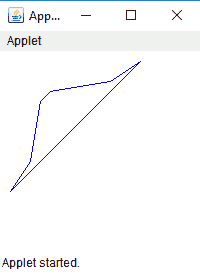

# 在 Java 小程序中绘制多边形

> 原文:[https://www.geeksforgeeks.org/draw-polygon-java-applet/](https://www.geeksforgeeks.org/draw-polygon-java-applet/)

多边形是一个封闭图形，其中有限的线段将一个顶点连接到另一个顶点。多边形由一组(x，y)坐标对组成，其中每一对都是多边形的顶点。多边形的边是在两个连续的坐标对之间绘制的线，线段是从第一个坐标对到最后一个坐标对绘制的。

**我们可以通过三种方式在 java 小程序中绘制多边形:**

1.  **drawPolygon(int[] x, int[] y, int numberofpoints) :** draws a polygon with the given set of x and y points.

    ```java
    // Java program to draw polygon using
    // drawPolygon(int[] x, int[] y, int numberofpoints)
    // function
    import java.awt.*;
    import javax.swing.*;

    public class poly extends JApplet {

        // called when applet is started
        public void init()
        {
            // set the size of applet to 300, 300
            setSize(200, 200);
            show();
        }

        // invoked when applet is started
        public void start()
        {
        }

        // invoked when applet is closed
        public void stop()
        {
        }

        public void paint(Graphics g)
        {
            // x coordinates of vertices
            int x[] = { 10, 30, 40, 50, 110, 140 };

            // y coordinates of vertices
            int y[] = { 140, 110, 50, 40, 30, 10 };

            // number of vertices
            int numberofpoints = 6;

            // set the color of line drawn to blue
            g.setColor(Color.blue);

            // draw the polygon using drawPolygon function
            g.drawPolygon(x, y, numberofpoints);
        }
    }
    ```

    **输出:**
    

2.  **drawPolygon(Polygon p) :** draws a polygon with the given object of Polygon class.

    ```java
    // Java program to draw polygon
    // using drawPolygon(Polygon p)
    // function
    import java.awt.*;
    import javax.swing.*;

    public class poly extends JApplet {

        // called when applet is started
        public void init()
        {
            // set the size of applet to 300, 300
            setSize(200, 200);
            show();
        }

        // invoked when applet is started
        public void start()
        {
        }

        // invoked when applet is closed
        public void stop()
        {
        }

        public void paint(Graphics g)
        {
            // x coordinates of vertices
            int x[] = { 10, 30, 40, 50, 110, 140 };

            // y coordinates of vertices
            int y[] = { 140, 110, 50, 40, 30, 10 };

            // number of vertices
            int numberofpoints = 6;

            // create a polygon with given x, y coordinates
            Polygon p = new Polygon(x, y, numberofpoints);

            // set the color of line drawn to blue
            g.setColor(Color.blue);

            // draw the polygon using drawPolygon
            // function using object of polygon class
            g.drawPolygon(p);
        }
    }
    ```

    **输出:**
    

3.  **drawLine(int x, int y, int x1, int y1) :** In this method we would connect adjacent vertices with a line segment and also connect the first and last vertex.

    ```java
    // Java code to draw a polygon
    // using  drawLine(int x, int y, int x1, int y1)
    // function
    import java.awt.*;
    import javax.swing.*;

    public class poly extends JApplet {

        // called when applet is started
        public void init()
        {
            // set the size of applet to 300, 300
            setSize(200, 200);
            show();
        }

        // invoked when applet is started
        public void start()
        {
        }

        // invoked when applet is closed
        public void stop()
        {
        }

        public void paint(Graphics g)
        {
            // x coordinates of vertices
            int x[] = { 10, 30, 40, 50, 110, 140 };

            // y coordinates of vertices
            int y[] = { 140, 110, 50, 40, 30, 10 };

            // number of vertices
            int numberofpoints = 6;

            // set the color of line drawn to blue
            g.setColor(Color.blue);

            // join the adjacent vertices
            for (int i = 0; i < numberofpoints - 1; i++)
                g.drawLine(x[i], y[i], x[i + 1], y[i + 1]);

            // join the first and last vertex
            g.drawLine(x[0], y[0], x[numberofpoints - 1], y[numberofpoints - 1]);
        }
    }
    ```

    **输出:**
    

**注意:**以上函数是 java.awt 包的一部分，属于 java.awt.Graphics 类。此外，这些代码可能无法在联机编译器中运行，请使用脱机编译器。程序员可以根据需要改变 x 和 y 坐标